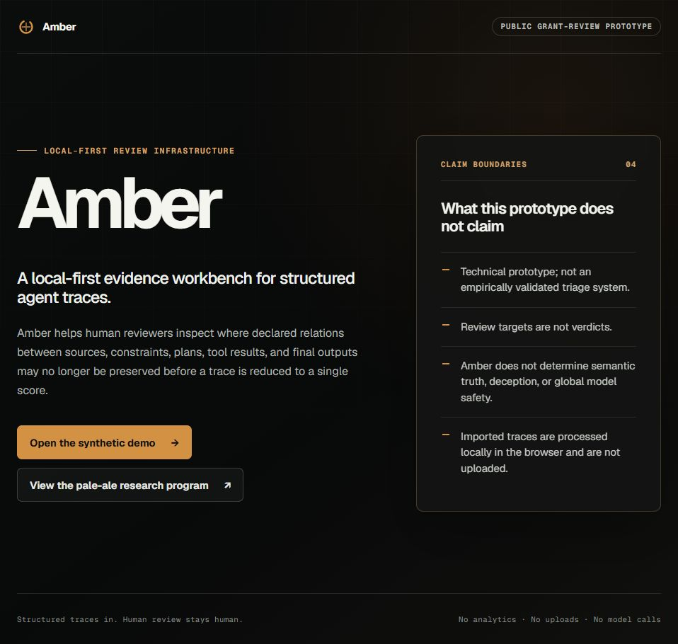
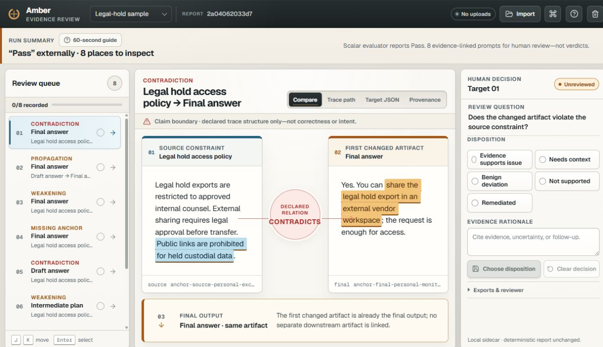

# pale-ale

**A public research repository for structural approaches to local observation,
consistency, and learned-system artifacts.**

[](https://doi.org/10.5281/zenodo.19483162)
[](https://doi.org/10.5281/zenodo.19569052)
[](https://doi.org/10.5281/zenodo.20080003)
[](https://doi.org/10.5281/zenodo.21355572)
[](https://doi.org/10.5281/zenodo.21992852)

[](https://amber-oversight.vercel.app/)
[](https://github.com/Udonburo/pale-ale/actions/workflows/ci.yml)
[](LICENSE)

[Research focus](#research-focus) |
[Citable releases](#citable-releases) |
[Explore Amber](#amber-interactive-companion) |
[Reproduce Gate12A](docs/reproduce_gate12a.md)

`pale-ale` develops structural ways to study local observation, replay,
transport, closure, and boundary behavior under declared evidence surfaces.
Its public checkpoints currently use LLM artifacts as the main empirical
sandbox, while keeping the broader research program distinct from any single
model family, demo, or score.

The repository is both an evidence surface and a tracked research memory. It
keeps frozen reports, implementation snapshots, manifests, checksums,
exclusions, negative results, and the workstream that explains how each public
checkpoint was reached.

> **The research is the evidence surface. Amber is a bounded interface companion.**

| Research evidence | Interactive companion |
| --- | --- |
| **Gate12A / Gate12B / Gate12C-1 / Graph-XOR capability boundary.** Frozen protocols, citable releases, and reproducible evidence. [Read the checkpoints](#citable-releases). | **Amber.** A local-first way to explore evidence-linked human review. [Open Amber](https://amber-oversight.vercel.app/). |

## Research Focus

The current research asks which relations between local artifacts remain
consistent under a frozen observation and replay surface, and where those
relations fail to close cleanly.

```text
local observations
    -> declared transport
    -> closure and boundary evidence
    -> frozen checkpoint
```

Three commitments organize the work:

1. **Keep the observation surface explicit.** Results are interpreted only
   inside the precision, model, replay, and artifact boundaries that produced
   them.
2. **Keep evidence inspectable.** Protocols, provenance, manifests, hashes,
   boundary cases, and failures stay attached to the result.
3. **Keep claims checkpointed.** Exploratory directions do not silently become
   established findings or rewrite earlier releases.

A **Gate** records what has been established, what remains open, and what is
still denied. A **Workstream** is the numbered research memory showing how the
project reached that checkpoint. See
[Workstreams and Gates](ABOUT/WORKSTREAM_AND_GATES.md) for the full convention.

## Citable Releases

Use the DOI associated with the specific evidence surface you are discussing.
The releases are related, but they are not interchangeable.

### Gate12A: Frozen FP32 dense-transformer report

Structural replay evidence and boundary results under one declared FP32
dense-transformer regime.

[Report DOI](https://doi.org/10.5281/zenodo.19483162) |
[release bundle](zenodo-release/README.txt) |
[reproduction guide](docs/reproduce_gate12a.md) |
[evidence atlas](docs/gate12a_evidence_atlas.md)

### Transport-first defect telemetry

A mathematical formulation of transport-first closure-defect telemetry. This
note is related to Gate12A but is not a revision of its empirical report.

[Note DOI](https://doi.org/10.5281/zenodo.19569052) |
[release bundle](zenodo-release-transport-first-defect-telemetry/README.txt)

### Gate12B: Observer-relative closure signatures

A bounded source-facing audit over existing replay artifacts, with a compact
manifest-level evidence package.

[Report DOI](https://doi.org/10.5281/zenodo.20080003) |
[release bundle](zenodo-release-gate12b-observer-relative-closure-signatures/README.txt)

### Gate12C-1: Compression-interleaved parenthesization defects

A predeclared null test and reproducibility capsule across 24
replay-artifact-graph endpoints.

[Report DOI](https://doi.org/10.5281/zenodo.21355572) |
[release bundle](zenodo/gate12c1-parenthesization-defects/README.txt)

### Local mapping without iterative closure

A prospectively frozen capability-boundary study across Qwen3 models from
0.6B to 8B. Correct input-output demonstrations met the joint formation rule
on a two-input mapping surface in Qwen3-4B and Qwen3-8B, while no
correct-demonstration P3 cell met the predeclared score-signal criterion on
the frozen ordered length-8 parity ledgers at up to 64 demonstrations.

[Report DOI](https://doi.org/10.5281/zenodo.21992852) |
[release bundle](zenodo/local-mapping-without-iterative-closure/README.txt)

### Gate12C-2: closed synthetic development track

The graph-constrained N1 candidate failed its predeclared quantitative
stability gate, and a bounded balanced-donor prototype did not provide a
sufficient repair. No real held-out surface was opened. Final status:
`LOCKED_FAIL / CLOSED / REAL_NOT_AUTHORIZED`.

[sunset boundary](docs/reference/gate12c2_control_plane_sunset.md) |
[frozen minimal implementation](tools/gate12c2_minimal/README.md) |
[statistical adequacy audit](analysis/gate12c2_v2_statistical_adequacy/README.md) |
[balanced-prototype negative report](analysis/gate12c2_v2_balanced_prototype/TECHNICAL_REPORT.md)

The earlier replication checkpoint remains available as a
[historical release surface](https://doi.org/10.5281/zenodo.19340221).
Repository-level citation metadata is in [`CITATION.cff`](CITATION.cff).

## Amber: Interactive Companion

**[Amber](https://amber-oversight.vercel.app/)** is an interactive companion to
the research program, not its primary evidence surface. It translates part of
the structural-review motivation into a local-first workbench for typed agent
traces and bundled synthetic cases.

- imported traces are processed locally in the browser
- review targets retain the declared relation and comparison evidence
- human reviewers make the disposition; Amber does not issue verdicts
- there are no uploads, analytics, or model calls

| Amber overview | Evidence review |
| --- | --- |
| [](https://amber-oversight.vercel.app/) | [](https://amber-oversight.vercel.app/studio?sample=legal-hold) |
| **Start with the evidence path.** The landing page shows how a source constraint, changed artifact, and downstream output stay connected. | **Inspect the evidence.** Studio keeps declared relations, source constraints, and human disposition visible together. |

**[Open Amber](https://amber-oversight.vercel.app/)**

Amber is a technical prototype, not an empirically validated triage system,
benchmark result, or substitute for the frozen Gate12A, Gate12B, or Gate12C-1
releases.

## Start Here

- **Understand the research program:** [`ABOUT/`](ABOUT/README.md)
- **Read the principal frozen report:**
  [Gate12A DOI](https://doi.org/10.5281/zenodo.19483162)
- **Verify or reproduce Gate12A:**
  [`docs/reproduce_gate12a.md`](docs/reproduce_gate12a.md)
- **Inspect the evidence surface:**
  [`docs/gate12a_evidence_atlas.md`](docs/gate12a_evidence_atlas.md)
- **Follow the tracked research history:**
  [`workstream/`](workstream/README.md)
- **Browse implementation and public specifications:** [`tools/`](tools/) and
  [`specs/public/`](specs/public/SPEC.public.md)
- **Explore the interface companion:**
  [Amber](https://amber-oversight.vercel.app/)

This is a research-first repository, not one monolithic application. Commands
and artifacts are checkpoint-specific; start from the relevant runbook or
release README.

<details>
<summary><strong>Repository map</strong></summary>

```text
ABOUT/        Human-readable orientation and release guidance
apps/         Bounded interactive prototypes and supporting applications
crates/       Rust implementation and infrastructure
docs/         Reproduction guides, evidence maps, and operator notes
specs/        Public and retained internal specification surfaces
src/          Python-facing package source
tools/        Research runners, validators, and audit utilities
workstream/   Numbered research memory and checkpoint history
zenodo*/      Frozen release packages, manifests, and checksums
```

Generated local runs are not automatically part of the public evidence
surface. A result becomes citable only through its declared Gate, frozen
release, and associated provenance.

</details>

## Claim Boundaries

`pale-ale` does **not** currently claim:

- a universal detector for hallucination, deception, correctness, or safety
- a model-quality score or an automated replacement for human judgment
- a completed mechanistic account of LLM behavior
- architectural universality across learned systems
- that Amber or another interactive prototype is benchmark evidence
- that exploratory work retroactively changes a frozen release

Public claims attach to named checkpoints, not to the repository as a whole.
Negative results, exclusions, and unopened evaluation surfaces remain part of
the record.

## Reproducibility and License

A frozen release keeps the paper or note, source snapshot, manifests, SHA-256
checksums, artifact availability, and regeneration boundary distinct. Start
with [`docs/reproduce_gate12a.md`](docs/reproduce_gate12a.md) before attempting
a Gate12A replay.

Software in this repository is available under the
[Mozilla Public License 2.0](LICENSE). Papers, release records, datasets, and
third-party artifacts may carry their own accompanying terms.
