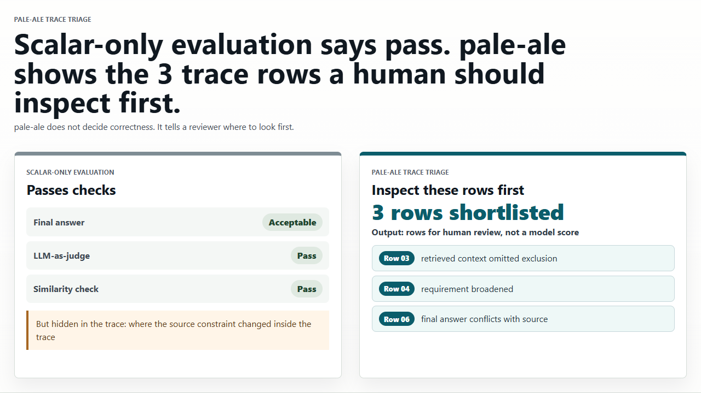

# pale-ale

**pale-ale is a public-facing research sandbox for structural approaches to local observation, consistency, and learned systems.**

Its current public checkpoints are LLM-centered. The Gate12A line is a frozen
FP32 dense-transformer replay regime used to test one narrow part of a broader
structural research program through structural replay evidence and boundary
cases. The Gate12B line adds a bounded source-facing audit over existing replay
artifact surfaces.

## First-Contact Demo

If you are evaluating whether pale-ale could be useful for LLM, agent,
red-team, or evaluation-trace workflows, start here:

- [Open the live Trace Triage demo](https://pale-ale-trace-triage.vercel.app/)
  ([source](apps/trace-triage-demo/README.md))

  Static one-glance Trace Triage demo. It shows a synthetic policy/RAG/evaluation
  trace where scalar-only checks pass while pale-ale-style triage shortlists the
  trace rows a human should inspect first.

  

The demo is intentionally bounded. It is not a benchmark, correctness
classifier, model-quality score, deception detector, or claim about model
internals. It is a first-contact demo, not a replacement for the bounded
Gate12A/Gate12B reports.

## Current Citable Releases

| Surface | DOI | Role | When to cite |
| --- | --- | --- | --- |
| Gate12A frozen technical report | [10.5281/zenodo.19483162](https://doi.org/10.5281/zenodo.19483162) | Main April 2026 frozen FP32 dense-transformer technical report and release bundle. | Cite for the current frozen Gate12A paper/release surface and its selected manifest/checksum bundle. |
| Transport-first telemetry note | [10.5281/zenodo.19569052](https://doi.org/10.5281/zenodo.19569052) | Mathematical telemetry note associated with the Gate12A line; not a revision of the empirical report. | Cite for the transport-first closure-defect formulation. |
| Gate12B observer-relative closure signatures | [10.5281/zenodo.20080003](https://doi.org/10.5281/zenodo.20080003) | Bounded source-facing audit of existing Gate12A/Gate12B replay artifacts and manifest-level Gate12B evidence package. | Cite for the Gate12B archive-family closure-signature report and its compact evidence manifest. |
| Earlier checkpoint / prior release surface | [10.5281/zenodo.19340221](https://doi.org/10.5281/zenodo.19340221) | Earlier replication checkpoint / prior release surface. | Cite only when referring to that earlier checkpoint record or comparing release surfaces. |

## About

This repo is organized around a staged research line.

- **Gate** means a named checkpoint in the line: what is established, what is open, and what is still denied
- **Workstream** means the numbered tracked memory that records how the line moved from one checkpoint to the next
- the current paper-facing surface is Gate12A, not the entire historical repo at once

This repo is a public-facing experimental surface for a broader structural research program. Its public scope is intentionally narrower than that broader canvas: the checkpoints tracked here are currently framed around LLMs and related learned-system artifacts unless they are explicitly widened. Public claims are intentionally checkpointed narrowly.

If you want the plain-language orientation first, go to [`ABOUT/`](ABOUT/README.md).

## If You Are Here For...

### The current report and artifacts

- [`zenodo-release/README.txt`](zenodo-release/README.txt)
- [`zenodo-release/CHECKSUMS-SHA256.txt`](zenodo-release/CHECKSUMS-SHA256.txt)
- [`zenodo-release-transport-first-defect-telemetry/README.txt`](zenodo-release-transport-first-defect-telemetry/README.txt)
- [`zenodo-release-gate12b-observer-relative-closure-signatures/README.txt`](zenodo-release-gate12b-observer-relative-closure-signatures/README.txt)
- [`docs/reproduce_gate12a.md`](docs/reproduce_gate12a.md)
- [`docs/gate12a_evidence_atlas.md`](docs/gate12a_evidence_atlas.md)
- [`docs/eval_factory_operator_guide.md`](docs/eval_factory_operator_guide.md)
- [`docs/l4_smoke_runbook.md`](docs/l4_smoke_runbook.md)
- [`workstream/213_GATE12A_SINGLE_GPU_FP32_DENSE_TRANSFORMER_TECHNICAL_REPORT_DRAFT.md`](workstream/213_GATE12A_SINGLE_GPU_FP32_DENSE_TRANSFORMER_TECHNICAL_REPORT_DRAFT.md)
- [`workstream/214_GATE12A_FROZEN_PROTOCOL_EXCLUSION_AND_NON_TRANSFORMER_SIDECAR_MEMO.md`](workstream/214_GATE12A_FROZEN_PROTOCOL_EXCLUSION_AND_NON_TRANSFORMER_SIDECAR_MEMO.md)
- [`tools/`](tools/)

### A human-readable explanation of the repo

- [`ABOUT/README.md`](ABOUT/README.md)
- [`ABOUT/WHAT_THIS_REPO_IS.md`](ABOUT/WHAT_THIS_REPO_IS.md)
- [`ABOUT/WORKSTREAM_AND_GATES.md`](ABOUT/WORKSTREAM_AND_GATES.md)
- [`ABOUT/RELEASES_AND_ARTIFACTS.md`](ABOUT/RELEASES_AND_ARTIFACTS.md)
- [`ABOUT/FORWARD_DIRECTIONS.md`](ABOUT/FORWARD_DIRECTIONS.md)

### The full tracked research memory

- [`workstream/README.md`](workstream/README.md)

### The first-contact trace triage demo

- [Live Trace Triage demo](https://pale-ale-trace-triage.vercel.app/)
- [`apps/trace-triage-demo/`](apps/trace-triage-demo/README.md)
- [`docs/demo/trace-triage/`](docs/demo/trace-triage/README.md)

## Current Release Shape

The intended frozen release surface for the Gate12A report is:

- `paper.pdf`
- paper source (`main.tex`, bibliography, figure source)
- manifest and checksum material
- a frozen implementation snapshot
- artifact bundles or stable links to those bundles

The repo is being shaped so that this release surface is easy to find and does not require reconstructing the entire workstream history first.

## Repo Map

- [`ABOUT/`](ABOUT/README.md): human-facing explanation and release guidance
- [`workstream/`](workstream/README.md): numbered tracked research memory
- [`zenodo-release/`](zenodo-release/README.txt): frozen Gate12A paper release bundle and checksum surface
- [`zenodo-release-transport-first-defect-telemetry/`](zenodo-release-transport-first-defect-telemetry/README.txt): formal telemetry-note release bundle
- [`zenodo-release-gate12b-observer-relative-closure-signatures/`](zenodo-release-gate12b-observer-relative-closure-signatures/README.txt): Gate12B bounded technical report release package
- `runs/`: local/generated working outputs; not the tracked public evidence surface
- [`apps/trace-triage-demo/`](apps/trace-triage-demo/README.md): static first-contact Trace Triage demo
- [`tools/`](tools/): current narrow Python-side runner and audit surface
- [`src/`](src/) and [`crates/`](crates/): retained implementation and infrastructure
- [`docs/`](docs/) and [`specs/`](specs/): longer-form design and specification material

## Scope

The current public claim surface is intentionally narrow relative to the broader research canvas:

- study local observation, replay, transport, closure, and boundary behavior under declared surfaces
- use LLMs as the current public sandbox rather than as the final scientific boundary
- keep current empirical claims narrower than the surrounding mathematical ambition
- use current checkpoints as testbeds rather than as a final ontology
- separate frozen report surfaces from broader exploratory directions
- avoid letting future extensions silently rewrite current evidence

Future mathematical and empirical directions are visible in [`ABOUT/FORWARD_DIRECTIONS.md`](ABOUT/FORWARD_DIRECTIONS.md), but they are not treated as already-earned results.
