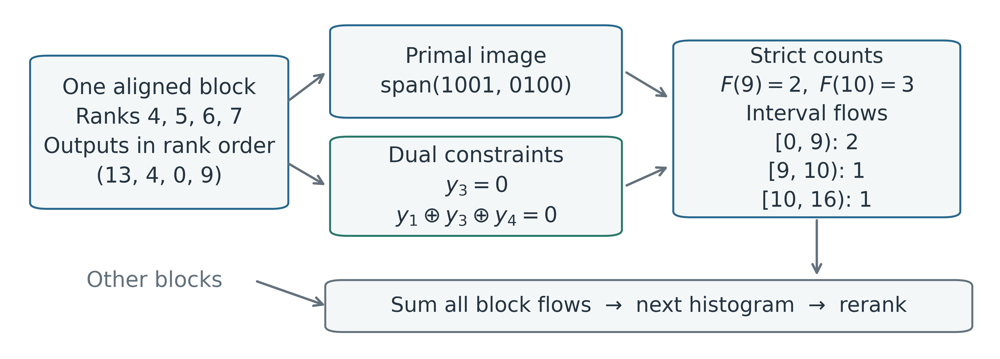
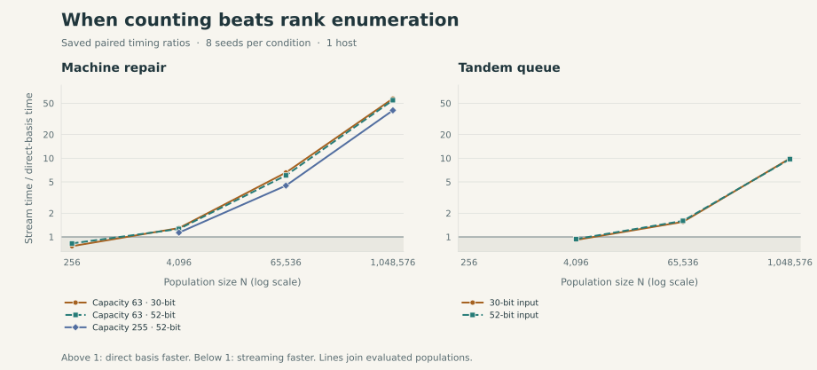
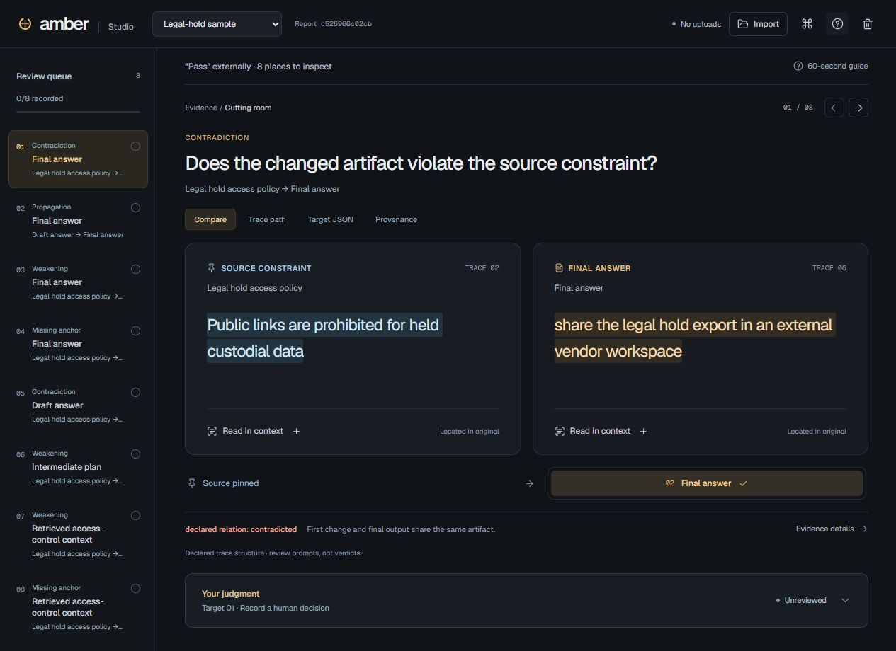

<picture>
  <source media="(prefers-color-scheme: dark)" srcset="docs/assets/readme/header-dark.svg">
  <source media="(prefers-color-scheme: light)" srcset="docs/assets/readme/header-light.svg">
  
</picture>

**Exact stochastic simulation. Reproducible studies of learned systems.**

Research and software by **Aoi Kawasaki** on how computational representations
determine what we can preserve, measure, and execute efficiently. This repository
connects papers, computational companions, and interactive work.

[Latest paper](#exact-state-ranked-array-rqmc) ·
[Reproduce a result](#reproduce-a-result) ·
[Publications](publications/README.md) ·
[Technical reports](#technical-reports) ·
[Amber](#amber)

| Selected work | Explore |
| --- | --- |
| **Exact State-Ranked Array-RQMC** — execute the same ranked population through algebraic counts; compare the representations and their costs. | [Read the paper](publications/exact-state-ranked-array-rqmc/zenodo/implicit-array-rqmc.pdf) · [Reproduce](#reproduce-a-result) |
| **Amber** — follow the evidence behind an agent's answer, inspect what changed, and record a human decision. | [Open Amber](https://amber-oversight.vercel.app/) · [Try Studio](https://amber-oversight.vercel.app/studio?sample=legal-hold) |

## Exact State-Ranked Array-RQMC

### Execute a reranked population without visiting every particle

*Exact State-Ranked Array-RQMC: Representations and Shared Work* — October 2026.
**Submitted to Monte Carlo Methods and Applications (MCMA).**
The public version is an author preprint, not yet peer reviewed.

[**Read the paper · 20 pages**](publications/exact-state-ranked-array-rqmc/zenodo/implicit-array-rqmc.pdf) ·
[Supplement · 6 pages](publications/exact-state-ranked-array-rqmc/zenodo/retained-studies.pdf) ·
[DOI](https://doi.org/10.5281/zenodo.23166655) ·
[Code and reproduction](papers/exact-state-ranked-array-rqmc/README.md) ·
[Download companion v1.0.0](https://github.com/Udonburo/pale-ale/releases/download/exact-state-ranked-array-rqmc-v1.0.0/array-rqmc-repro-20261006.zip)

Array randomized quasi-Monte Carlo (Array-RQMC) repeatedly sorts a population
of simulated states and assigns inputs by rank. Equal states can receive
different inputs, so updating one representative and multiplying its count
does not generally reproduce the population.

The paper counts exactly how many rank-assigned inputs send each state to
each destination, then rebuilds the next rank intervals from those counts.
When complete states repeat and transitions have short finite-word input
interval partitions, this closes the update without enumerating every particle.
**The realized histogram path and supported readouts stay the same.**

<details>
<summary>See the exact update in a four-rank example</summary>



*One block, two exact representations. The four inputs in this worked example
produce interval counts of 2, 1, and 1. Both counters feed the same population
update; Section 3 of the [paper source](papers/exact-state-ranked-array-rqmc/main.md)
develops the construction.*

</details>

### What the paper adds

- **An exact execution method.** Primal image-basis and dual constraint counters
  connect algebraic counting to dynamic population updates, including reranking.
- **An account of shared work.** Under conditionally uniform shifts, overlap
  among query prefixes determines the dual counter's exact expected transformation
  demand. The analysis connects that demand to the cost of transforming retained
  coefficients and resolving occupied-state rank boundaries.
- **A measured implementation choice.** Six compiled executors use the same
  repair and tandem inputs and return every step's histogram and readout.
  The comparison separates interval decomposition, coefficient retention,
  and the benefit of avoiding rank enumeration.

Preserving a realization matters when studying the error distribution of a
finite-population estimator. A one-chain dynamic program may supply its
reference mean; exact population execution supplies realizations of the coupled
estimator around that mean. Section S4 of the
[supplement](papers/exact-state-ranked-array-rqmc/retained_studies.md)
shows this distinction.

### What the measurements say

<picture>
  <source media="(prefers-color-scheme: dark)" srcset="docs/assets/readme/crossover-dark.svg">
  <source media="(prefers-color-scheme: light)" srcset="docs/assets/readme/crossover-light.svg">
  
</picture>

<details>
<summary>Exact values at 1,048,576 particles (2²⁰)</summary>

| Model | Simulated updates | Direct-basis trajectory time | Compact stream / direct basis |
| --- | --- | --- | --- |
| Machine repair | 100 | 8.63–10.76 ms | 40.6–57.3× |
| Tandem queue | 200 | 91.48–94.84 ms | 9.75–9.95× |

</details>

The chart uses all 17 saved ratios from [Table 2](papers/exact-state-ranked-array-rqmc/tables/primal_dual_times.md),
with **eight independent seeds per cell on one non-isolated host**. The expanded
table shows the largest-population conditions. Times are
medians of seed medians; speed ratios are calculated within each seed before
taking their median. Each seed has five technical timing repeats. The workload
includes every step's histogram and readout.

Across all 17 measured conditions, median within-seed ratios favor direct
basis over the other non-enumerating executors. Dual coefficient retention
improves on matched reconstruction by factors of 1.055–1.201. Compact streaming
wins in the smallest-population conditions. The shared-work analysis explains
transformation demand; the full comparison establishes which implementation
was faster in these workloads.

[Seed-level comparisons](papers/exact-state-ranked-array-rqmc/figures/primal_dual_pairs.png) ·
[Study design and six methods](papers/exact-state-ranked-array-rqmc/review_checks/primal_dual/README.md) ·
[Publication record and citation](publications/exact-state-ranked-array-rqmc/README.md)

## Amber

### Follow the evidence behind an agent's answer

[**Open Amber**](https://amber-oversight.vercel.app/) ·
[Try the Studio sample](https://amber-oversight.vercel.app/studio?sample=legal-hold)

Amber is a browser-based workspace for reviewing structured agent traces.
Compare a declared source constraint with an output, follow the evidence path,
and open the original context. A review queue connects each question to the
evidence you can inspect; the decision stays with the reviewer.

Trace, report, and saved-review files are processed in the browser. Review
decisions can be exported separately from the original report. The public app
includes bundled examples to explore the workflow before opening your own file.

[](https://amber-oversight.vercel.app/)

<details>
<summary>Inside Studio: the review queue, evidence comparison, and decision channel</summary>

[](https://amber-oversight.vercel.app/studio?sample=legal-hold)

</details>

*Screenshots of the public app, 8 October 2026. The examples are illustrative.*

## Reproduce a result

### Start with the Array-RQMC companion

Download the [fixed v1.0.0 ZIP](https://github.com/Udonburo/pale-ale/releases/download/exact-state-ranked-array-rqmc-v1.0.0/array-rqmc-repro-20261006.zip),
extract it into an empty directory, and run these commands from the extracted
companion directory using **Python 3.11**:

```sh
python -m pip install -r requirements.txt
python verify_public.py
python reproduce_review.py --quick --skip-pdf
```

This checks the package, exact counting, model domains, saved trajectories,
conditional workloads, and regenerated numerical results. It includes
**102 corrected-wrapper trajectories** and a **12-trajectory sample of the
measured source**. It does not collect new performance timings.

The companion retains all **4,080 original timing observations**, the source
that produced them, 136 saved population realizations, fixed input matrices,
and the manuscript build inputs. The
[full reproduction guide](papers/exact-state-ranked-array-rqmc/README.md#reproduce)
covers all 816 measured-source method trajectories and PDF regeneration.
The [release verification](publications/exact-state-ranked-array-rqmc/verification.json)
records a separate extraction's successful quick replay and byte-identical
PDF builds on the specified Windows environment.

### Other studies

| Result | Reproduction entry point |
| --- | --- |
| Exact binary projections for Array-RQMC | [19 tests, three kernels, saved-data regeneration](papers/binary-array-rqmc/repro/README.md) |
| FP32 structural replay | [Reproduction guide](docs/reproduce_gate12a.md) · [Evidence atlas](docs/gate12a_evidence_atlas.md) |
| Other papers and notes | [Publication catalog](publications/README.md), with each study's archive and dependencies |

Published releases retain their original bytes. Use the release associated
with the paper when reproducing an archived result; working documentation
can continue to evolve. The local publication catalog can be checked with
`python publications/validate_catalog.py`.

## Research across the repository

Two research lines connect the published work: **exact representations for
stochastic computation**, and **what structural measurements of learned systems
can establish**. Each paper states and tests its own claim.

<details>
<summary>Browse all eight papers and notes · April–October 2026</summary>

| Study | Question and result |
| --- | --- |
| [Exact State-Ranked Array-RQMC](publications/exact-state-ranked-array-rqmc/README.md) · Oct 2026 | Propagate the same ranked population through primal or dual counts; analyze shared work and compare six executors. |
| [Exact Binary Projections for Array-RQMC](publications/binary-array-rqmc/README.md) · Sep 2026 | Generate the consumed joint binary law directly and maintain state order while preserving finite-seed paths. |
| [Sensitivity Without Reproducibility](publications/sensitivity-without-reproducibility/README.md) · Aug 2026 | Separate positive-control sensitivity from reproducibility under fresh estimation of a representation instrument. |
| [Local Mapping Without Iterative Closure](publications/local-mapping-without-iterative-closure/README.md) · Aug 2026 | Test the boundary between input-output demonstrations and bounded iterative Graph-XOR capability in Qwen3. |
| [Compression-Interleaved Parenthesization Defects](publications/compression-interleaved-parenthesization-defects/README.md) · Jul 2026 | Report a predeclared null test across 24 replay-artifact-graph endpoints. |
| [Observer-Relative Closure Signatures](publications/observer-relative-closure-signatures/README.md) · May 2026 | Audit the information available from declared observation surfaces on existing replay artifacts. |
| [Transport-First Defect Telemetry](publications/transport-first-defect-telemetry/README.md) · Apr 2026 | Formulate transport and closure inconsistency mathematically. |
| [Structural Replay Under FP32](publications/structural-replay-fp32/README.md) · Apr 2026 | Establish replay evidence under a fixed precision and execution regime. |

</details>

Use the [publication catalog](publications/README.md) for DOIs and archived
versions. Cite the paper supporting the result you use;
[citation metadata](CITATION.cff) identifies the individual records.

## Technical reports

Closed repository studies retain their negative results and verification paths.

- **[CRD: controlled calibration and a negative acquisition test](analysis/crd/TECHNICAL_REPORT.md).**
  Calibration succeeded in a constructed system; no primary seed met local
  action acquisition in the fixed 242-seed successor study.
  [Aggregate data and verification](analysis/crd/README.md).
- **[Gate12C-2: synthetic development negative](analysis/gate12c2_v2_balanced_prototype/TECHNICAL_REPORT.md).**
  The candidate failed its quantitative stability criterion, and the bounded
  repair was insufficient. The real held-out evaluation remained unopened.
  [Closure record and retained implementation](docs/reference/gate12c2_control_plane_sunset.md).

## Navigate the repository

| Location | Start here for |
| --- | --- |
| [publications/](publications/README.md) | Citable records, distribution links, and exact archive packages. |
| [papers/](papers/) | Manuscript sources and paper-specific computational companions. |
| [analysis/](analysis/) · [docs/](docs/) | Technical reports, verification notes, and reproduction guides. |
| [tools/](tools/) · [src/](src/) · [crates/](crates/) | Research utilities and Python/Rust implementations. |
| [apps/](apps/) | Retained prototypes, including the earlier static Trace Triage demo. The current Amber app is linked above. |
| [ABOUT/](ABOUT/README.md) · [workstream/](workstream/README.md) | Project orientation and numbered research history. |

## License

Repository software is [MPL-2.0](LICENSE). The current Array-RQMC companion
uses **CC BY 4.0 for publication materials and author-created saved data**, and
**MPL-2.0 for code**. See its [per-file scope](papers/exact-state-ranked-array-rqmc/LICENSES.txt).
Other publications and third-party artifacts retain their accompanying terms.
