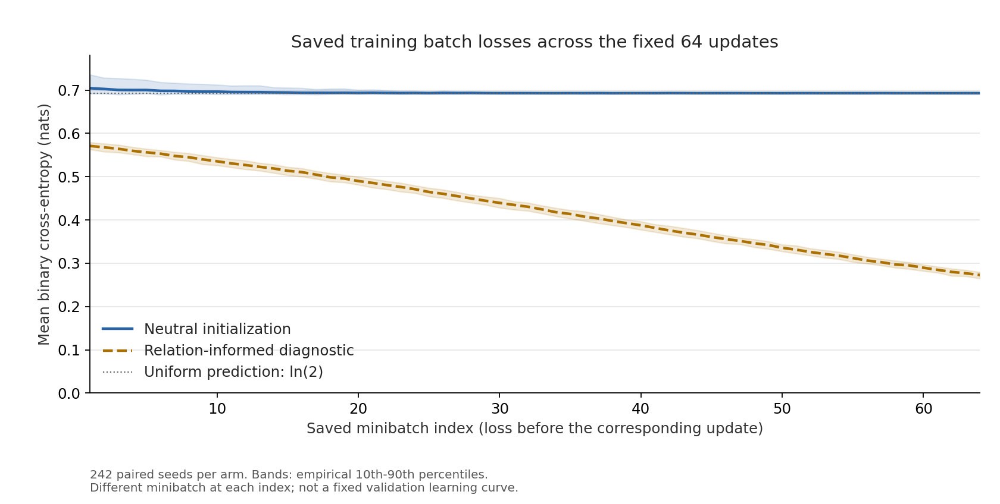

# Controlled calibration and a negative action-acquisition test

CRD-01 and CRD-02 in an explicit two-state learned system

Date: 2026-09-07

Status: completed studies; repository technical report, not a standalone DOI release

## Technical summary

**A controlled path-order measurement can be successfully calibrated without
establishing that a less constrained learner will acquire the intended local
actions from final task labels.** CRD-01 calibrated that measurement in a
deliberately commuting transition family. CRD-02 removed transition tying and
relation-oriented transition initialization, retained a transparent two-state
carrier, and tested acquisition after a fixed 64-update training schedule.
None of its 242 primary seeds met the local acquisition, finite-behavior, or
assay qualification conditions. All components were measured: the negative
result did not leave a downstream scientific stage unopened.

A mandatory relation-informed diagnostic improved to about 3% median local
action error but failed the longer behavioral tests. Saved kernels explain
this long-horizon failure through contraction of register distinctions.
An even-length-only training ambiguity is also present, but the primary
learners did not reach either the canonical action or the explicit alias
examined here. The optimization mechanism behind failed acquisition remains
unresolved. These are bounded calibration and acquisition results, not a
general impossibility result or evidence about spontaneous structure in
opaque models.

## 1. The measurement and the learning question are distinct

CRD denotes *Coherent Representation Descent*. Both studies use column-stochastic
binary kernels, the register-swap matrix $P$, and a learned decoder $D$:

$$
K_x=\begin{pmatrix}a_x&b_x\\1-a_x&1-b_x\end{pmatrix},\qquad
P=\begin{pmatrix}0&1\\1&0\end{pmatrix},\qquad
D=\begin{pmatrix}d_0&d_1\\1-d_0&1-d_1\end{pmatrix}.
$$

For an input word $w=(x_1,\ldots,x_L)$ and initial register $r_0$, the
prediction is $DK_{x_L}\cdots K_{x_1}e_{r_0}$ and the target is
$r_0\oplus\operatorname{parity}(w)$. The canonical actions are $K_0=I$ and
$K_1=P$. The decoder is learned, not a hardwired output-register identity.
In the core measured model, the two-entry register distribution is the complete
downstream-relevant state; there is no additional hidden memory or shortcut channel.

For a fixed suffix, let $G$ be its transition product followed by $D$.
The measurement retains the full ordered path packet and its defect:

$$
(GKP,\;GPK),\qquad \mathcal D(K)=G(KP-PK),\qquad
\phi(\mathcal D)=\tfrac12\max_r\sum_y|\mathcal D_{yr}|.
$$

These compare flip-before-transition with flip-after-transition. The same
suffix, decoder, context, and model bytes are used for both orders and matched
controls. Explicit basis-state queries for both register states return full
probability vectors; naturally visited states alone are not used to identify
the columns. The estimator is assignment-metadata-blinded, not
response-value-blinded, and its outputs are sealed before the assignment join.

CRD-01 uses the architecturally commuting family
$K(a)=\left(\begin{smallmatrix}a&1-a\\1-a&a\end{smallmatrix}\right)$.
At a designated local cell, the intervention
$K^\delta=(1-\delta)K(a)+\delta Q_0$, with
$Q_0=\left(\begin{smallmatrix}1&1\\0&0\end{smallmatrix}\right)$, gives

$$
K^\delta P-PK^\delta=
\delta\begin{pmatrix}1&1\\-1&-1\end{pmatrix},\qquad
\phi_{\rm BREAK}=\delta\,d_{\rm TV}(G_{\cdot0},G_{\cdot1}).
$$

Analytic commuting controls match balanced one-step risk or the intervention's
kernel-space Frobenius displacement. The risk control is $K(b)$ with
$b=(1-\delta)a+\delta/2$; the norm control fixes
$c=a+s\delta\sqrt{\{a^2+(1-a)^2\}/2}$, with $s=+1$ for $a\le1/2$ and
$s=-1$ otherwise. Both remain stochastic for the tested doses
$\delta\in\{1/8,1/4,1/2\}$ and have zero path-order defect. Their coefficients
are not fitted to observed outcomes. Wrong-cell and unexposed-cell controls
also test intervention specificity.

Positive qualification contrasts subtract the matched control's mean $\phi$
from the BREAK mean over the prescribed context ledger. They are path-order
contrasts, not changes in ordinary task loss.

In CRD-02, raw learned actions are measured first. Only the later assay
constructs a commuting base $\Pi(K_1)=(K_1+PK_1P)/2$ and its intervention
siblings; suffix transitions and the decoder remain learned. This projection
does **not** replace the raw kernels used to score acquisition. Assay success
would show transmission and recovery of a constructed defect, not discovery
of spontaneous commutation.

## 2. CRD-02 changes transition provenance under a fixed training budget

The primary model has six trainable logits: four independent transition
probabilities and two decoder probabilities, all obtained by sigmoid. No
transition tying, commutator loss, local-action label, or hidden-state target
is used. Primary transition initialization uses a complement-symmetric finite
grid strictly inside $(0.25,0.75)$. The common decoder starts near probabilities
$(0.9,0.1)$, anchoring output orientation; the whole system is not prior-free.

Each seed has 16,384 final-label training records, 4,096 at each length
4, 8, 12, and 16. Words, their complements, and both initial registers supply
the declared balances. Both arms use binary64 Adam, learning rate 0.02,
$(\beta_1,\beta_2)=(0.9,0.999)$, epsilon $10^{-8}$, zero initial moments and
weight decay, batch size 256, and exactly one pass of 64 updates. No outcome-based
extension, checkpoint choice, threshold change, or hyperparameter search is
part of the result.

The relation-informed arm starts its untied transitions near I/P. It uses
the same seed-specific records, order, and decoder initialization, and runs
only after primary models, responses, and estimator outputs are sealed.
It is a diagnostic, not an alternative primary arm that can rescue failure.
Both arms retain the same explicit carrier and intervention access.

CRD-01 and CRD-02 are separate studies, not a paired two-arm experiment.
Transition parameterization and transition initialization both change between
them. Their differing outcomes do not isolate either change's causal effect.
Within CRD-02, the paired initialization diagnostic also changes both action
orientation and information retention.

## 3. Calibration passed; the acquisition study completed with a negative result

For CRD-01, all 228 registered endpoints met their fixed margins in all
242 seeds. Every endpoint passed its criterion of at least 233 successes.
The smallest positive contrast was 0.083975, versus a strict 0.030 floor;
scalar nulls were exactly zero and the largest signed recovery residual was
$4.3043\times10^{-16}$. Under the declared i.i.d. uniform seed-ticket model,
the one-sided lower bound for each endpoint's success probability is about
0.9658, using a Bonferroni-adjusted 0.05 familywise error budget over 228
endpoints. This exceeds the 0.90 target. The model is an operational
assumption, not a mathematical guarantee supplied by the random-number API.
The power alternative of 0.99 was not thereby established as an empirical
coverage claim.

CRD-02 instead uses **one seed-level joint event**, not 228 separate population
tests. Let $e_{\rm act}=\max_{x,r}d_{\rm TV}(K_xe_r,P^xe_r)$ and
$e_D=\max_r d_{\rm TV}(De_r,e_r)$. Its prespecified outcomes are:

| Component | Fixed seed-level condition | Primary seeds meeting it |
|---|---|---:|
| Local acquisition, A | Post action error ≤0.05, decoder error ≤0.05, pre/post action improvement ≥0.20 | 0/242 |
| Finite behavior, F | Worst target-probability error ≤0.25 separately at every evaluated length | 0/242 |
| Assay, V | All 24 positive contrasts >0.030, all 52 scalar nulls <0.010, all 152 absolute signed residuals <0.010 | 0/242 |
| Primary joint event, B | A and F and V within the same seed | 0/242 |
| Uniform length-32 certificate, C | Post action error ≤0.00625 and decoder error ≤0.05; descriptive only | 0/242 |

Only B receives the population test: at least 226 successes out of 242 are
required to qualify coverage above 0.90. Counts for A/F/V/C are not separate
population claims, and observing zero successes is not a proof of zero
population probability. The stronger C condition cannot alter primary B.
It gives the worst-case bound $32e_{\rm act}+e_D\le0.25$, rather than replacing
the observed finite-ledger assessment.

The behavioral ledger contains 3,702 records per arm at lengths
0, 1, 3, 4, 5, 8, 9, 12, 16, 17, and 32. Lengths through 9 in this set are
exhaustive; each of 12/16/17/32 contains 512 prescribed records. Only
0/1/3/5/9/17/32 are held out **by length**. Trained-length inputs can overlap
training data. Longer-length results are finite-ledger results, not exhaustive
guarantees over all words.

The run completed all 1,710 chunks and 93,568 queries per seed. All continuous
values, failure reasons, length strata, and diagnostic results were retained.
The terminal was `CRD_02_NO_LOCAL_ACTION_ACQUISITION_DETECTED`, not an unopened
or incomplete scientific stage. Documented storage and diagnostic-record
projection repairs preserved existing values and the prior stopping history;
they did not add a draw, training run, model query, or unblinding.

## 4. The primary failure was not a near miss at the action threshold

The primary arm's smallest post-training action error was 0.18190 and its
smallest decoder error was 0.07983, both above 0.05. The typical final loss
window remained near the uniform-prediction loss $\log 2$.

| Quantity; median across 242 seeds | Primary | Relation-informed diagnostic |
|---|---:|---:|
| Mean loss over the first 8 minibatches, nats | 0.70083 | 0.55812 |
| Mean loss over the last 8 minibatches, nats | 0.69324 | 0.28720 |
| Pre-training action error | 0.68465 | 0.10064 |
| Post-training action error | 0.60996 | 0.02914 |
| Post-training decoder error | 0.12931 | 0.03183 |
| Post-training maximum register-retention factor $\rho$ | 0.25003 | 0.94282 |

For each loss row, the eight-minibatch mean is formed within a seed before
taking the seed median. Here $\rho=\max_x|a_x-b_x|$ measures the largest
one-step retention of a register distinction. These medians describe separate
distributions; combining them does not construct a representative real seed.

The figure shows the seed median at each of 64 saved minibatches, with empirical
10th–90th percentile bands. Each value is evaluated before its corresponding
update on a different minibatch. This is **not** a fixed-validation learning
curve, and the bands are not confidence intervals. The diagnostic's falling
loss demonstrates improvement from a favorable starting point, not acquisition
from the primary initialization. All 242 diagnostics met their local
competence condition, which does not require A's 0.20 improvement; none met
the complete finite-behavior condition.

## 5. Saved kernels explain long-horizon attenuation, not its training cause

Set $\lambda_x=a_x-b_x$ and $\eta=d_0-d_1$. Then
$K_x(1,-1)^T=\lambda_x(1,-1)^T$. For a word containing $n_0$ zeros and
$n_1$ ones, averaging target-probability error over its two initial registers
cancels the affine bias terms and gives

$$
\bar e(w)=\frac{1-(-1)^{n_1}\eta\lambda_0^{n_0}\lambda_1^{n_1}}{2}.
$$

Both initial registers occur for every one of the 1,851 evaluated words.
The largest pair-average error within a length therefore lower-bounds that
length's observed worst error. The relation-informed diagnostic illustrates
how local competence can coexist with poor long-horizon behavior:

| Length | Median observed worst error | Median kernel-derived lower bound | Seeds with worst error ≤0.25 |
|---:|---:|---:|---:|
| 9 | 0.22747 | 0.22655 | 242/242 |
| 12 | 0.27196 | 0.27108 | 0/242 |
| 32 | 0.43159 | 0.43042 | 0/242 |

At length 12, even the smallest seed-specific lower bound is 0.26768,
already above 0.25. These are constraints calculated from each saved kernel,
not causal explanations of why Adam reached that kernel. Primary initialization
has $|\lambda_x|<0.5$: label symmetry does not mean neutrality about retaining
information. The relation-informed comparison cannot isolate correct
orientation from favorable retention.

The same contraction reaches the assay. For its suffix word $u$,

$$
\gamma(u)=|\eta|\prod_{x\in u}|\lambda_x|,\qquad
\phi_{\rm BREAK}(u)=\delta\gamma(u),\qquad\phi_{\rm COMM}(u)=0.
$$

The full assay lengths 16/32 use suffixes of 8/16 steps. Median seed-level
mean $\gamma$ is $3.459\times10^{-7}$ and $2.383\times10^{-13}$,
respectively. At dose 0.125 the fixed floor requires mean $\gamma>0.24$.
All 5,808 positive contrasts fell below the floor; even the largest was
0.015511. All 12,584 scalar nulls were zero and the largest of 36,784 absolute
signed residuals was $2.5674\times10^{-16}$.

The saved-data postmortem reconstructed BREAK means as
$\delta\operatorname{mean}(\gamma)$ with maximum absolute discrepancy
$2.996\times10^{-16}$. Extremely small algebraic signals can lie below
output-subtraction precision; this is not relative-accuracy evidence at those
scales. **Numerical recovery consistency does not make the assay qualified.**
V failed because the learned suffix did not transmit sufficient positive
signal. Conversely, this valid control failure is not evidence of estimator
corruption, and it does not erase A's direct basis measurements.

## 6. Even-length ambiguity is real, but does not explain away the result

The canonical pair I/P and the alias P/I produce the same transition product
on every even-length word: with $n$ ones their products are $P^n$ and
$P^{L-n}=P^LP^n$. Thus the training lengths cannot identify their orientation
even with the same decoder. Odd-length evaluation detects that distinction;
it does not add missing training supervision.

However, the smallest primary distance to this alias was 0.18846, above 0.05.
The primary did not merely learn this alternative and receive the wrong score.
This example does not classify every equivalent parameterization.

Intermediate parameters and gradients were not saved. Gradient starvation,
bias correction, optimizer dynamics, or a different training budget remain
questions rather than established causes. Adding odd lengths or shorter
sequences would change the learning signal; even a mean-length-matched change
would not isolate identifiability from attenuation. No such follow-up is
reported here.

## 7. Consequence and evidence availability

Both studies are scientifically closed. CRD-01 remains a controlled
calibration result; CRD-02 remains a negative result under its fixed carrier,
initialization, supervision, ledgers, and budget. No same-condition rerun or
threshold rescue is indicated. Additional acquisition exploration is parked.
Neither result establishes the efficacy of a subsequent coupling method, nor
does this report claim a new general theory of parity learning or contraction.

[Report data and verification notes](README.md) accompany the report, including
a compact [aggregate snapshot](report_data.json), the unchanged saved figure,
and a read-only extraction/checking script. They support inspection of the
reported numbers; they are **not a complete public reproduction package**.
The sealed run databases, full query records, protocols, and training-source
dependencies remain outside this report package. Their release or DOI deposit
is deferred. The acquisition result is closed independently of that publication
decision and of the remaining CRD-02 off-site preservation work.

The underlying postmortem checked 484 saved training chunks, parameter-to-metric
agreement (maximum absolute difference $5.552\times10^{-17}$), the BREAK
identity, and behavioral lower bounds across both arms. Report preparation
re-extracted selected aggregates and recomputed the primary flags from sealed
metric exports. It did not rerun training, model forward/query execution,
unblinding, or a full database audit. Source identities, verification scope,
and the boundary between prospective results and post-hoc interpretation are
recorded in the accompanying notes.
