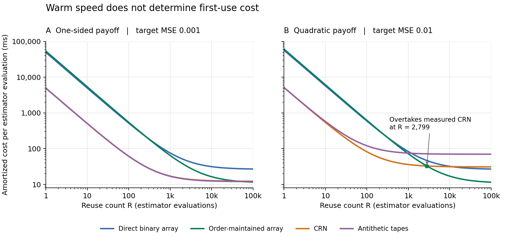

# Exact Binary Projections for Array-RQMC: Joint Laws and Pathwise-Preserving Execution

Aoi Kawasaki  
Preprint - 25 September 2026

## Abstract

Array randomized quasi-Monte Carlo (Array-RQMC) assigns randomized points to simulated states at each step. We characterize the joint binary law obtained from a specified two-dimensional Sobol net with linear matrix scrambling and a digital shift, after sorting by the first coordinate and thresholding the second at one half. For $N=2^m$ with $1\le m\le30$, the complete rank-ordered vector is uniform over $N$ affine binary patterns and can be generated from $m$ independent fair bits. An exact stopped-chain example shows that replacing this law by independently randomized adjacent-rank pairs can change the variance of an array-average payoff despite identical one-step sign covariances. Direct sampling removes coordinate construction and point sorting while preserving the joint trajectory law under the stated ideal randomization. A second algorithm exploits nondecreasing binary transition branches to maintain the exact state order, including absorption and floating-point ties, preserving trajectories and outputs for the same finite seed. Across eight fixed benchmark cases on one CPU and software stack, order maintenance reduced warm execution time by 37.2% at 512 paths and 67.5% at 4,096 paths relative to direct generation with full sorting. Together, the two results identify a smaller executable representation of a specified stochastic computation and show how to exploit it without changing the estimator.

## 1. Introduction: the law consumed by the simulator

Quasi-Monte Carlo (QMC) estimates an integral by averaging the integrand over points designed to cover the unit cube evenly. Sobol' sequences are base-two digital sequences: their coordinates are constructed from binary digits, and their first $N=2^m$ points form a digital net with balance properties over binary subdivisions of the cube. Randomized QMC (RQMC) randomizes this construction while retaining useful uniformity properties; independent randomizations provide repeated estimates from which variability can be assessed [1, 2].

Array-RQMC applies this idea to an array of simulated Markov-chain states [3]. At each step, a fresh randomized point set is matched to the current states, and the assigned coordinates drive their next transitions. In the scalar setting used here, states are sorted by value and points by a designated coordinate, then paired by rank; the remaining coordinates supply the transition inputs. This state-dependent matching aims to improve the approximation of the state distribution at successive steps.

A simulator need not consume all the information in these points. In the two-dimensional construction studied here, one coordinate orders the points and only the leading bit of the second drives each transition. We ask whether the resulting rank-ordered bits can be generated directly. Preserving their complete joint law guarantees equivalence for the same downstream computation, without relying on cancellations specific to a transition or payoff. Matching marginal laws or covariance alone gives no such general guarantee.

The answer is particularly simple for the specified Sobol construction with linear matrix scrambling and a digital shift: the entire binary vector is an affine function of the rank's binary digits, with random coefficients and a fair offset. Direct sampling removes coordinate construction and point sorting. A second simplification uses the two nondecreasing transition branches to update the state order by merging, preserving which sign reaches each label. The first result is an equality of randomized laws; the second is an equality of finite-seed executions. Their combination is the central contribution.

The contributions are:

1. An exact joint-law characterization and direct sampler for the consumed binary projection, with a stopped-chain counterexample showing what covariance alone misses.
2. A pathwise-preserving order-maintenance algorithm for stopped scalar binary chains, including absorption and floating-point tie repair.
3. A fixed-size execution-cost study, with original paired timing rows and a reanalysis script, and a separate cost-accounting case study for two accuracy targets.

Array-RQMC for stopped chains and unbiased estimation is established in [3]; mapping and sorting choices are studied in [4, 5]. Puchhammer, Ben Abdellah, and L'Ecuyer [6, Sections 4.1-4.2] describe constructions whose sorting coordinates are ordered in advance and whose transition coordinates alone are randomized. Our reference instead randomizes both coordinates and then sorts the points. The contribution is the joint binary law remaining after that randomization and sorting, and a direct sampler for that law. This distinguishes the result from the already established possibility of avoiding a point sort.

The algebra uses standard finite binary characters [1, 7], and merging ordered runs is a classical sorting technique [8]. Here the runs arise from the transition branches, and exact label order must survive stopping and new floating-point ties. The scalar binary setting complements broader Array-RQMC applications, including the multidimensional walk-on-spheres study of Ho and Owen [9]. The paper develops the input law in Section 3, the ordering algorithm in Section 4, and their fixed-size costs in Sections 5-6. Appendix C examines how implementation, calibration, and reuse affect comparisons at a fixed mean-squared-error target.

## 2. Simulation model and estimand

### 2.1 Stopped binary chains

We compare three processes, indexed by $j\in\{0,1,2\}$, starting from $X^j_0=0$. While a process remains active,

$$
X^j_{t+1}=\rho X^j_t+d+s_j\epsilon^j_t,
\qquad
\Pr(\epsilon^j_t=-1)=\Pr(\epsilon^j_t=+1)=\tfrac12.
$$

Along each individual path, fresh innovations have the independent fair-sign law. Dependence across processes and across simulated paths is determined by the sampling method.

A path stops at its first transition with $|X^j_t|\ge b$, or at the fixed horizon $T$. Its crossing state is retained; it is not clipped to the barrier. The terminal payoff is either

$$
f(x)=(x-K)_+
\quad\text{or}\quad
f(x)=x^2.
$$

The recorded response includes independent readout noise,

$$
Y_j=f(X^j_{\tau_j})+\xi_j,\qquad
\Pr(\xi_j=-1)=\Pr(\xi_j=+1)=\tfrac1{20},
\quad \Pr(\xi_j=0)=\tfrac{18}{20}.
$$

Thus $\mathbb E[\xi_j]=0$ and $\nu=\operatorname{Var}(\xi_j)=0.1$. Noise is independent for every process, path, and block. We retain it to preserve the declared noisy computation. Since its mean is known to be zero, an estimator of the same mean could instead average $f(X_{\tau_j}^j)$ alone. The accuracy comparisons in Appendix C concern the noise-retaining workload; they do not optimize over all estimators of the same mean. The preservation results also apply without this noise.

The target is the vector of all three pairwise mean differences,

$$
\Delta=H\mu,\qquad
H=
\begin{pmatrix}
-1&1&0\\
-1&0&1\\
0&-1&1
\end{pmatrix},
\qquad
\mu_j=\mathbb E[Y_j].
$$

We evaluate

$$
\mathcal E=\mathbb E\!\left[\|\widehat\Delta-\Delta\|_2^2\right].
$$

The three contrasts are linearly dependent. They define one aggregate loss, not three independent statistical endpoints.

Each block simulates $N$ paths per process. An **estimator evaluation** averages $k$ independently randomized blocks. With block index $\ell$ and original path label $i$, it computes

$$
\widehat\mu_j=\frac1{Nk}\sum_{\ell=1}^{k}\sum_{i=1}^{N}Y_{\ell,i,j},
\qquad \widehat\Delta=H\widehat\mu.
$$

Its **sampling configuration** is $(N,k)$. In the numerical study, $\mu$ is the expectation for the specified reference float64 transition and terminal-payoff maps under ideal randomization. Final averaging is interpreted mathematically. Bias relative to a real-arithmetic chain and rounding in final reductions are outside the reported error budget.

Under this convention the estimator is unbiased. For the array methods, a label's rank before a transition is determined by the past. The fresh offset bit in Proposition 1 is independent and fair, so its assigned sign is conditionally fair given that past. Each labeled path therefore has the prescribed Markov-chain marginal law. Bounded-horizon stopping and linear averaging preserve the mean for the integrable payoffs considered here. The CRN and antithetic-tape constructions also preserve each path's innovation law.

The MSE is consequently the sum of the contrast variances. The independent readout noise contributes

$$
\mathcal E_{\mathrm{noise}}=\frac{6\nu}{Nk}=\frac{0.6}{Nk}.
$$

For precision assessment, we estimate the variance of the noise-free contrast outputs across complete independent replicates and add this known contribution. This is a variance-based MSE estimate justified by unbiasedness, not an empirical squared-error calculation using known population means.

### 2.2 Reference array-RQMC execution

At each of the $T$ time steps, the reference implementation:

1. Sorts each process's $N$ labeled states by active status, state value, and original label, with active paths first.
2. Generates the first $N=2^m$ points of a fresh two-dimensional scrambled Sobol net.
3. Sorts those points by their first coordinate and thresholds the second coordinate at $1/2$, obtaining a rank-ordered sign vector.
4. Assigns the same sign vector to the three independently sorted state arrays, updates active paths, and applies the stopping rule.

The net implementation is SciPy 1.15.3, with 30-bit direction numbers, a left linear matrix scramble followed by a digital random shift, and no point-set optimization. These choices specify the randomization being specialized; they are not interchangeable with arbitrary Sobol implementations. [10]

Digital nets and digital shifts have a standard algebraic treatment [1], as do variance theory for scrambled nets [2] and linear scrambling [11, 12]. The LMS-plus-shift law used here is distinct from an unrestricted nested digit-permutation scramble. Proposition 1 derives its required finite-dimensional projection directly.

Direction numbers specify the underlying Sobol net, separately from its randomization. SciPy uses the Joe-Kuo construction [13]. Our proof uses its first two dimensions and the leading-digit recurrence stated below; the version-pinned software [10] fixes those conventions.

The reference consumes a full rank-sign vector at every one of the $T$ time steps, including after all paths have stopped. Both rewrites retain this scheduling convention where needed for their stated equivalence.

### 2.3 Comparison methods

The comparison includes three array implementations and two baselines using aligned innovations:

| Method | Execution |
|---|---|
| Library array | The reference array-RQMC implementation above. |
| Direct binary array | The same state sorting and transitions, with direct generation of the consumed binary projection. |
| Order-maintained array | Direct binary generation with incremental maintenance of the same state order. |
| Common random numbers (CRN) | Independent paths sharing each innovation tape across the three processes. |
| Antithetic tapes | Half as many independent tapes, paired with their bitwise complements; each tape is shared across the three processes. |

The CRN and antithetic-tape baselines align actual innovations across the three processes. All methods receive the same known model structure. Antithetic tapes are distinct from the independently randomized adjacent-*rank* pairs used as a mathematical comparison in Section 3; the former pair complete paths, whereas the latter pair current ranks afresh at each step.

## 3. Direct generation of the consumed binary projection

By a *consumed projection* we mean the deterministic map from a randomized point set to the inputs actually used by a transition. Here that map includes sorting by the first coordinate before extracting the second-coordinate bits; it is not merely a coordinate projection before sorting. Sampling its pushforward distribution is sufficient to reproduce the transition input, without reproducing unused coordinates.

Per-rank fairness gives the correct individual innovation law, but dependence across ranks affects the joint simulation. Covariance determines the variance of linear readouts of a fixed sign vector. Equality of the complete input law also supports nonlinear updates and their subsequent composition. We derive that law using standard binary-character algebra [1, 7], then exhibit a stopped-chain estimate for which covariance is insufficient.

### 3.1 Joint-law characterization

Let $z_r$ denote the bit obtained after sorting the Sobol points by their first coordinate and thresholding the second coordinate, for rank $r=0,\ldots,N-1$. Write the rank in most-significant-bit-first order as

$$
r=\sum_{j=1}^m r_j2^{m-j},\qquad r_j\in\{0,1\}.
$$

We use $\mathbb F_2=\{0,1\}$, with addition and multiplication modulo two, for the digit calculations below.

**Proposition 1.** Consider the first $N=2^m$ points of the specified two-dimensional net, with $1\le m\le30$. Model the strictly lower entries of each scrambling matrix as independent fair bits, with diagonal entries one, and use independent uniform digital shifts. Then the *entire* consumed vector has the law generated by

$$
z_r=b_0+\sum_{j=1}^m c_jr_j\quad\text{in }\mathbb F_2,
\qquad r=0,\ldots,N-1,
$$

where $c=(c_1,\ldots,c_m)$ is uniform over the vectors in $\mathbb F_2^m$ satisfying $c_m=1$, and $b_0$ is an independent fair bit. Equivalently, $c_1,\ldots,c_{m-1},b_0$ are independent fair bits. The same $c$ and $b_0$ are used for all ranks. The corresponding innovation is $\epsilon_r=2z_r-1$, with this last expression evaluated in the integers. At $N=1$, the sole bit $z_0$ is fair.

**Proof.** Work over $\mathbb F_2$, with coordinate digits in most-significant-first order. The leading block of the first $m$ direction columns for the first Sobol coordinate is the identity matrix. Thus their binary coefficient vector $q$ is also the first-coordinate prefix. Gray-code enumeration traverses every $q\in\mathbb F_2^m$; its enumeration order does not affect the set of points.

For the specified second dimension, the leading digit is $hq$, where $h=(1,\ldots,1)$. To see this, write its 30-bit direction vectors as binary columns $d_\ell\in\mathbb F_2^{30}$. They satisfy

$$
d_1=(1,0,\ldots,0)^{\mathsf T},\qquad
d_\ell=d_{\ell-1}+Rd_{\ell-1},
$$

where $R(u_1,\ldots,u_{30})^{\mathsf T}=(0,u_1,\ldots,u_{29})^{\mathsf T}$ and the addition is over $\mathbb F_2$. Every column therefore has leading digit one. This direction-number property, rather than a generic balance property, is needed here.

Write the scrambled first-coordinate prefix as $y=Lq+s$, where $L$ is unit lower triangular. These prefixes are distinct and exhaust all ranks, so sorting fixes $y=(r_1,\ldots,r_m)^{\mathsf T}$. Lower digits cannot change the order. The first row of the second scrambling matrix leaves its leading unshifted digit unchanged. If $t$ is the second coordinate's leading shift bit, then, over $\mathbb F_2$,

$$
z_r=hL^{-1}y+(hL^{-1}s+t).
$$

Inversion is a bijection of the finite unit-lower-triangular group. Hence $L^{-1}$ is uniform on that group. In $c=hL^{-1}$, the last component is one. Conditional on all rows of $L^{-1}$ except the last, its remaining components are fixed constants plus independent entries of the last row. They are jointly uniform. Thus $c$ is uniform over row vectors ending in one. The independent bit $t$ makes $b_0=cs+t$ fair and independent of $c$. This proves the full-vector distribution. $\square$

**Remark.** The distributional argument needs only $h_m=1$. For any fixed row $h$ with this property, conditioning on all but the last row of a uniform unit-lower-triangular matrix $U$ makes the first $m-1$ components of $hU$ independent fair bits translated by constants. The specified direction numbers identify one such $h$; changing the projection still requires identifying its corresponding row. The implementation convention is fixed by the version-pinned direction initialization and scrambling code [10].

Single-bit fairness would be insufficient. At $N=8$, this law has eight possible vectors; uniform balanced assignment has 70, and independently randomized opposite adjacent pairs have 16. For the true vector,

$$
\epsilon_0\epsilon_2\epsilon_4\epsilon_6=1
$$

always holds, whereas it need not hold for independently randomized adjacent pairs. Either replacement changes the input law.

### 3.2 Support, covariance, and what covariance misses

**Corollary 1.** Under Proposition 1 with $N=2^m\ge2$, the consumed vector has exactly $N$ equiprobable values and Shannon entropy $m$ bits. Its signs have zero means and covariance

$$
\mathbb E[\epsilon_r\epsilon_s]=
\begin{cases}
1,&r=s,\\
-1,&r\ne s\text{ and }\lfloor r/2\rfloor=\lfloor s/2\rfloor,\\
0,&\text{otherwise}.
\end{cases}
$$

Consequently, for deterministic real weights $w_r$,

$$
\operatorname{Var}\!\left(\frac1N\sum_{r=0}^{N-1}w_r\epsilon_r\right)
=\frac1{N^2}\sum_{j=0}^{N/2-1}(w_{2j}-w_{2j+1})^2.
$$

Independently randomized adjacent-rank pairs have this same covariance and linear-readout variance. The pair construction has $2^{N/2}$ equiprobable vectors, so its joint law agrees for $N=2,4$ and differs for $N\ge8$.

**Proof.** The bit at rank zero determines the offset. For $j=1,\ldots,m$, the sum $z_0+z_{2^{m-j}}$ in $\mathbb F_2$ determines $c_j$. Thus the $N$ equally likely parameter pairs give distinct vectors and entropy $\log_2N=m$. The independent offset makes each sign centered. In a sign product it cancels, leaving the binary character associated with the sum in $\mathbb F_2^m$ of the two rank-digit vectors. Averaging over the free coefficients gives zero unless the ranks agree in all but possibly their least significant digit. Equal ranks give one; distinct ranks in the same adjacent pair give minus one because $c_m=1$. Expanding the quadratic form yields the variance formula. Independent fair signs assigned to adjacent pairs with opposite signs have exactly the same covariance. $\square$

For $N=8$, define $G=\epsilon_0\epsilon_2-\epsilon_4\epsilon_6$. Under the projected law, the two products are equal, so $G$ is identically zero. Under independently randomized adjacent pairs, they are independent fair signs, and $G$ has mean zero and variance two. Changing the minus to a plus gives variances four and two, respectively. Hence covariance matching can either overstate or understate the variance of a nonlinear readout. These are exact finite-law examples, not additional stopped-chain benchmark results or a universal variance advantage.

The distinction also reaches an ordinary stopped-chain estimate. Take $N=8$, $X_0=0$, $X_{t+1}=3X_t/4+\epsilon_t$, barrier 3, horizon 6, and payoff $x^2$, without readout noise. Under the same active-first rank assignment, exact enumeration gives

$$
\operatorname{Var}_{\mathrm{pairs}}(\widehat\mu)
-\operatorname{Var}_{\mathrm{projection}}(\widehat\mu)
=\frac{45927}{268435456}>0,
\qquad \widehat\mu=\frac18\sum_{i=1}^{8}X_{\tau_i,i}^2.
$$

Both means are $40354351/16777216$. Appendix B derives the result using two exact enumerations. The variance difference is small; its role is to show that the one-step covariance does not determine the variance after state-dependent matching and stopping. It is not a comparison with the antithetic-tape benchmark.

The entropy in Corollary 1 concerns one consumed vector under ideal randomization. Materializing its $N$ signs still requires $O(N)$ work.

### 3.3 Execution and scope of equivalence

To implement Proposition 1, pack its binary coefficients into the integer

$$
a=\sum_{j=1}^m c_j2^{m-j}.
$$

Because $c_m=1$, this mask is uniform over the odd integers in $[1,N)$. If $\&$ denotes bitwise AND and $\operatorname{parity}$ is the number of set bits modulo two, the binary inner product is $\operatorname{parity}(a\mathbin{\&}r)$. Addition in $\mathbb F_2$ is exclusive-or, denoted by $\oplus$ or `XOR`, so the same law becomes

$$
z_r=b_0\oplus\operatorname{parity}(a\mathbin{\&}r).
$$

In the pseudocode, `>>` is an integer right shift. These operations encode the digit arithmetic of Proposition 1. For $N=1$, use $a=0$ and one fair offset bit.

For $N\ge2$, a single uniform $m$-bit word $w$ suffices:

~~~text
a = 2 * (w >> 1) + 1
b0 = w & 1
for rank r = 0, ..., N-1:
    sign[r] = 2 * (b0 XOR parity(a & r)) - 1
~~~

This removes net construction, the two floating-point coordinate arrays, and point sorting. Materializing the $N$ signs still costs $O(N)$; the state sorts are unchanged.

To lift Proposition 1 to the stopped experiment, condition on the joint history of all processes and labels before a step. The state sorts are then fixed. Both generators supply the same conditional joint distribution of the fresh sign vector, followed by the same deterministic update and stopping map. Induction preserves the joint law of the labeled trajectories, stopping times, and final outputs. Independent readout noise is unchanged.

This is an equality under the stated ideal randomization model. The library's integer-seed interface and the direct generator consume different pseudorandom sequences and have different finite seed-to-output maps. They are **not** claimed to produce identical trajectories from the same integer seed. Unused floating-point net coordinates are not preserved either.

The result is limited to the specified first dyadic block, two-dimensional net, scrambling law, rank coordinate, and one-bit threshold. Continuous transitions, additional consumed digits, different thresholds, thinning, and other net constructions require a new derivation.

## 4. Maintaining exactly the same state order

After binary specialization, state sorting becomes a larger fraction of execution cost. For $\rho\ge0$, each branch

$$
x\longmapsto \rho x+d+s_j,
\qquad
x\longmapsto \rho x+d-s_j
$$

is nondecreasing. This permits order maintenance without changing which sign is assigned to any label.

The reference uses NumPy's stable lexicographic sort. Its exact order is
$(\text{not active},x,\text{original label})$, including label order at equal values. [14]

**Proposition 2.** Fix the initial labeled states, all rank-sign vectors, and the readout-noise array. For finite transition parameters, a finite positive barrier, and $\rho\ge0$, the following procedure reproduces the reference state order and trajectories under the specified float64 arithmetic:

1. Split the current active prefix into its negative- and positive-sign subsequences, retaining their order.
2. Apply the original vectorized state update, without reassociation.
3. Within each updated branch, repair original-label order in any equal-value group that contains a label inversion.
4. Merge the branches by state value and label. Separate survivors from newly absorbed paths.
5. Merge newly absorbed paths with the unchanged, previously absorbed list. Place the survivor list first.

**Proof.** The active prefix is initially sorted by state and label. Each branch preserves nondecreasing state order. Floating-point rounding can merge previously distinct values, so inherited label order within a new tie need not be correct; step 3 restores it. The two-way merge therefore produces the exact state-and-label order of updated active paths. Its survivor and newly absorbed subsequences are each sorted. Previously absorbed states do not change, so the second merge and final concatenation reproduce the active-status, state, and label keys of the reference sort. Initially all paths are active at zero and label order is known. Induction gives identical assignments and states at every subsequent transition. $\square$

The implementation keeps the original NumPy update expression. Monotonicity is non-strict under rounding. Overflowed states are immediately absorbed; the declared parameter conditions do not permit an active NaN. Signed zeros and label ties are handled consistently with the reference. These claims do not cover fast-math reassociation.

The following pseudocode makes the treatment of absorption and ties explicit. All lists contain original labels; comparisons use the stored updated values.

~~~text
order[j] = labels 0, ..., N-1; active_count[j] = N
for t = 0, ..., T-1:
    signs = draw_full_rank_sign_vector()       # also when all paths are absorbed
    for each process j:
        active, old_dead = split_at(order[j], active_count[j])
        minus, plus = stable_partition(active, signs at their CURRENT ranks)
        update active values with the original float64 expression
        mark paths with abs(updated value) >= barrier as absorbed
        if t == T-1:
            continue                           # no subsequent rank assignment
        for branch in (minus, plus):
            for each maximal equal-updated-value group:
                if original labels are not increasing:
                    sort the labels within that group
        updated = merge(minus, plus, key=(updated value, original label))
        survivors, new_dead = stable_partition(updated, still active)
        dead = merge(old_dead, new_dead, key=(stored value, original label))
        order[j] = concatenate(survivors, dead)
        active_count[j] = length(survivors)
compute terminal payoff; add independent readout noise
~~~

The sort after the final transition is unnecessary because no later assignment uses it. Every one of the $T$ randomization words is still consumed, even after complete absorption. Final payoff arithmetic and readout-noise generation are unchanged. Consequently, the order-maintained and direct binary implementations agree for the **same finite seed**, including labeled outputs and terminal random-generator states.

Splitting and merging require $O(N)$ work per step. Tie repair adds

$$
\sum_{g}O(k_g\log k_g)
$$

over repaired groups of sizes $k_g$. We do not claim unconditional worst-case linear time in floating-point arithmetic. With exact arithmetic and $\rho>0$, no new within-branch ties occur. The implemented three-process ordering workspace contains $9N$ int64 slots, plus constant-size counters. This is an $O(N)$ auxiliary-memory cost, not a claim about total process memory.

The implemented specialization is scalar, binary, and nonnegative-$\rho$. It does not establish the same rewrite for arbitrary nonmonotone or multidimensional transitions.

**Table 1. Exactness guarantees for the two execution changes.**

| Property | Library to direct binary | Direct binary to order-maintained |
|---|---|---|
| Consumed rank-sign law | Preserved under the stated ideal randomization | Same sign stream |
| Joint labeled-trajectory law | Preserved for the same update and stopping maps | Preserved |
| Paths, outputs, and terminal PRNG states from the same finite seed | Not asserted | Preserved under the fixed arithmetic and random-call schedule |
| Work removed | Coordinate construction and point sorting | Repeated full state sorting |
| Conditions | Specified net, scramble, rank coordinate, and threshold | Nondecreasing branches, label tie repair, and absorbed-state merge |

## 5. Experimental design and validation

### 5.1 Cases, implementations, and timing

The benchmark contains eight fixed combinations of horizon, persistence, barrier, drift, and payoff, listed in Appendix A. They were available during method development. Each is represented with two invertible, triangular binary encodings of its input tape: one mixes a fresh bit with recent raw bits, and the other with bits from anywhere in the preceding history. Both induce the same independent innovation law.

These produce 16 execution configurations, **not 16 independent model laws**. The methods in this report work directly with innovations, so the encoding repetitions do not establish robustness to unknown or inaccessible random-number semantics. Fresh randomizations provide independent estimator validation, not held-out-model validation.

Experiments used an Intel Core i7-10510U CPU on Windows, with Python 3.11.2, NumPy 1.26.4, SciPy 1.15.3, and Numba 0.61.2. No GPU was used. Array transitions use vectorized NumPy, with compiled binary-generation or order-maintenance helpers. CRN and antithetic transitions use a fused scalar compiled loop. The latter stop work on a path at absorption; the array implementations retain their declared full-step schedule. Cross-method costs compare these concrete implementations, not backend-independent complexity bounds.

The two rewrite comparisons were measured in separate batches, on 11 and 12 September 2026. Each comparison remeasured its own reference. We do not multiply ratios from the two batches into a claimed cumulative speedup.

All fixed-size comparisons in Tables 2–3 use $k=1$; reported times are normalized per complete estimator evaluation. Timing repetitions are separate evaluations, not additional blocks within one estimate.

The order-maintenance study used five paired serial timing rounds per method, size, and configuration, with randomized execution order. Each timing block contained four complete estimates for an array method or 32 for a baseline. Including intermediate-size measurements for the two accuracy targets, this yielded 720 timing blocks. Warm measurements include allocation, randomization, state updates, stopping, payoff, and noise generation. Instrumented profiles were collected separately and did not determine the headline times.

Reported fixed-size time ratios are geometric means of within-configuration ratios. Their percentile intervals resample the five paired rounds within each configuration, using 2,000 bootstrap replicates. They describe variation on this machine and case set, not uncertainty over new hardware or a population of simulators.

### 5.2 Equivalence checks

For direct binary generation, exhaustive enumeration of relevant scrambles and shifts for $m=1,\ldots,5$ covered 67,732 configurations. The full-vector support and multiplicities matched Proposition 1. Additional checks covered 532 library-generated rank vectors, with sizes up to $2^{20}$, 96 prescribed scrambling configurations, and 18 complete trajectory comparisons with common sign vectors.

For order maintenance, a separate full-sort reference implementation was compared on 20,736 exhaustive four-label cases and 400 randomized state cases. Tests included new rounding ties, signed zeros, and absorption. Eighty-two complete direct-binary trajectories agreed step by step, including outputs and random-generator states. Three additional trajectory checks used library-generated sign sequences.

No exceptional tie-repair group occurred in the 96 profiled order-maintained executions. Explicit tests nevertheless exercised that branch; its absence from the profile is not a worst-case guarantee.

An independent randomization check for binary specialization used 16,384 complete estimates: eight cases, two sizes, four methods, and 256 replicates. The geometric-mean direct-to-library MSE ratios were 1.0026 at $N=512$ and 1.0004 at $N=4096$, with respective bootstrap intervals [0.9669, 1.0407] and [0.9764, 1.0260]. These observations are consistent with the proved law equality; they do not establish a variance improvement.

## 6. Results

### 6.1 Fixed-size execution cost

Direct binary generation removed net construction and point sorting while retaining the reference state sort. Table 2 reports its first-batch warm times, geometrically averaged across the 16 configurations.

**Table 2. Direct binary generation versus the library implementation.**

| Paths per process $N$ | Library array, ms | Direct binary array, ms | Time reduction | Direct/library ratio, 95% interval |
|---:|---:|---:|---:|---:|
| 512 | 34.57 | 9.60 | 72.2% | [0.2693, 0.2855] |
| 4,096 | 97.56 | 52.83 | 45.8% | [0.5256, 0.5589] |

In the second batch, order maintenance further reduced execution time relative to a remeasured direct binary reference (Table 3). It was faster in all 16 configurations at both sizes.

**Table 3. Order maintenance versus direct binary generation with full state sorting.**

| $N$ | Wall-time ratio | 95% paired-round interval | Time reduction | CPU-time ratio |
|---:|---:|---:|---:|---:|
| 512 | 0.6279 | [0.6200, 0.6369] | 37.2% | 0.6821 |
| 4,096 | 0.3248 | [0.3211, 0.3285] | 67.5% | 0.3171 |

Both changes reduce execution overhead at fixed estimator law. The second does so while preserving the same-seed trajectories. The larger benefit at $N=4096$ is consistent with removing repeated full state sorts; it is not evidence of lower statistical variance.

Figure 1 separates the instrumented components behind the two changes. It uses the larger fixed size to show the cost of repeated sorting; it does not replace the uninstrumented times in Tables 2–3.

**Figure 1. Which work is removed?** Stacked values are arithmetic means of separately instrumented component timers over the 16 execution configurations at $N=4096$: eight profiles per configuration and implementation in the first batch, three in the second. The two panels come from different batches with independently measured references; their heights are not a cumulative speedup estimate. They exclude time outside the named timers. Profiles explain implementation costs, whereas Tables 2–3 report uninstrumented end-to-end timing.

### 6.2 From execution speed to estimation cost

The fixed-size comparisons isolate work removed from the same stochastic computation. Choosing an estimator at a specified accuracy adds different questions: how many paths and blocks to use, what calibration costs, and how often that calibration can be reused. Appendix C gives a case study using the recorded CRN and antithetic-tape implementations. It retains their original initialization costs and the independent readout noise. The warm-time and first-use rankings differ, illustrating why a fixed-size speedup alone does not settle the choice of estimator.

## 7. Discussion

### 7.1 What the two results preserve

Table 1 separates two uses of structure. The first discards coordinates after identifying the complete law of the bits that the simulator consumes. The second retains the previous state order because the transition turns it into two runs that can be merged. This pairing explains the computational gain: discarded information is irrelevant to the specified input law, while retained information makes the next update cheaper.

The applicability conditions are different. The trajectory-law argument in Section 3 requires the same conditional input law and update map, even if the transition is nonmonotone. The ordering argument requires nondecreasing branches in the actual sorting key. Changing the threshold, consumed digits, or net randomization requires a new projected-law calculation; a multidimensional transition requires its own ordering argument. The stopped-chain example shows why replacing these calculations by covariance matching can fail even for an array-average payoff.

### 7.2 What the measurements establish

The preservation arguments apply throughout their stated classes. The timing evidence covers eight affine-chain cases on one CPU and software stack, with two input encodings per case. Horizon and persistence vary together, so the experiment does not isolate all parameter effects. Frequent large tie groups, small arrays, different absorption patterns, or a faster reference sort can change the benefit while leaving the equality of executions intact.

The primary empirical result is the cost reduction between implementations of the same array computation. The cross-method case study in Appendix C addresses a separate decision using the recorded implementations. Its avoidable baseline initialization and retained readout noise prevent interpreting its rankings as minima over CRN implementations or over estimators of the same mean.

### 7.3 Verification scope

The numerical record includes per-replicate outputs, timing observations, calibration-selected sampling configurations, and separate validation samples. Using a separate verification implementation within the same project, we reaggregated all 3,072 new calibration estimates and 1,664 precision-validation estimator evaluations through the pair-distance identity

$$
\widehat{\mathcal E}
=\frac{1}{M(M-1)}
  \sum_{i<j}\|z_i-z_j\|_2^2
+\frac{0.6}{Nk},
$$

where $z_i$ is the signal-only contrast vector of one complete estimator evaluation and $M$ is the number of independent estimator evaluations at fixed $N,k$. Calibration uses the same identity with $k=1$. The maximum absolute difference from the original aggregation was $2.78\times10^{-16}$. Fifty stored estimator evaluations were also replayed with matching outputs; this was not a replay of every raw record.

### 7.4 Code and data availability

The archived v1.0.0 manuscript and computational companion are available at [doi:10.5281/zenodo.22728405](https://doi.org/10.5281/zenodo.22728405). They contain the three array kernels, exactness tests, saved result inputs, and figure/table regeneration. The revised companion adds the stopped-chain calculation in Appendix B and all 720 original timing rows from the order-maintenance study, including their within-condition execution order. Its reanalysis script recomputes the point estimates and paired-round intervals in Table 3. These additions and this revised manuscript are not part of the earlier deposit. The [revised companion README at source commit `2d7e0c8`](https://github.com/Udonburo/pale-ale/blob/2d7e0c8e961d45e108ae2792d1bb3316800875d5/papers/binary-array-rqmc/repro/README.md) specifies the files and reproduction commands.

The measured kernels and original observations are unchanged. The companion is self-contained, but it does not contain the full original calibration/validation archive or baseline orchestration. Table 2's interval endpoints and Appendix C's precision summaries are retained from the saved analyses. Regenerating those summaries is distinct from rerunning their underlying experiments. The optional timing driver runs a new small kernel comparison on the reader's machine.

## 8. Conclusion

For $N=2^m\ge2$, the specified scrambled Sobol construction supplies a rank-ordered binary vector whose complete law has only $N$ equally likely outcomes. Identifying that law permits direct generation; identifying the order preserved by the transition permits incremental state sorting. The stopped-chain counterexample gives a concrete reason to preserve the joint law, and the ordering proof extends preservation through absorption and floating-point ties.

The measured cost reductions show that these representations can matter in execution. The broader lesson is a method for specializing a stochastic computation: derive the random object used by its transitions, identify the structure those transitions preserve, and measure the work removed under the corresponding equality guarantee.

## Use of generative AI tools

Generative AI assistants were used to assist mathematical reasoning, software implementation, verification-code development, and manuscript drafting and revision, and to obtain critical feedback. The finite-enumeration tests, pathwise comparisons, and saved-data checks described above are computational verification within this project, not third-party replication or peer review. Responsibility for the mathematical statements, references, implementations, and reported results rests with the author.

## Appendix A. Benchmark parameters

All cases start at zero and use $s=(0.82,1.03,1.19)$. Barriers are symmetric. Readout-noise variance is 0.1 per path and process.

| Case | Horizon $T$ | $\rho$ | Barrier $b$ | Payoff | Drift $d$ | Strike $K$ |
|---:|---:|---:|---:|---|---:|---:|
| 1 | 36 | 0.897 | 2.65 | $(x-K)_+$ | 0.021 | 0.45 |
| 2 | 36 | 0.897 | 2.65 | $x^2$ | 0 | — |
| 3 | 36 | 0.897 | 5.10 | $(x-K)_+$ | 0.021 | 0.45 |
| 4 | 36 | 0.897 | 5.10 | $x^2$ | 0 | — |
| 5 | 60 | 0.963 | 2.65 | $(x-K)_+$ | 0.037 | 0.65 |
| 6 | 60 | 0.963 | 2.65 | $x^2$ | 0 | — |
| 7 | 60 | 0.963 | 5.10 | $(x-K)_+$ | 0.037 | 0.65 |
| 8 | 60 | 0.963 | 5.10 | $x^2$ | 0 | — |

The two input encodings map independent raw bits $u_t$ to innovation bits through

$$
v_t=u_t\oplus\bigoplus_{\ell\in J_t}u_\ell,
\qquad J_t\subseteq\{0,\ldots,t-1\}.
$$

The recent-history encoding uses at most one earlier bit from the preceding six positions. The full-history encoding uses up to four earlier bits from the entire preceding history. Each triangular map has a fresh diagonal bit and is invertible, so both preserve the uniform law of the whole innovation tape. The methods using aligned innovations bypass this encoding; it is not a hidden system-identification task.

The two accuracy targets are cases 7 and 8 in the full-history encoding. All case parameters and both MSE targets were retained from the existing benchmark rather than selected from fresh validation results.

## Appendix B. An exact stopped-chain counterexample

This example was constructed during manuscript revision to connect the rank-law calculation to the array-average estimator. It is separate from the eight performance cases. Use one process with $N=8$, $X_0=0$, $\rho=3/4$, $d=0$, innovation scale one, barrier three, and horizon six. A path retains its crossing state. At every step, sort active paths first, then by state and original label. Compare independent fresh draws from Proposition 1 with independent fresh orientations of the four adjacent-rank pairs. No readout noise is added.

Both laws assign a conditionally fair sign to each active label, so both estimates $\widehat\mu=8^{-1}\sum_i X_{\tau_i,i}^2$ have the single-path expectation. Enumerating the 64 single-path tapes gives

$$
\mathbb E[\widehat\mu]=\frac{40354351}{16777216}.
$$

To compute the variance, propagate the probability distribution over sorted arrays using exact rational arithmetic. A second computation retains fixed labels and uses integer states at scale $4^t$.

All sign-vector histories under either law give the same sorted states after three steps,

$$
\frac1{64}(-148,-76,-52,-20,20,52,76,148),
$$

with all paths active. Enumerating the remaining three steps requires $8^3=512$ suffixes for the projected law and $16^3=4096$ for independent rank pairs. Equal states are interchangeable for the symmetric payoff, so choosing labels for this common prefix does not alter its future payoff distribution. Both computations give the same complete distribution of $\widehat\mu$ and the variances

$$
\operatorname{Var}_{\mathrm{projection}}(\widehat\mu)
=\frac{150156208090179}{562949953421312},
\qquad
\operatorname{Var}_{\mathrm{pairs}}(\widehat\mu)
=\frac{150252523990083}{562949953421312}.
$$

Their difference is $45927/268435456$, about 0.064% of the projected variance. The point is failure of equality after sequential composition and stopping, rather than a practically important variance advantage. The companion's `stopped_witness.py` reproduces both distributions and the single-path mean using only the Python standard library.

## Appendix C. Cost-accounting case study

This case study asks how fixed-size execution costs translate to two specified accuracy targets when sampling-configuration selection, startup, and calibration are included. It uses the recorded implementations and keeps the declared readout noise. Its purpose is to expose those cost components and their effect on the decision, rather than establish an optimal estimator.

### C.1 Workload and sampling-configuration selection

Two fixed targets use the horizon-60, barrier-5.1 cases: aggregate MSE $q=0.001$ for the one-sided payoff and $q=0.01$ for the quadratic payoff. For each method and candidate $N\in\{512,1024,2048,4096\}$, let $U_N$ be the upper endpoint of a bootstrap 95% interval for one-block MSE. The selected block count is

$$
k_N=\max\!\left(1,\left\lceil\frac{1.5\,U_N}{q}\right\rceil\right).
$$

The method selects the candidate with the lowest calibrated execution cost, including input-encoding initialization in the measured baseline implementations. Here initialization means construction of the binary encoding masks. The fused baseline transition uses innovation bits directly and does not need the mask values, so this cost is part of the measured implementation, not an intrinsic requirement of CRN or antithetic sampling. We retain the recorded costs rather than retrospectively subtracting an unmeasured optimization. The factor 1.5 is a fixed safety factor, not fitted to validation outcomes. Calibration and sampling configuration selection precede fresh precision validation.

The two binary array implementations share their variance calibration because their estimator law is identical. Existing calibration at $N=512,4096$ was retained; 3,072 additional complete estimates calibrated the intermediate sizes. Restricting selection to the two endpoint sizes was also evaluated to separate ordering gains from size-selection gains.

After deduplicating identical configurations across these comparisons, 13 method/configuration pairs were each checked with 128 fresh complete estimator evaluations, for 1,664 validation evaluations in total. A separate 312 serial evaluations measured target execution time: three rounds of eight for each pair.

Precision intervals resample whole independent estimator evaluations, not individual dependent paths within an array. Each uses 2,000 bootstrap replicates. All 13 upper endpoints fell below their respective target, but these are finite-case checks, not simultaneous coverage guarantees or guarantees for unseen problems.

### C.2 Warm cost at the two targets

Table C1 uses the expanded candidate-size grid. Time is per complete estimator evaluation after process startup and calibration; it still includes the per-evaluation input-encoding initialization performed by the measured baseline implementations.

**Table C1. Selected sampling configurations, independent precision checks, and warm estimator evaluation times.**

| Payoff; target $q$ | Method | $N\times k$ | Estimated MSE | Bootstrap 95% upper endpoint | Warm time, ms |
|---|---|---:|---:|---:|---:|
| One-sided; 0.001 | Direct binary array | $512\times3$ | 0.00058336 | 0.00061554 | 26.51 |
| One-sided; 0.001 | Order-maintained array | $2048\times1$ | 0.00032209 | 0.00032684 | 11.08 |
| One-sided; 0.001 | CRN | $2048\times7$ | 0.00062070 | 0.00071107 | 12.19 |
| One-sided; 0.001 | Antithetic tapes | $4096\times4$ | 0.00050082 | 0.00056925 | 11.97 |
| Quadratic; 0.01 | Direct binary array | $2048\times1$ | 0.0024182 | 0.0027658 | 26.39 |
| Quadratic; 0.01 | Order-maintained array | $2048\times1$ | 0.0022989 | 0.0026453 | 10.94 |
| Quadratic; 0.01 | CRN | $4096\times13$ | 0.0064098 | 0.0075468 | 30.91 |
| Quadratic; 0.01 | Antithetic tapes | $2048\times55$ | 0.0060657 | 0.0070546 | 70.00 |

For the quadratic target, the recorded warm times are 10.94 ms for the order-maintained array and 30.91 ms for the selected CRN implementation. Direct and order-maintained arrays at $2048\times1$ have identical true MSE; their different estimates in Table C1 arise from independent validation randomizations.

Block-size choice matters separately. With only $N=512,4096$ available, the order-maintained target times were 17.12 ms for the one-sided payoff and 18.62 ms for the quadratic payoff. Reaching 10.94 ms therefore combines order maintenance with selection from a finer grid. The direct implementation also benefits from the intermediate sizes; that benefit is not credited exclusively to order maintenance.

The one-sided difference is small. A retained alternative CRN sampling configuration, $4096\times4$, measured 11.66 ms, slightly faster than the calibration-selected CRN sampling configuration. The selected result was not replaced after inspection. This illustrates cost-calibration variability and cautions against interpreting an approximately one-millisecond gap as robust superiority.

The payoff also changes the comparison. The order-maintained-to-CRN ratios of MSE multiplied by wall time, geometrically averaged within each payoff group, were:

| Payoff | $N=512$ | $N=4096$ |
|---|---:|---:|
| One-sided | 1.500 | 1.050 |
| Quadratic | 0.851 | 0.192 |

Lower is better. Even for the quadratic payoff at $N=4096$, the array method won in six of eight encoding configurations, not all of them.

### C.3 Startup, calibration, and reuse

Order maintenance adds compiled implementation work at startup. Across three fresh processes per method with empty JIT caches, median process times were 2.39 s for the direct binary array, 7.90 s for the order-maintained array, 2.73 s for CRN, and 2.74 s for antithetic sampling. These measurements include imports, compilation, one fixed estimator evaluation, and process shutdown. Operating-system file caches were not controlled.

We separately account for a startup-overhead estimate, the acquisition cost of previously collected variance-calibration data, new intermediate-size variance calibration, and target-condition timing calibration. Both binary arrays are charged equally for the same shared variance-calibration data. For $R$ estimator evaluations under an unchanged workload, the accounting model is

$$
C_m(R)=A_m+R\,c_m,
$$

where $A_m$ is acquisition and startup cost and $c_m$ is measured warm estimator evaluation cost. Table C2 includes the acquisition cost of that previously collected calibration data.

**Table C2. Acquisition-inclusive accounting for the selected sampling configurations.**

| Payoff | Method | First estimator evaluation, s | Per estimator evaluation at $R=1000$, ms |
|---|---|---:|---:|
| One-sided | Direct binary array | 49.498 | 75.98 |
| One-sided | Order-maintained array | 53.725 | 64.79 |
| One-sided | CRN | 4.945 | 17.12 |
| One-sided | Antithetic tapes | 4.975 | 16.93 |
| Quadratic | Direct binary array | 56.737 | 83.10 |
| Quadratic | Order-maintained array | 60.990 | 71.92 |
| Quadratic | CRN | 5.138 | 36.01 |
| Quadratic | Antithetic tapes | 5.130 | 75.06 |

The quadratic warm-time advantage does not repay these costs within 1,000 evaluations. With constant measured evaluation costs and reusable calibration, the order-maintained array overtakes CRN after approximately 2,800 evaluations. If the previously collected variance-calibration data are treated as already paid for, the incremental-cost crossover is approximately 480 evaluations.

**Figure C1. Reuse changes the ranking.** Each curve is $C_m(R)/R=A_m/R+c_m$, using the recorded setup and warm-time components of Table C2, including acquisition of previously collected calibration data. Curves are accounting projections, not additional timing observations or fitted scaling laws. The quadratic crossover with CRN is 2,799 evaluations under these components. The incremental-cost convention, excluding previously paid variance-calibration acquisition, gives 476 instead; it is not mixed into these curves. Separate panels retain the two different accuracy targets.

These are workload-specific accounting results, not universal break-even thresholds. The first-evaluation column sums separately acquired components; it is not a single timed replay of the entire calibration workflow. Historical variance-acquisition times are retained serial-equivalent estimates, including acquisition with an earlier, slower array implementation. They are not lower bounds on calibration performed from scratch with the optimized code. Research development, correctness testing, precision validation, aggregation used to select sampling configurations, and common research setup are excluded from this evaluation-cost accounting.

## References

1. Josef Dick and Friedrich Pillichshammer. *Digital Nets and Sequences: Discrepancy Theory and Quasi-Monte Carlo Integration*. Cambridge University Press, 2010. [doi:10.1017/CBO9780511761188](https://doi.org/10.1017/CBO9780511761188).
2. Art B. Owen. Scrambling Sobol' and Niederreiter-Xing points. *Journal of Complexity*, 14(4), 466-489, 1998. [doi:10.1006/jcom.1998.0487](https://doi.org/10.1006/jcom.1998.0487).
3. Pierre L'Ecuyer, Christian Lécot, and Bruno Tuffin. A randomized quasi-Monte Carlo simulation method for Markov chains. *Operations Research*, 56(4), 958-975, 2008. [doi:10.1287/opre.1080.0556](https://doi.org/10.1287/opre.1080.0556).
4. Pierre L'Ecuyer, Christian Lécot, and Adam L'Archevêque-Gaudet. On Array-RQMC for Markov Chains: Mapping Alternatives and Convergence Rates. In *Monte Carlo and Quasi-Monte Carlo Methods 2008*, 485-500, Springer, 2009. [doi:10.1007/978-3-642-04107-5_31](https://doi.org/10.1007/978-3-642-04107-5_31); [author research report](https://www.gerad.ca/en/papers/G-2009-03).
5. Pierre L'Ecuyer, David Munger, Christian Lécot, and Bruno Tuffin. Sorting methods and convergence rates for Array-RQMC: Some empirical comparisons. *Mathematics and Computers in Simulation*, 143, 191-201, 2018. [doi:10.1016/j.matcom.2016.07.010](https://doi.org/10.1016/j.matcom.2016.07.010).
6. Florian Puchhammer, Amal Ben Abdellah, and Pierre L'Ecuyer. Variance Reduction with Array-RQMC for Tau-Leaping Simulation of Stochastic Biological and Chemical Reaction Networks. *Bulletin of Mathematical Biology*, 83, article 91, 2021. [doi:10.1007/s11538-021-00920-5](https://doi.org/10.1007/s11538-021-00920-5); [author manuscript](https://bird.bcamath.org/bitstream/handle/20.500.11824/1302/arqmc-tau-leaping.pdf?sequence=1).
7. Josef Dick, Frances Y. Kuo, and Ian H. Sloan. High-dimensional integration: The quasi-Monte Carlo way. *Acta Numerica*, 22, 133-288, 2013. [doi:10.1017/S0962492913000044](https://doi.org/10.1017/S0962492913000044).
8. Tim Peters and CPython contributors. *Design notes for adaptive stable mergesort (listsort.txt)*, CPython 3.11.2. [Version-pinned source](https://github.com/python/cpython/blob/v3.11.2/Objects/listsort.txt). Accessed 12 September 2026.
9. Valérie N. P. Ho and Art B. Owen. Walk on spheres and Array-RQMC. *arXiv preprint*, arXiv:2605.12844v3, 2026. [Version 3, 8 July 2026](https://arxiv.org/abs/2605.12844v3).
10. SciPy contributors. *SciPy 1.15.3: Sobol documentation and implementation*. [Documentation](https://docs.scipy.org/doc/scipy-1.15.3/reference/generated/scipy.stats.qmc.Sobol.html); [Python source](https://github.com/scipy/scipy/blob/v1.15.3/scipy/stats/_qmc.py); [Cython source](https://github.com/scipy/scipy/blob/v1.15.3/scipy/stats/_sobol.pyx). Accessed 12 September 2026.
11. Jiří Matoušek. On the L2-discrepancy for anchored boxes. *Journal of Complexity*, 14(4), 527-556, 1998. [doi:10.1006/jcom.1998.0489](https://doi.org/10.1006/jcom.1998.0489).
12. Hee Sun Hong and Fred J. Hickernell. Algorithm 823: Implementing scrambled digital sequences. *ACM Transactions on Mathematical Software*, 29(2), 95-109, 2003. [doi:10.1145/779359.779360](https://doi.org/10.1145/779359.779360).
13. Stephen Joe and Frances Y. Kuo. Constructing Sobol' sequences with better two-dimensional projections. *SIAM Journal on Scientific Computing*, 30(5), 2635-2654, 2008. [doi:10.1137/070709359](https://doi.org/10.1137/070709359).
14. NumPy contributors. *NumPy 1.26: numpy.lexsort*. [Documentation](https://numpy.org/doc/1.26/reference/generated/numpy.lexsort.html). Accessed 12 September 2026.
