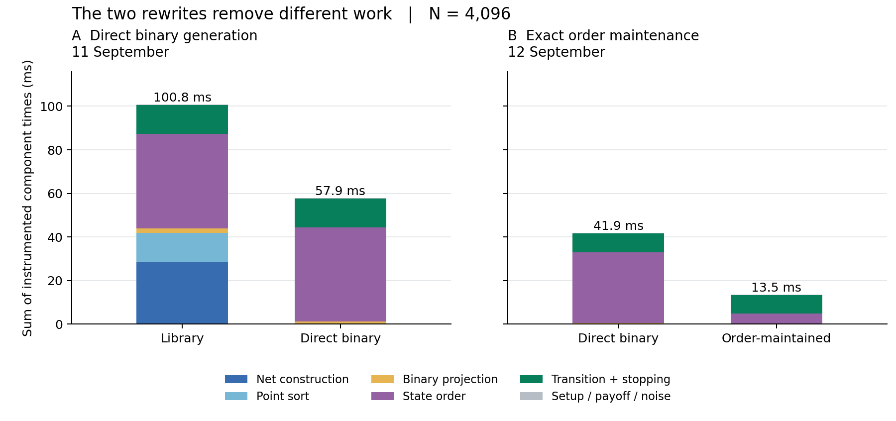
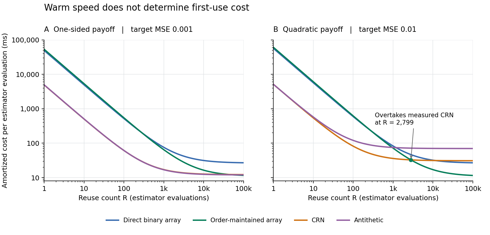

# Exact Binary Projections for Array-RQMC: Joint Laws and Pathwise-Preserving Execution

Aoi Kawasaki  
Preprint - 13 September 2026

DOI: [10.5281/zenodo.22728405](https://doi.org/10.5281/zenodo.22728405)

## Abstract

For a specified two-dimensional Sobol net with linear matrix scrambling and a digital shift, we characterize the complete rank-ordered binary innovation vector consumed by an array-RQMC simulator. At $N=2^m$ paths with $m\ge1$, the vector is uniform over exactly $N$ outcomes indexed by an odd mask and a fair bit, so $m$ independent fair bits suffice per step. The law is not determined by its covariance: independently randomized antithetic rank pairs share that covariance but can differ in higher-order dependence. This characterization replaces coordinate generation and point sorting by direct sampling while preserving the joint trajectory law under the stated ideal randomization model. A second specialization maintains the state order for stopped scalar chains with monotone binary branches, including absorption and floating-point ties, preserving trajectories and outputs for the same finite seed. Across eight fixed benchmark cases in two input encodings, order maintenance reduced warm execution time by 37.2% at 512 paths and 67.5% at 4,096 paths relative to direct binary generation with full state sorting. Cost-to-accuracy comparisons with measured common-random-numbers and antithetic implementations remained workload- and reuse-dependent. These results identify an exact computational interface for a specified randomized net and demonstrate how to execute it more cheaply without changing the estimator.

## 1. Introduction: the law consumed by the simulator

A simulator need not consume all the information in its randomized input. In the array randomized quasi-Monte Carlo (array-RQMC) construction studied here, one coordinate orders the points and only the leading bit of a second coordinate drives each transition. The relevant random object is therefore the joint law of the resulting rank-ordered bits. Replacing the point generator is exact only if this consumed law, including dependence across ranks, is preserved.

Our first result identifies this law for the specified two-dimensional Sobol net under linear matrix scrambling and a digital shift. The entire binary vector is selected by one odd mask and one fair bit. This exposes both a computational opportunity and a constraint: few random bits suffice, but independent antithetic rank pairs do not in general reproduce the law, even though they reproduce its covariance. We then use monotonicity of the binary transition branches to preserve the exact state-to-rank assignment at lower cost. The question is **which parts of the randomized construction can be omitted or retained without changing the stochastic computation?**

The contributions are:

1. An exact joint-law characterization and direct sampler for the consumed binary projection, with explicit support, covariance, and higher-order-dependence consequences.
2. A pathwise-preserving order-maintenance algorithm for stopped scalar binary chains, including absorption and floating-point tie repair.
3. A reproducible execution-cost study that separates fixed-size speed from accuracy-target cost and charges startup and calibration separately from warm execution.

Array-RQMC advances dependent copies of a Markov chain using freshly randomized point sets and state-dependent point-to-chain matching. Its use for stopped chains and unbiased estimation is established by [L'Ecuyer, Lécot, and Tuffin (2008)](https://doi.org/10.1287/opre.1080.0556). Mapping choices and convergence behavior are studied by [L'Ecuyer, Lécot, and L'Archevêque-Gaudet (2009)](https://doi.org/10.1007/978-3-642-04107-5_31), and sorting choices are compared empirically by [L'Ecuyer, Munger, Lécot, and Tuffin (2018)](https://doi.org/10.1016/j.matcom.2016.07.010). We retain a specified matching rather than optimize its variance or claim a new convergence rate.

Avoiding a point sort is not itself new. [Puchhammer, Ben Abdellah, and L'Ecuyer (2021), Sections 4.1-4.2](https://doi.org/10.1007/s11538-021-00920-5), describe constructions with sorting coordinates ordered in advance and only transition coordinates randomized at each step. Their construction fixes the sorting coordinates; our reference randomizes the sorting coordinate as well and then orders the points. We derive the complete binary law left after that randomization and sorting, and sample that law directly. Both approaches can eliminate a point sort, but the present equivalence claim concerns the consumed law of the specified fully scrambled reference, not an assertion that presorted-coordinate constructions are new or incorrect.

Recent work by Ho and Owen applies Array-RQMC to walk-on-spheres simulation for Dirichlet boundary value problems, using Hilbert-curve ordering of multidimensional states and investigating variance reduction and its explanation. [Walk on spheres and Array-RQMC](https://arxiv.org/abs/2605.12844v3) Our contribution is complementary: it preserves a specified estimator while reducing its execution cost in a narrower scalar binary setting. Neither the binary projection nor the branch-order argument below is established for their multidimensional walk-on-spheres algorithm.

Reusing existing order is also a classical algorithmic idea: adaptive stable mergesorts exploit ordered runs. Our specialization obtains those runs from the two known monotone transition branches and maintains the exact reference matching across absorption and floating-point ties. The contribution is this preservation contract and its implementation, not a new general merging algorithm or a different variance-optimizing sort. [CPython's adaptive stable mergesort design](https://github.com/python/cpython/blob/v3.11.2/Objects/listsort.txt)

These distinctions delimit the claim rather than establish exhaustive priority over all specialized implementations. The parity representation uses standard finite Walsh-character algebra, not a new general theory of digital nets. Its role here is to identify exactly the smaller random object needed by the executable reference. The second rewrite retains the previous ordering to avoid recomputation. Neither changes the transition model, the payoff, or the number of trajectories in a fixed-size comparison.

The paper separates three claims: equivalence of the stochastic computation, speed at fixed array size, and cost to reach a specified mean-squared error (MSE). A speedup in the second comparison does not automatically imply a win in the third, especially when initialization and calibration must be paid for.

## 2. Simulation model and estimand

### 2.1 Stopped binary chains

We compare three processes, indexed by $j\in\{0,1,2\}$, starting from $X^j_0=0$. While a process remains active,

$$
X^j_{t+1}=\rho X^j_t+d+s_j\epsilon^j_t,
\qquad
\Pr(\epsilon^j_t=-1)=\Pr(\epsilon^j_t=+1)=\tfrac12.
$$

Along each individual path, fresh innovations have the independent fair-sign law. Dependence across processes and across simulated paths is determined by the sampling method.

A path stops at its first transition with $|X^j_t|\ge b$, or at the fixed horizon $T$. Its crossing state is retained; it is not clipped to the barrier. The terminal payoff is either

$$
f(x)=(x-K)_+
\quad\text{or}\quad
f(x)=x^2.
$$

The recorded response includes independent readout noise,

$$
Y_j=f(X^j_{\tau_j})+\xi_j,\qquad
\Pr(\xi_j=-1)=\Pr(\xi_j=+1)=\tfrac1{20},
\quad \Pr(\xi_j=0)=\tfrac{18}{20}.
$$

Thus $\mathbb E[\xi_j]=0$ and $\nu=\operatorname{Var}(\xi_j)=0.1$. Noise is generated independently for every process, path, and independent block. It remains in the executed estimator. This additive term represents terminal variability outside the shared-innovation construction. It makes the benchmark include a known noise contribution that none of the compared innovation-coupling methods removes at fixed $(N,k)$; it is not a universal lower bound for other estimators. The two preservation arguments do not rely on choosing $\nu=0.1$, but the reported MSE and cost comparisons use this value.

The target is the vector of all three pairwise mean differences,

$$
\Delta=H\mu,\qquad
H=
\begin{pmatrix}
-1&1&0\\
-1&0&1\\
0&-1&1
\end{pmatrix},
\qquad
\mu_j=\mathbb E[Y_j].
$$

We evaluate

$$
\mathcal E=\mathbb E\!\left[\|\widehat\Delta-\Delta\|_2^2\right].
$$

The three contrasts are linearly dependent. They define one aggregate loss, not three independent statistical endpoints.

Each block simulates $N$ paths per process. An **estimator evaluation** averages $k$ independently randomized blocks to produce one estimate of the vector $\Delta$. Its **sampling configuration** is the pair $(N,k)$. Under unbiasedness, its MSE is the sum of its contrast variances. The independent readout noise contributes exactly

$$
\mathcal E_{\mathrm{noise}}=\frac{6\nu}{Nk}=\frac{0.6}{Nk}.
$$

For precision assessment, we estimate the variance of the noise-free contrast outputs across complete independent replicates and add this known contribution. This is a variance-based MSE estimate justified by unbiasedness, not an empirical squared-error calculation using known population means.

### 2.2 Reference array-RQMC execution

At each of the $T$ time steps, the reference implementation:

1. Sorts each process's $N$ labeled states by active status, state value, and original label, with active paths first.
2. Generates the first $N=2^m$ points of a fresh two-dimensional scrambled Sobol net.
3. Sorts those points by their first coordinate and thresholds the second coordinate at $1/2$, obtaining a rank-ordered sign vector.
4. Assigns the same sign vector to the three independently sorted state arrays, updates active paths, and applies the stopping rule.

The net implementation is SciPy 1.15.3, with 30-bit direction numbers, a left linear matrix scramble followed by a digital random shift, and no point-set optimization. These choices specify the randomization being specialized; they are not interchangeable with arbitrary Sobol implementations. [SciPy Sobol documentation](https://docs.scipy.org/doc/scipy-1.15.3/reference/generated/scipy.stats.qmc.Sobol.html)

Digital nets and digital shifts have a standard algebraic treatment in [Dick and Pillichshammer (2010)](https://doi.org/10.1017/CBO9780511761188), while [Owen (1998)](https://doi.org/10.1006/jcom.1998.0487) develops variance theory for scrambled nets. Linear scrambling is studied by [Matoušek (1998)](https://doi.org/10.1006/jcom.1998.0489), with computational implementations described by [Hong and Hickernell (2003)](https://doi.org/10.1145/779359.779360). The LMS-plus-shift law used here is not an unrestricted nested digit-permutation scramble; Proposition 1 establishes the required finite-dimensional law directly, rather than importing a generic scrambling guarantee.

Direction numbers specify the underlying Sobol net, separately from its randomization. SciPy uses the direction-number construction of [Joe and Kuo (2008)](https://doi.org/10.1137/070709359). Our proof needs the particular first two dimensions and the leading-digit recurrence stated below. The version-pinned software references identify those exact conventions; the mathematical references supply the broader construction and randomization background.

The reference consumes a full rank-sign vector at every one of the $T$ time steps, including after all paths have stopped. Both rewrites retain this scheduling convention where needed for their stated equivalence.

### 2.3 Comparison methods

The comparison includes three array implementations and two baselines using aligned innovations:

| Method | Execution |
|---|---|
| Library array | The reference array-RQMC implementation above. |
| Direct binary array | The same state sorting and transitions, with direct generation of the consumed binary projection. |
| Order-maintained array | Direct binary generation with incremental maintenance of the same state order. |
| Common random numbers (CRN) | Independent paths sharing each innovation tape across the three processes. |
| Antithetic | Half as many independent tapes, paired with their bitwise complements; each tape is shared across the three processes. |

The CRN and antithetic baselines use the actual innovations, not a potentially misaligned sequence of raw random-number calls. All methods receive the same known model structure. The baselines are therefore stronger than merely giving three simulators the same integer seed.

## 3. Direct generation of the consumed binary projection

By a *consumed projection* we mean the deterministic map from a randomized point set to the inputs actually used by a transition. Here that map includes sorting by the first coordinate before extracting the second-coordinate bits; it is not merely a coordinate projection before sorting. Sampling its pushforward distribution is sufficient to reproduce the transition input, without reproducing unused coordinates.

This distinction matters statistically as well as computationally. Per-rank fairness gives the correct individual innovation law, but the dependence across ranks contributes to the joint simulation. Covariance describes linear readouts of a fixed sign vector, whereas equality of the complete input law supports arbitrary deterministic updates and their subsequent composition. Proposition 1 supplies that stronger equality. Corollary 1 makes the difference concrete without claiming a new variance-reduction method. This use of binary characters fits the standard digital-net and Walsh-function framework discussed by [Dick and Pillichshammer (2010)](https://doi.org/10.1017/CBO9780511761188) and [Dick, Kuo, and Sloan (2013)](https://doi.org/10.1017/S0962492913000044).

### 3.1 Joint-law characterization

Let $z_r$ denote the bit obtained after sorting the Sobol points by their first coordinate and thresholding the second coordinate, for rank $r=0,\ldots,N-1$.

**Proposition 1.** Consider the first $N=2^m$ points of the specified two-dimensional net, with $1\le m\le30$. Model the strictly lower entries of each scrambling matrix as independent fair bits, with diagonal entries one, and use independent uniform digital shifts. Then the *entire* consumed vector has the distribution

$$
z_r=b_0\oplus\operatorname{parity}(a\mathbin{\&}r),
\qquad r=0,\ldots,N-1,
$$

where $a$ is uniform over the odd integers in $[1,N)$, $b_0$ is an independent fair bit, $\oplus$ is exclusive-or, and $\&$ is bitwise intersection. The corresponding innovation is $\epsilon_r=2z_r-1$. At $N=1$, use $a=0$ and a single fair bit.

**Proof.** Work over $\mathbb F_2$, with digits in most-significant-first order. The first $m$ digits $q$ of the unscrambled first coordinate traverse every element of $\mathbb F_2^m$. The enumeration order of the Sobol points does not affect this set.

For the specified second dimension, the leading digit is $hq$, where $h=(1,\ldots,1)$. In the 30-bit convention, its direction vectors satisfy

$$
v_1=2^{29},\qquad
v_\ell=v_{\ell-1}\oplus(v_{\ell-1}\gg1).
$$

Every column therefore has leading digit one. This direction-number property, rather than a generic balance property, is needed here.

Write the scrambled first-coordinate prefix as $y=Lq\oplus s$, where $L$ is unit lower triangular. These prefixes are distinct and exhaust all ranks, so sorting fixes $y$ as the binary representation of the rank. Lower digits cannot change the order. The first row of the second scrambling matrix leaves its leading unshifted digit unchanged. If $t$ is the second coordinate's leading shift bit, then

$$
z_r=hL^{-1}y\oplus(hL^{-1}s\oplus t).
$$

Inversion is a bijection of the finite unit-lower-triangular group. Hence $L^{-1}$ is uniform on that group. In $c=hL^{-1}$, the last component is one. Conditional on all rows of $L^{-1}$ except the last, its remaining components are fixed constants exclusive-or independent entries of the last row. They are jointly uniform. Thus $c$ is uniform over row vectors ending in one, corresponding to the odd masks $a$. The independent bit $t$ makes the offset fair and independent of $c$. This proves the full-vector distribution. $\square$

The implementation convention was checked against the version-pinned [Python scrambling code](https://github.com/scipy/scipy/blob/v1.15.3/scipy/stats/_qmc.py) and [direction initialization and matrix scrambling code](https://github.com/scipy/scipy/blob/v1.15.3/scipy/stats/_sobol.pyx). The uniformity argument is the finite-group argument above, not a histogram of pseudorandom seeds.

Single-bit fairness would be insufficient. At $N=8$, this law has eight possible vectors; uniform balanced assignment has 70, and independently randomized opposite adjacent pairs have 16. For the true vector,

$$
\epsilon_0\epsilon_2\epsilon_4\epsilon_6=1
$$

always holds, whereas it need not hold for independently randomized adjacent pairs. Substituting either of those simpler constructions would change the experiment.

### 3.2 Support, covariance, and what covariance misses

**Corollary 1.** Under Proposition 1 with $N=2^m\ge2$, the consumed vector has exactly $N$ equiprobable values and Shannon entropy $m$ bits. Its signs have zero means and covariance

$$
\mathbb E[\epsilon_r\epsilon_s]=
\begin{cases}
1,&r=s,\\
-1,&r\oplus s=1,\\
0,&\text{otherwise}.
\end{cases}
$$

Consequently, for deterministic real weights $w_r$,

$$
\operatorname{Var}\!\left(\frac1N\sum_{r=0}^{N-1}w_r\epsilon_r\right)
=\frac1{N^2}\sum_{j=0}^{N/2-1}(w_{2j}-w_{2j+1})^2.
$$

Independently randomized adjacent antithetic pairs have this same covariance and linear-readout variance, but not generally the same joint law.

**Proof.** The bit at rank zero determines the offset. Comparing it with the bits at power-of-two ranks determines every mask bit. Thus the $N$ equally likely parameter pairs give distinct vectors and entropy $\log_2N=m$. The independent offset makes each sign centered. In a sign product it cancels, leaving the binary character associated with the exclusive-or of the two ranks. Averaging over the free mask bits gives zero unless the ranks differ only in their least significant bit; the fixed odd mask then gives the displayed signs. Expanding the quadratic form yields the variance formula. Independent fair signs assigned to adjacent pairs with opposite signs have exactly the same covariance. $\square$

For $N=8$, define $G=\epsilon_0\epsilon_2-\epsilon_4\epsilon_6$. Under the projected law, the two products are equal, so $G$ is identically zero. Under independently randomized adjacent pairs, they are independent fair signs, and $G$ has mean zero and variance two. Changing the minus to a plus gives variances four and two, respectively. Hence covariance matching can either overstate or understate the variance of a nonlinear readout. These are exact finite-law examples, not additional stopped-chain benchmark results or a universal variance advantage.

The entropy statement concerns the consumed vector at one step under ideal randomization. It does not describe the entropy of the full scrambled point set, promise fewer pseudorandom-generator calls in every implementation, or remove the $O(N)$ work of materializing the signs. The elementary character identities are used to explain the specialization, not claimed as new general Walsh theory. Their support, covariance, linear-readout variance, and nonlinear counterexample are checked by exact enumeration in the reproduction companion.

### 3.3 Execution and scope of equivalence

For $N\ge2$, a single uniform $m$-bit word $w$ suffices:

~~~text
a = 2 * (w >> 1) + 1
b0 = w & 1
for rank r = 0, ..., N-1:
    sign[r] = 2 * (b0 XOR parity(a & r)) - 1
~~~

This removes net construction, the two floating-point coordinate arrays, and point sorting. Materializing the $N$ signs still costs $O(N)$; the state sorts are unchanged.

To lift Proposition 1 to the stopped experiment, condition on the joint history of all processes and labels before a step. The state sorts are then fixed. Both generators supply the same conditional joint distribution of the fresh sign vector, followed by the same deterministic update and stopping map. Induction preserves the joint law of the labeled trajectories, stopping times, and final outputs. Independent readout noise is unchanged.

This is an equality under the stated ideal randomization model. The library's integer-seed interface and the direct generator consume different pseudorandom sequences and have different finite seed-to-output maps. They are **not** claimed to produce identical trajectories from the same integer seed. Unused floating-point net coordinates are not preserved either.

The result is limited to the specified first dyadic block, two-dimensional net, scrambling law, rank coordinate, and one-bit threshold. Continuous transitions, additional consumed digits, different thresholds, thinning, and other net constructions require a new derivation.

## 4. Maintaining exactly the same state order

After binary specialization, state sorting becomes a larger fraction of execution cost. For $\rho\ge0$, each branch

$$
x\longmapsto \rho x+d+s_j,
\qquad
x\longmapsto \rho x+d-s_j
$$

is nondecreasing. This permits order maintenance without changing which sign is assigned to any label.

The reference uses NumPy's stable lexicographic sort. Its exact order is
$(\text{not active},x,\text{original label})$, including label order at equal values. [NumPy lexsort documentation](https://numpy.org/doc/1.26/reference/generated/numpy.lexsort.html)

**Proposition 2.** Fix the initial labeled states, all rank-sign vectors, and the readout-noise array. For finite transition parameters, a finite positive barrier, and $\rho\ge0$, the following procedure reproduces the reference state order and trajectories under the specified float64 arithmetic:

1. Split the current active prefix into its negative- and positive-sign subsequences, retaining their order.
2. Apply the original vectorized state update, without reassociation.
3. Within each updated branch, repair original-label order in any equal-value group that contains a label inversion.
4. Merge the branches by state value and label. Separate survivors from newly absorbed paths.
5. Merge newly absorbed paths with the unchanged, previously absorbed list. Place the survivor list first.

**Proof.** The active prefix is initially sorted by state and label. Each branch preserves nondecreasing state order. Floating-point rounding can merge previously distinct values, so inherited label order within a new tie need not be correct; step 3 restores it. The two-way merge therefore produces the exact state-and-label order of updated active paths. Its survivor and newly absorbed subsequences are each sorted. Previously absorbed states do not change, so the second merge and final concatenation reproduce the active-status, state, and label keys of the reference sort. Initially all paths are active at zero and label order is known. Induction gives identical assignments and states at every subsequent transition. $\square$

The implementation keeps the original NumPy update expression. Monotonicity is non-strict under rounding. Overflowed states are immediately absorbed; the declared parameter conditions do not permit an active NaN. Signed zeros and label ties are handled consistently with the reference. These claims do not cover fast-math reassociation.

The following pseudocode makes the treatment of absorption and ties explicit. All lists contain original labels; comparisons use the stored updated values.

~~~text
order[j] = labels 0, ..., N-1; active_count[j] = N
for t = 0, ..., T-1:
    signs = draw_full_rank_sign_vector()       # also when all paths are absorbed
    for each process j:
        active, old_dead = split_at(order[j], active_count[j])
        minus, plus = stable_partition(active, signs at their CURRENT ranks)
        update active values with the original float64 expression
        mark paths with abs(updated value) >= barrier as absorbed
        if t == T-1:
            continue                           # no subsequent rank assignment
        for branch in (minus, plus):
            for each maximal equal-updated-value group:
                if original labels are not increasing:
                    sort the labels within that group
        updated = merge(minus, plus, key=(updated value, original label))
        survivors, new_dead = stable_partition(updated, still active)
        dead = merge(old_dead, new_dead, key=(stored value, original label))
        order[j] = concatenate(survivors, dead)
        active_count[j] = length(survivors)
compute terminal payoff; add independent readout noise
~~~

The sort after the final transition is unnecessary because no later assignment uses it. Every one of the $T$ randomization words is still consumed, even after complete absorption. Final payoff arithmetic and readout-noise generation are unchanged. Consequently, the order-maintained and direct binary implementations agree for the **same finite seed**, including labeled outputs and terminal random-generator states.

Splitting and merging require $O(N)$ work per step. Tie repair adds

$$
\sum_{g}O(k_g\log k_g)
$$

over repaired groups of sizes $k_g$. We do not claim unconditional worst-case linear time in floating-point arithmetic. With exact arithmetic and $\rho>0$, no new within-branch ties occur. The implemented three-process ordering workspace contains $9N$ int64 slots, plus constant-size counters. This is an $O(N)$ auxiliary-memory cost, not a claim about total process memory.

The implemented specialization is scalar, binary, and nonnegative-$\rho$. It does not establish the same rewrite for arbitrary nonmonotone or multidimensional transitions.

## 5. Experimental design and validation

### 5.1 Cases, implementations, and timing

The benchmark contains eight fixed combinations of horizon, persistence, barrier, drift, and payoff, listed in Appendix A. They were available during method development. Each is represented with two invertible, triangular binary encodings of its input tape: one mixes a fresh bit with recent raw bits, and the other with bits from anywhere in the preceding history. Both induce the same independent innovation law.

These produce 16 execution configurations, **not 16 independent model laws**. The methods in this report work directly with innovations, so the encoding repetitions do not establish robustness to unknown or inaccessible random-number semantics. Fresh randomizations provide independent estimator validation, not held-out-model validation.

Experiments used an Intel Core i7-10510U CPU on Windows, with Python 3.11.2, NumPy 1.26.4, SciPy 1.15.3, and Numba 0.61.2. No GPU was used. Array transitions use vectorized NumPy, with compiled binary-generation or order-maintenance helpers. CRN and antithetic transitions use a fused scalar compiled loop. The latter stop work on a path at absorption; the array implementations retain their declared full-step schedule. Cross-method costs compare these concrete implementations, not backend-independent complexity bounds.

The two rewrite comparisons were measured in separate batches, on 11 and 12 September 2026. Each comparison remeasured its own reference. We do not multiply ratios from the two batches into a claimed cumulative speedup.

The order-maintenance study used five paired serial timing rounds per method, size, and configuration, with randomized execution order. Each timing block contained four complete estimates for an array method or 32 for a baseline. Including intermediate-size measurements for the two accuracy targets, this yielded 720 timing blocks. Warm measurements include allocation, randomization, state updates, stopping, payoff, and noise generation. Instrumented profiles were collected separately and did not determine the headline times.

Reported fixed-size time ratios are geometric means of within-configuration ratios. Their percentile intervals resample the five paired rounds within each configuration, using 2,000 bootstrap replicates. They describe variation on this machine and case set, not uncertainty over new hardware or a population of simulators.

### 5.2 Equivalence checks

For direct binary generation, exhaustive enumeration of relevant scrambles and shifts for $m=1,\ldots,5$ covered 67,732 configurations. The full-vector support and multiplicities matched Proposition 1. Additional checks covered 532 library-generated rank vectors, with sizes up to $2^{20}$, 96 prescribed scrambling configurations, and 18 complete trajectory comparisons with common sign vectors.

For order maintenance, a separate full-sort reference implementation was compared on 20,736 exhaustive four-label cases and 400 randomized state cases. Tests included new rounding ties, signed zeros, and absorption. Eighty-two complete direct-binary trajectories agreed step by step, including outputs and random-generator states. Three additional trajectory checks used library-generated sign sequences.

No exceptional tie-repair group occurred in the 96 profiled order-maintained executions. Explicit tests nevertheless exercised that branch; its absence from the profile is not a worst-case guarantee.

An independent randomization check for binary specialization used 16,384 complete estimates: eight cases, two sizes, four methods, and 256 replicates. The geometric-mean direct-to-library MSE ratios were 1.0026 at $N=512$ and 1.0004 at $N=4096$, with respective bootstrap intervals [0.9669, 1.0407] and [0.9764, 1.0260]. These observations are consistent with the proved law equality; they do not establish a variance improvement.

### 5.3 Accuracy-target selection

Two fixed targets use the horizon-60, barrier-5.1 cases: aggregate MSE $q=0.001$ for the one-sided payoff and $q=0.01$ for the quadratic payoff. For each method and candidate $N\in\{512,1024,2048,4096\}$, let $U_N$ be the upper endpoint of a bootstrap 95% interval for one-block MSE. The selected block count is

$$
k_N=\max\!\left(1,\left\lceil\frac{1.5\,U_N}{q}\right\rceil\right).
$$

The method selects the candidate with the lowest calibrated execution cost, including input-encoding initialization in the measured baseline implementations. Here initialization means construction of the binary encoding masks. The fused baseline transition uses innovation bits directly and does not need the mask values, so this cost is part of the measured implementation, not an intrinsic requirement of CRN or antithetic sampling. We retain the recorded costs rather than retrospectively subtracting an unmeasured optimization. The factor 1.5 is a fixed safety factor, not fitted to validation outcomes. Calibration and sampling configuration selection precede fresh precision validation.

The two binary array implementations share their variance calibration because their estimator law is identical. Existing calibration at $N=512,4096$ was retained; 3,072 additional complete estimates calibrated the intermediate sizes. Restricting selection to the two endpoint sizes was also evaluated to separate ordering gains from size-selection gains.

After deduplicating identical configurations across these comparisons, 13 method/configuration pairs were each checked with 128 fresh complete estimator evaluations, for 1,664 validation evaluations in total. A separate 312 serial evaluations measured target execution time: three rounds of eight for each pair.

Precision intervals resample whole independent estimator evaluations, not individual dependent paths within an array. Each uses 2,000 bootstrap replicates. All 13 upper endpoints fell below their respective target, but these are finite-case checks, not simultaneous coverage guarantees or guarantees for unseen problems.

## 6. Results

### 6.1 Fixed-size execution

Direct binary generation removed net construction and point sorting while retaining the reference state sort. Table 1 reports its first-batch warm times, geometrically averaged across the 16 configurations.

**Table 1. Direct binary generation versus the library implementation.**

| Paths per process $N$ | Library array, ms | Direct binary array, ms | Time reduction | Direct/library ratio, 95% interval |
|---:|---:|---:|---:|---:|
| 512 | 34.57 | 9.60 | 72.2% | [0.2693, 0.2855] |
| 4,096 | 97.56 | 52.83 | 45.8% | [0.5256, 0.5589] |

In the second batch, order maintenance further reduced execution time relative to a remeasured direct binary reference (Table 2). It was faster in all 16 configurations at both sizes.

**Table 2. Order maintenance versus direct binary generation with full state sorting.**

| $N$ | Wall-time ratio | 95% paired-round interval | Time reduction | CPU-time ratio |
|---:|---:|---:|---:|---:|
| 512 | 0.6279 | [0.6200, 0.6369] | 37.2% | 0.6821 |
| 4,096 | 0.3248 | [0.3211, 0.3285] | 67.5% | 0.3171 |

Both changes reduce execution overhead at fixed estimator law. The second does so while preserving the same-seed trajectories. The larger benefit at $N=4096$ is consistent with removing repeated full state sorts; it is not evidence of lower statistical variance.

Figure 1 separates the instrumented components behind the two changes. It uses the larger fixed size to show the cost of repeated sorting; it does not replace the uninstrumented times in Tables 1–2.

**Figure 1. Which work is removed?** Stacked values are arithmetic means of separately instrumented component timers over the 16 execution configurations at $N=4096$: eight profiles per configuration and implementation in the first batch, three in the second. The two panels come from different batches with independently measured references; their heights are not a cumulative speedup estimate. They exclude time outside the named timers. Profiles explain implementation costs, whereas Tables 1–2 report uninstrumented end-to-end timing.

### 6.2 Cost at the two accuracy targets

Table 3 uses the expanded candidate-size grid. Time is per complete estimator evaluation after process startup and calibration; it still includes the per-evaluation input-encoding initialization performed by the measured baseline implementations.

**Table 3. Selected sampling configurations, independent precision checks, and warm estimator evaluation times.**

| Payoff; target $q$ | Method | $N\times k$ | Estimated MSE | Bootstrap 95% upper endpoint | Warm time, ms |
|---|---|---:|---:|---:|---:|
| One-sided; 0.001 | Direct binary array | $512\times3$ | 0.00058336 | 0.00061554 | 26.51 |
| One-sided; 0.001 | Order-maintained array | $2048\times1$ | 0.00032209 | 0.00032684 | 11.08 |
| One-sided; 0.001 | CRN | $2048\times7$ | 0.00062070 | 0.00071107 | 12.19 |
| One-sided; 0.001 | Antithetic | $4096\times4$ | 0.00050082 | 0.00056925 | 11.97 |
| Quadratic; 0.01 | Direct binary array | $2048\times1$ | 0.0024182 | 0.0027658 | 26.39 |
| Quadratic; 0.01 | Order-maintained array | $2048\times1$ | 0.0022989 | 0.0026453 | 10.94 |
| Quadratic; 0.01 | CRN | $4096\times13$ | 0.0064098 | 0.0075468 | 30.91 |
| Quadratic; 0.01 | Antithetic | $2048\times55$ | 0.0060657 | 0.0070546 | 70.00 |

For the quadratic target, the order-maintained implementation is approximately 2.82 times as fast as CRN at its selected sampling configuration in warm repeated use. Direct and order-maintained arrays at $2048\times1$ have identical true MSE; their different estimates in Table 3 arise from independent validation randomizations.

Block-size choice matters separately. With only $N=512,4096$ available, the order-maintained target times were 17.12 ms for the one-sided payoff and 18.62 ms for the quadratic payoff. Reaching 10.94 ms therefore combines order maintenance with selection from a finer grid. The direct implementation also benefits from the intermediate sizes; that benefit is not credited exclusively to order maintenance.

The comparison is to the measured baseline implementations, including their mask-initialization cost, not to a fully optimized lower bound for aligned-innovation CRN. The one-sided difference is small. A retained alternative CRN sampling configuration, $4096\times4$, measured 11.66 ms, slightly faster than the calibration-selected CRN sampling configuration. The selected result was not replaced after inspection. This illustrates cost-calibration variability and cautions against interpreting an approximately one-millisecond gap as robust superiority.

Nor do the fixed-size efficiency results support universal advantage. The order-maintained-to-CRN ratios of MSE multiplied by wall time, geometrically averaged within each payoff group, were:

| Payoff | $N=512$ | $N=4096$ |
|---|---:|---:|
| One-sided | 1.500 | 1.050 |
| Quadratic | 0.851 | 0.192 |

Lower is better. Even for the quadratic payoff at $N=4096$, the array method won in six of eight encoding configurations, not all of them.

### 6.3 Startup, calibration, and reuse

Order maintenance adds compiled implementation work at startup. Across three fresh processes per method with empty JIT caches, median process times were 2.39 s for the direct binary array, 7.90 s for the order-maintained array, 2.73 s for CRN, and 2.74 s for antithetic sampling. These measurements include imports, compilation, one fixed estimator evaluation, and process shutdown. Operating-system file caches were not controlled.

We separately account for a startup-overhead estimate, the acquisition cost of previously collected variance-calibration data, new intermediate-size variance calibration, and target-condition timing calibration. Both binary arrays are charged equally for the same shared variance-calibration data. For $R$ estimator evaluations under an unchanged workload, the accounting model is

$$
C_m(R)=A_m+R\,c_m,
$$

where $A_m$ is acquisition and startup cost and $c_m$ is measured warm estimator evaluation cost. Table 4 includes the acquisition cost of that previously collected calibration data.

**Table 4. Acquisition-inclusive accounting for the selected sampling configurations.**

| Payoff | Method | First estimator evaluation, s | Per estimator evaluation at $R=1000$, ms |
|---|---|---:|---:|
| One-sided | Direct binary array | 49.498 | 75.98 |
| One-sided | Order-maintained array | 53.725 | 64.79 |
| One-sided | CRN | 4.945 | 17.12 |
| One-sided | Antithetic | 4.975 | 16.93 |
| Quadratic | Direct binary array | 56.737 | 83.10 |
| Quadratic | Order-maintained array | 60.990 | 71.92 |
| Quadratic | CRN | 5.138 | 36.01 |
| Quadratic | Antithetic | 5.130 | 75.06 |

The quadratic warm-time advantage does not repay these costs within 1,000 evaluations. With constant measured evaluation costs and reusable calibration, the order-maintained array overtakes CRN after approximately 2,800 evaluations. If the previously collected variance-calibration data are treated as already paid for, the incremental-cost crossover is approximately 480 evaluations.

**Figure 2. Reuse changes the ranking.** Each curve is $C_m(R)/R=A_m/R+c_m$, using the recorded setup and warm-time components of Table 4, including acquisition of previously collected calibration data. Curves are accounting projections, not additional timing observations or fitted scaling laws. The quadratic crossover with CRN is 2,799 evaluations under these components. The incremental-cost convention, excluding previously paid variance-calibration acquisition, gives 476 instead; it is not mixed into these curves. Separate panels retain the two different accuracy targets.

These are workload-specific accounting results, not universal break-even thresholds. The first-evaluation column sums separately acquired components; it is not a single timed replay of the entire calibration workflow. Historical variance-acquisition times are retained serial-equivalent estimates, including acquisition with an earlier, slower array implementation. They are not lower bounds on calibration performed from scratch with the optimized code. Research development, correctness testing, precision validation, aggregation used to select sampling configurations, and common research setup are excluded from this evaluation-cost accounting.

## 7. Discussion

### 7.1 Two distinct boundaries of exactness

The strongest result is the conjunction of a preservation argument and a measured cost reduction. Direct binary generation preserves the consumed joint law, not merely per-path fairness. Order maintenance preserves the full labeled computation under the same seed, not merely its terminal covariance. At fixed $N$, the observed gain is computational.

The two specializations have different applicability conditions. Proposition 1 concerns the randomized input law. Its trajectory-law argument needs the same fresh conditional sign law and deterministic transition map, but not monotone transitions. A nonmonotone binary chain can therefore use the same input replacement if it consumes precisely this rank-bit interface; the measured kernels here remain the stated affine chains. By contrast, Proposition 2 needs monotone branches to maintain sorted runs. If a branch can reverse state order, the current merge procedure no longer supplies the reference sort. Full sorting remains a correct fallback; an extension to decreasing or piecewise-monotone branches would need its own ordering and tie argument.

Additional consumed digits, a different threshold, another rank coordinate, or a different net randomization changes the projected law and requires a new characterization. In particular, knowing the one-bit law is insufficient for a transition that consumes continuous coordinates. Multidimensional states may admit a scalar sorting key, but a transition need not preserve order in that key; no multidimensional merge guarantee follows from the scalar argument. The state representation, sort key, randomization law, and arithmetic are separate parts of the equivalence claim.

These boundaries explain why the result is useful but not a generic compiler theorem: once a transition's actual input law is characterized, discarded coordinates need not be reconstructed. Identifying and sampling that law cheaply for an arbitrary simulator is a separate problem. Nor does the small support alone imply improved variance. Corollary 1 identifies exactly which linear readouts depend only on covariance and gives a nonlinear witness where covariance is insufficient.

### 7.2 Robustness of correctness versus robustness of speed

The correctness arguments quantify over the stated class, rather than only over the eight benchmark cases. The projection proof is uniform over the declared dyadic sizes and randomization model. The order argument covers the stated transition and arithmetic conditions, and the tests separately exercise absorption, ties, and rounding. This is stronger than observing equal outputs on the performance cases, but it is not a performance guarantee.

The timing evidence is limited to eight affine-chain cases on one CPU and software stack. Horizon and persistence vary together, and the input encodings duplicate model laws. The design is not a factorial sensitivity study that can isolate all parameter effects, nor does it validate speed on unseen dynamics or hardware. Order maintenance is faster in all recorded fixed-size configurations, but that establishes consistency within this suite only. Frequent large tie groups, small arrays, different absorption profiles, or a more efficient reference sort can change the cost balance. Tie repair can restore sorting-like worst-case work even while the computation remains exact.

This does not establish a new convergence rate, a new coupling principle, an automatic optimizer, or general superiority over CRN. The full-sort reference comparison isolates the implemented ordering change; the cross-method cost comparison also reflects different kernels and avoidable initialization in the measured baselines. Unmeasured baseline optimizations must not be estimated retrospectively as if they had been timed.

The favorable quadratic target also does not eliminate the need for cost accounting. Array-RQMC's statistical efficiency can be valuable in warm repeated use while startup and calibration make a baseline preferable for a small number of estimator evaluations. The correct choice depends on the target, integer block counts, implementation, and reuse horizon.

### 7.3 Verification scope

The numerical record includes per-replicate outputs, timing observations, calibration-selected sampling configurations, and separate validation samples. Using a separate verification implementation within the same project, we reaggregated all 3,072 new calibration estimates and 1,664 precision-validation estimator evaluations through the pair-distance identity

$$
\widehat{\mathcal E}
=\frac{1}{M(M-1)}
  \sum_{i<j}\|z_i-z_j\|_2^2
+\frac{0.6}{Nk},
$$

where $z_i$ is the signal-only contrast vector of one complete estimator evaluation and $M$ is the number of independent estimator evaluations at fixed $N,k$. Calibration uses the same identity with $k=1$. The maximum absolute difference from the original aggregation was $2.78\times10^{-16}$. Fifty stored estimator evaluations were also replayed with matching outputs; this was not a replay of every raw record.

### 7.4 Code and data availability

The version-specific archival identifier for this preprint and its [reproduction package](https://doi.org/10.5281/zenodo.22728405) is doi:10.5281/zenodo.22728405. The package contains the three array kernels, finite-law and pathwise consistency tests, a small timing driver, and saved numerical inputs with a script regenerating the figures and Tables 1–4. It also includes the manuscript source, PDF build instructions, licenses, and file checksums. The kernels are extracted from the measured implementations without changing their function bodies. The package is self-contained; it does not require the larger development workspace. The archived source files, rather than a moving development branch, specify the reproducible implementation.

The bundled numerical inputs are a compact export of saved summaries and profiled observations, with source-file hashes and field mappings. They support regeneration and arithmetic checks, not independent replay of every original raw experiment or recomputation of all bootstrap intervals. The timing driver is an engineering reproduction aid, not a replacement for the original calibrated experiment; its local timings are not substituted into this manuscript.

### 7.5 Use of generative AI tools

Generative AI assistants were used to assist mathematical reasoning, software implementation, verification-code development, and manuscript drafting and revision, and to obtain critical feedback. The finite-enumeration tests, pathwise comparisons, and saved-data checks described above are computational verification within this project, not third-party replication or peer review. Responsibility for the mathematical statements, references, implementations, and reported results rests with the author.

## 8. Conclusion

For the specified scrambled Sobol construction, the complete rank-ordered binary vector is uniform over a family of exactly $N$ outcomes at $N=2^m\ge2$, indexed by an odd mask and a fair offset. Its small support permits direct generation, while its higher-order constraints explain why matching marginal laws or covariance alone is not a general substitute. With monotone scalar transition branches, repeated full state sorting can additionally be replaced by maintenance of the same order, including labels, absorption, and floating-point ties.

The two rewrites reduce execution cost without obtaining a statistical advantage by changing the estimator. Order maintenance delivered substantial fixed-size speedups and a practical warm-use advantage for one quadratic-payoff target, while acquisition-inclusive costs continued to favor CRN for infrequent use.

The resulting contribution is a concrete example of computational specialization with explicit preservation conditions: determine what a simulator actually consumes, retain auxiliary information when it makes updates cheaper, and assess the result at the level of complete estimation cost.

## Appendix A. Benchmark parameters

All cases start at zero and use $s=(0.82,1.03,1.19)$. Barriers are symmetric. Readout-noise variance is 0.1 per path and process.

| Case | Horizon $T$ | $\rho$ | Barrier $b$ | Payoff | Drift $d$ | Strike $K$ |
|---:|---:|---:|---:|---|---:|---:|
| 1 | 36 | 0.897 | 2.65 | $(x-K)_+$ | 0.021 | 0.45 |
| 2 | 36 | 0.897 | 2.65 | $x^2$ | 0 | — |
| 3 | 36 | 0.897 | 5.10 | $(x-K)_+$ | 0.021 | 0.45 |
| 4 | 36 | 0.897 | 5.10 | $x^2$ | 0 | — |
| 5 | 60 | 0.963 | 2.65 | $(x-K)_+$ | 0.037 | 0.65 |
| 6 | 60 | 0.963 | 2.65 | $x^2$ | 0 | — |
| 7 | 60 | 0.963 | 5.10 | $(x-K)_+$ | 0.037 | 0.65 |
| 8 | 60 | 0.963 | 5.10 | $x^2$ | 0 | — |

The two input encodings map independent raw bits $u_t$ to innovation bits through

$$
v_t=u_t\oplus\bigoplus_{\ell\in J_t}u_\ell,
\qquad J_t\subseteq\{0,\ldots,t-1\}.
$$

The recent-history encoding uses at most one earlier bit from the preceding six positions. The full-history encoding uses up to four earlier bits from the entire preceding history. Each triangular map has a fresh diagonal bit and is invertible, so both preserve the uniform law of the whole innovation tape. The methods using aligned innovations bypass this encoding; it is not a hidden system-identification task.

The two accuracy targets are cases 7 and 8 in the full-history encoding. All case parameters and both MSE targets were retained from the existing benchmark rather than selected from fresh validation results.

## References

1. Pierre L'Ecuyer, Christian Lécot, and Bruno Tuffin. A randomized quasi-Monte Carlo simulation method for Markov chains. *Operations Research*, 56(4), 958-975, 2008. [doi:10.1287/opre.1080.0556](https://doi.org/10.1287/opre.1080.0556).
2. Pierre L'Ecuyer, David Munger, Christian Lécot, and Bruno Tuffin. Sorting methods and convergence rates for Array-RQMC: Some empirical comparisons. *Mathematics and Computers in Simulation*, 143, 191-201, 2018. [doi:10.1016/j.matcom.2016.07.010](https://doi.org/10.1016/j.matcom.2016.07.010).
3. Florian Puchhammer, Amal Ben Abdellah, and Pierre L'Ecuyer. Variance Reduction with Array-RQMC for Tau-Leaping Simulation of Stochastic Biological and Chemical Reaction Networks. *Bulletin of Mathematical Biology*, 83, article 91, 2021. [doi:10.1007/s11538-021-00920-5](https://doi.org/10.1007/s11538-021-00920-5); [author manuscript](https://bird.bcamath.org/bitstream/handle/20.500.11824/1302/arqmc-tau-leaping.pdf?sequence=1).
4. Valérie N. P. Ho and Art B. Owen. Walk on spheres and Array-RQMC. *arXiv preprint*, arXiv:2605.12844v3, 2026. [Version 3, 8 July 2026](https://arxiv.org/abs/2605.12844v3).
5. Tim Peters and CPython contributors. *Design notes for adaptive stable mergesort (listsort.txt)*, CPython 3.11.2. [Version-pinned source](https://github.com/python/cpython/blob/v3.11.2/Objects/listsort.txt). Accessed 12 September 2026.
6. SciPy contributors. *SciPy 1.15.3: Sobol documentation and implementation*. [Documentation](https://docs.scipy.org/doc/scipy-1.15.3/reference/generated/scipy.stats.qmc.Sobol.html); [Python source](https://github.com/scipy/scipy/blob/v1.15.3/scipy/stats/_qmc.py); [Cython source](https://github.com/scipy/scipy/blob/v1.15.3/scipy/stats/_sobol.pyx). Accessed 12 September 2026.
7. Josef Dick and Friedrich Pillichshammer. *Digital Nets and Sequences: Discrepancy Theory and Quasi-Monte Carlo Integration*. Cambridge University Press, 2010. [doi:10.1017/CBO9780511761188](https://doi.org/10.1017/CBO9780511761188).
8. Art B. Owen. Scrambling Sobol' and Niederreiter-Xing points. *Journal of Complexity*, 14(4), 466-489, 1998. [doi:10.1006/jcom.1998.0487](https://doi.org/10.1006/jcom.1998.0487).
9. Jiří Matoušek. On the L2-discrepancy for anchored boxes. *Journal of Complexity*, 14(4), 527-556, 1998. [doi:10.1006/jcom.1998.0489](https://doi.org/10.1006/jcom.1998.0489).
10. Hee Sun Hong and Fred J. Hickernell. Algorithm 823: Implementing scrambled digital sequences. *ACM Transactions on Mathematical Software*, 29(2), 95-109, 2003. [doi:10.1145/779359.779360](https://doi.org/10.1145/779359.779360).
11. Stephen Joe and Frances Y. Kuo. Constructing Sobol' sequences with better two-dimensional projections. *SIAM Journal on Scientific Computing*, 30(5), 2635-2654, 2008. [doi:10.1137/070709359](https://doi.org/10.1137/070709359).
12. NumPy contributors. *NumPy 1.26: numpy.lexsort*. [Documentation](https://numpy.org/doc/1.26/reference/generated/numpy.lexsort.html). Accessed 12 September 2026.
13. Pierre L'Ecuyer, Christian Lécot, and Adam L'Archevêque-Gaudet. On Array-RQMC for Markov Chains: Mapping Alternatives and Convergence Rates. In *Monte Carlo and Quasi-Monte Carlo Methods 2008*, 485-500, Springer, 2009. [doi:10.1007/978-3-642-04107-5_31](https://doi.org/10.1007/978-3-642-04107-5_31); [author research report](https://www.gerad.ca/en/papers/G-2009-03).
14. Josef Dick, Frances Y. Kuo, and Ian H. Sloan. High-dimensional integration: The quasi-Monte Carlo way. *Acta Numerica*, 22, 133-288, 2013. [doi:10.1017/S0962492913000044](https://doi.org/10.1017/S0962492913000044).
