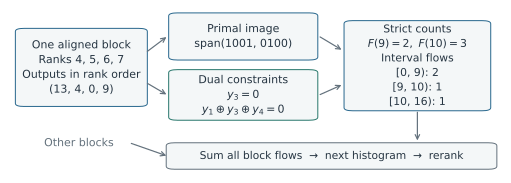
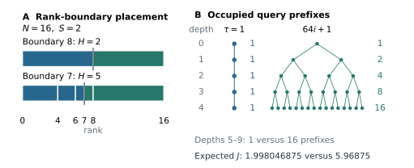
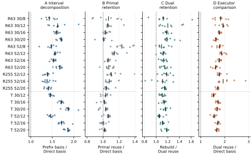
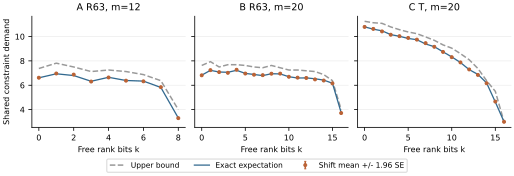
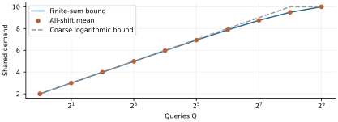

# Exact State-Ranked Array-RQMC: Representations and Shared Work

## Abstract

Repeated states in state-ranked Array-RQMC receive rank-specific inputs. We execute the reranked population without visiting every particle when complete states repeat and transitions admit short finite-word interval partitions. Primal image-basis and dual constraint counters preserve the realized histogram path and supported readouts. Fixed suffix dependencies survive triangular scrambles; syndrome-prefix diversity determines exact conditional demand for shared dual transformations. A sharp finite-sum bound and rank-boundary geometry connect demand to execution cost. Six compiled executors share repair and tandem tapes and return every step histogram and readout. With eight seeds per cell on one non-isolated host, median within-seed timing ratios favor direct basis over the other non-enumerating methods in all 17 cells. With $2^{20}$ particles, it outpaces compact rank streaming by about 41-57 times for repair and 10 for tandem. Dual coefficient retention improves on matched reconstruction; fixed-workload diagnostics characterize the remaining work.

**MSC 2010:** Primary 65C05; Secondary 65C20, 60J10.

**Keywords:** Array-RQMC; exact simulation; digital nets; state aggregation; implicit execution.

## 1. Introduction

Array randomized quasi-Monte Carlo (Array-RQMC) advances Markov-chain states by sorting them and matching their ranks to jointly randomized inputs [5,7]. For a fixed population size and realized point sets, the histogram path and readouts form a specific coupled random object. The computational question is which representation retains enough information to propagate that population, and which auxiliary structure reduces the work of exact execution.

Finite-population error assessment illustrates why the realized population matters. In the tandem example, one-chain dynamic programming supplies the reference mean, while repeated population executions sample the specified coupled estimator and its error around that mean. Exact execution lets the implementation change while preserving each realization and, under the prescribed input law, the estimator distribution. Supplement Section S4 gives the estimator and error calculation.

Repeated complete states allow a multiplicity representation, but their copies occupy different ranks and can receive different inputs. Advancing one representative and multiplying its destination count therefore need not reproduce the realized population. We instead count exactly how many rank-assigned inputs send each state to each destination.

With short interval partitions of finite-word inputs, these multiplicities are rank-rectangle counts. We compute them algebraically without visiting every rank, aggregate the destinations and recover the next rank intervals by cumulative sums in the state order. This closes the histogram update.

The digital map is $V_t y_r=CU_t r+c_t$, with fixed $C$ and step-dependent invertible lower triangular matrices and shift. An aligned rank block leaves a suffix of rank bits free. Its outputs form an affine space, described either by an image basis or by linear constraints. Both counting routes use the same interval decomposition and fixed-matrix structure.

The two representations expose different reusable structure. Primal image bases can be transported through each fresh triangular scramble; the dual route transforms fixed dependencies only when queried and shares them within the step. Under a conditionally uniform shift, overlap among query syndrome prefixes determines the expected transformation demand.

This structure yields three contributions.

1. **Primal and dual exact execution.** We give image-basis and dependency-based block counters within a common histogram update. They preserve the realized state-ranked process, including reranking and supported readouts. Fixed suffix images and dependencies supply two ways to reuse algebraic structure across fresh triangular scrambles.
2. **Exact shared-demand analysis.** For the dual counter, we derive the conditional transformation demand from query-prefix diversity, an attained finite-sum upper bound, and a bound of $m+1$ source-row XORs per first transformation. Rank-boundary geometry and operation identities connect this batch-level quantity to complete execution cost.
3. **An implementation choice supported by matched evidence.** Six compiled executors use identical tapes in repair and tandem models. The comparison measures the effects of interval decomposition and of retaining primal or dual structure. Direct basis is faster than dual reuse in every measured cell median; dual coefficient retention improves on matched reconstruction. Fixed-workload diagnostics test the demand formula and characterize the remaining work.

Section 2 defines the preserved process. Section 3 develops the primal and dual counters, Section 4 analyzes dual shared demand, and Section 5 compares execution costs. The supplement gives dense-alphabet counts, finite-word corrections and the estimator-error example.

### 1.1. Position relative to existing methods

Lécot and Tuffin express empirical Markov-chain updates through rectangles formed by state-rank and transition-probability intervals [5, Section 2]. Randomized array simulation and sorting methods are developed in [7,8]. We use that rank-rectangle formulation and compute its multiplicities algebraically through successive state updates. The rank contract in Proposition 1 states the information needed to propagate those counts and reconstruct the next ordering.

The counting ingredients have established origins. Niederreiter and Pirsic relate digital-net box counts to restricted dual spaces and matrix rank [10, Section 3, Theorem 3]. Their theorem gives the maximum occupancy among boxes of a specified shape; consistency of a particular box is a separate linear-system condition. Linear matrix scrambling is standard [9,11], finite-field systems characterize elementary-interval constraints [12], and prefix branching is an enumerative counting technique [3]. These results supply the algebraic basis for both our dependency and image-basis implementations.

The coordinate change also has a close precedent. Ahmed et al. define $C_yC_x^{-1}$ as a characteristic matrix for invertible square generating matrices and describe triangular reorderings and affine shifts [1, Definition 3.3 and Section 3.5]. We use the corresponding rank-coordinate representation with a rectangular, possibly deficient consumed matrix. Our analysis concerns the dynamic query sets produced by successive population updates. It identifies their common syndrome prefixes, evaluates the shared transformation demand exactly, and connects that demand to transformation costs and occupied-state rank boundaries. The elementary coordinate change and box-counting principles are used as known ingredients.

Both dual implementations share queries and terminate early. The primal comparator transports suffix-image bases through triangular scrambles (Lemma 2), alongside fresh basis construction. These controls place retained coefficients within a matched choice among exact executors.

Packed generating matrices support coordinate generation without storing all points [6, Sections 1--2]. SSJ's SortedAndCutPointSet also separates sorting coordinates from the retained point representation [14]. We therefore include compact rank streaming as an explicit comparator that visits every rank with compact state storage. Section 5 specifies the comparators' complete update and measurement contract. Pre-scrambling selects and retains a realized scramble [6]. Here the suffix structure of $C$ remains usable across fresh scrambles.

Other digital-net representations serve different computational objectives. Dick and Feischl approximate data-dependent loss calculations [4], while Anupindi and Kritzer exploit column reduction and analyze the resulting nets [2]. Scrambled-net dependence is studied through pair counts and joint densities in [15]. Here the execution contract fixes the entire realized map and finite population.

## 2. The process to preserve

### 2.1. Complete states, rank intervals and transition regions

Let $N=2^m$, $m\ge1$. A complete transition state contains every variable needed for its next update and the requested future readouts. A fixed computable total order $\prec$ distinguishes these states. Equal complete states may have different particle labels, but transitions do not depend on those labels. At time $t$, the reference population is the sorted array $X_t=(x_{t,0},\ldots,x_{t,N-1})$. A realized input map assigns the $w$-bit word $y_{t,r}$ to rank $r$. Explicit execution is

$$
X_{t+1}=\operatorname{sort}_{\prec}
\bigl(\Phi_t(x_{t,r},y_{t,r}):0\le r<N\bigr).
$$

Its ordered histogram is

$$
\mathcal H(X_t)=((s_{t,1},n_{t,1}),\ldots,(s_{t,S_t},n_{t,S_t})),
\qquad s_{t,1}\prec\cdots\prec s_{t,S_t}.
$$

Expanding each state by its multiplicity recovers the sorted unlabeled complete-state array exactly: the ordered histogram is a lossless representation of that array. All counts are positive and sum to $N$. Set $a_{t,1}=0$ and $a_{t,j+1}=a_{t,j}+n_{t,j}$, so state $s_{t,j}$ occupies $I_{t,j}=[a_{t,j},a_{t,j+1})$. Suppress $t$ for one step. Input words are ordered by their integer values. Several consumed coordinates may be encoded in one word, but this need not preserve a short transition partition. For each state, supply a partition of the input words,

$$
0=\tau_{j,0}\le\tau_{j,1}\le\cdots\le\tau_{j,q_j}=2^w,
$$

on whose half-open intervals the next state is constant. Write that destination as $v_{j,l}$ on $[\tau_{j,l-1},\tau_{j,l})$. Empty intervals are permitted. The partition must also distinguish any transition-dependent accumulator contributions not determined by the resulting histogram. Its construction cost is part of the algorithm's cost; a small number of destinations alone does not supply a short, countable partition.

Define the rank-rectangle counts and destination multiplicities by

$$
F_{j,l}=\#\{r\in I_j:\tau_{j,l-1}\le\operatorname{int}(y_r)<\tau_{j,l}\},
\qquad
n'_v=\sum_{j,l}F_{j,l}\mathbf1\{v_{j,l}=v\}.
$$

Sorting the positive destinations gives the implicit update $\bar E_\omega(\mathcal H(X))$ for the realized map $\omega:r\mapsto y_r$.

If interval $(j,l)$ also contributes a fixed vector reward $g_{j,l}$, update the supported accumulator before merging destinations:

$$
A_{t+1}=A_t+\sum_{j,l}F_{j,l}g_{j,l}.
$$

Distinct rewards leading to the same destination must remain separate until this sum is formed. Reward evaluation and accumulation are included in $\mathcal A_t$ below.

**Proposition 1 (rank sufficiency and commutation).** Suppose the ordered histogram reconstructs the reference rank intervals of every complete transition state, the update is deterministic given that state and its input, and all counts $F_{j,l}$ use the same realized map as explicit execution. Then

$$
\mathcal H(E_\omega(X))=\bar E_\omega(\mathcal H(X)).
$$

Successive applications preserve every histogram and every deterministic functional of those histograms and supported accumulators.

*Proof.* The rectangles partition the reference ranks according to their incoming state and transition region. Exactly $F_{j,l}$ particles contribute destination $v_{j,l}$. Summing their counts gives the explicit destination multiplicities. Both implementations use the same total order on complete states, so cumulative sums of these equal multiplicities give identical next rank intervals. Induction proves the trajectory statement and equality of identically updated readouts. $\square$

The rank condition is substantive. Two states 0 and 1 tied under a coarse sorting key can be ordered by labels as either $(0,1)$ or $(1,0)$. With rank inputs $(0,1)$ and update $\Phi(x,z)=x+z$, these orders produce histograms of $(0,2)$ and $(1,1)$, respectively. The incoming state histograms alone do not distinguish them. A total order of complete states resolves this ambiguity; a coarser order needs a richer representation or a separate sufficiency argument.

Terminal averages, histogram-path functionals and additive state-cost accumulators are covered. Individual path payoffs require the relevant history in the state or another sufficiency proof. Original labels and a baseline's floating-point reduction order are outside this contract. Reading an arbitrary expanded initial population also incurs its full input cost; the experiments start from one known state of multiplicity $N$.

The proposition is pointwise in the input maps. Under a common law for those maps, it therefore preserves the distribution of the supported readouts as well. The maps may depend on preceding histograms if both executors use the same maps. Exact implementations can also be switched between steps without changing the result, provided conversions are exact and the map is retained. The experiments below use fixed methods throughout.

For an integrable state readout $g$, define the post-update time average $Y_{N,T}^{(g)}=(NT)^{-1}\sum_{t=1}^{T}\sum_{j=1}^{S_t}n_{t,j}g(s_{t,j})$ and its finite-word reference mean $\mu_{T,w}^{(g)}=T^{-1}\sum_{t=1}^{T}\mathbb E[g(Z_t^{(w)})]$, where $Z_t^{(w)}$ follows the same transition maps with independent uniform $w$-bit inputs and starts from the fixed population's initial empirical distribution. If, at every update, each rank input has this uniform marginal conditional on the population past, linearity gives $\mathbb E[Y_{N,T}^{(g)}]=\mu_{T,w}^{(g)}$; independence across particles is not required. Even when dynamic programming can compute $\mu_{T,w}^{(g)}$, this mean alone does not determine the distribution of $Y_{N,T}^{(g)}-\mu_{T,w}^{(g)}$, sampled by repeated population randomizations. Exact execution preserves each realization of this error; Supplement Section S4 gives a numerical example.

### 2.2. A fixed digital matrix under triangular transformations

Ranks and input words are binary column vectors, with their most significant bits first. Fix $C\in\mathbb F_2^{w\times m}$ and define

$$
V_t y_r=CU_t r+c_t,
$$

where $U_t$ and $V_t$ are invertible lower triangular binary matrices of orders $m$ and $w$. Their diagonal entries are one. The full realized affine map is $M_t=V_t^{-1}CU_t$, $b_t=V_t^{-1}c_t$. The dual reusable executor works with the inverse equations and the fixed dependencies of $C$.

For a two-coordinate digital net with invertible sorting prefix $C_s$ and consumed matrix $C_y$, take $C=C_yC_s^{-1}$. Sorting and consumed-coordinate scrambles give $U_t=L_{s,t}^{-1}$ and $V_t=L_{y,t}^{-1}$. Substituting the unique point index associated with each sorting prefix gives the displayed equation; the sorting shift is absorbed into the consumed shift. A point-index convention, including any Gray-code map, must be included consistently in both matrices. Section 5.2 specifies the actual generator used in the experiments.

Execution accepts arbitrary shifts and admissible triangular matrices; Theorem 1 separately states the conditional-shift assumption for expected work and the fresh-LMS law.

## 3. Primal and dual block counts

Figure 1 previews the two counting routes on the four-rank example developed in Section 3.4. They describe the same block outputs and recover the same transition multiplicities. Those contributions join the other blocks before the population is reranked.

**Figure 1. From one rank block to a population update.** In the Section 3.4 example, ranks 4--7 give outputs $(13,4,0,9)$. The primal span and dual constraints describe the same set; $y_1$ is the most significant bit. Strict counts at 9 and 10 yield the three displayed interval flows. These are contributions from one block, to be summed with all other blocks before forming the next ordered histogram.

### 3.1. The common affine block

**Lemma 1 (fixed right-hand-side suffix image).** In an aligned rank block $r=r_0+\lambda$, $0\le\lambda<2^k$, the last $k$ bits of $r_0$ are zero. Write $C_L$ for the trailing $k$ columns of $C$, $C_H$ for the other columns and $\rho_k=\operatorname{rank}C_L$. The multiset of right-hand sides is

$$
C_H U_{11}r_{0,H}+c_t+\operatorname{im}C_L,
$$

with multiplicity $2^{k-\rho_k}$. The right-hand-side suffix image $\operatorname{im}C_L$ and its row-prefix rank profile depend only on $C,k$. The corresponding output suffix image is $V_t^{-1}\operatorname{im}C_L$, as described in Lemma 2.

*Proof.* Ordinary addition of $r_0$ and $\lambda$ equals XOR. The lower triangular block decomposition of $U_t$ gives upper coordinates $U_{11}r_{0,H}$ and lower coordinates $U_{21}r_{0,H}+U_{22}\lambda$. Since $U_{22}$ is invertible, the latter range over all $k$-bit vectors. Applying $C_L$ gives the stated image and multiplicity. $\square$

Let $F_{k,r_0}(\tau)$ count outputs strictly below $\tau$ in this block, with $F(0)=0$ and $F(2^w)=2^k$. Both representations below compute this same function. Differences at successive transition thresholds give the destination multiplicities used in Proposition 1.

### 3.2. Primal counting and suffix-image transport

An aligned block has image $M_tr_0+b_t+\operatorname{im}(M_{t,L})$, with multiplicity $2^{k-\rho_k}$. The basis kernel follows the threshold prefix in an echelon basis. At each pivot it counts the complete smaller branch and retains only the equal branch. Bits between pivots are fixed over the remaining coset, so one packed comparison resolves them. After the final pivot, a comparison of the remaining word enforces the strict inequality. Algorithm 3 and Proposition 3 in Appendix D give the complete procedure and invariant, including rank deficiency and the endpoints. Given the basis, pivots and affine offset, a block-threshold query costs $O(\rho_k+1)$ word operations and $O(1)$ auxiliary words. Basis construction and offset generation are charged separately.

**Lemma 2 (transport of suffix-image bases).** Let $B_k$ be an echelon basis of $\operatorname{im}(C_L)$ with distinct leading nonzero positions, in most-significant-bit-first order. Then $V_t^{-1}B_k$ is an echelon basis with the same leading positions for the realized suffix image:

$$
\operatorname{im}(M_{t,L})
=\operatorname{im}(V_t^{-1}C_LU_{t,22})
=V_t^{-1}\operatorname{im}(C_L).
$$

*Proof.* Lower triangular $U_t$ has a zero upper-right block and invertible trailing block $U_{t,22}$. Right multiplication by that block leaves the column image unchanged. A unit lower triangular matrix, including $V_t^{-1}$, preserves each vector's first nonzero coordinate. Consequently the transformed columns remain independent and have the same ordered leading positions. $\square$

This is echelon preservation; additional zeros of reduced echelon form are not required. The affine block offset still uses $M_tr_0+b_t$ and therefore retains $U_t$.

The fixed bases can share vectors across widths. Inserting suffix columns by echelon elimination without modifying earlier basis vectors constructs a nested frame: every suffix basis is a subset of the final frame $B$, of size $r=\operatorname{rank}C$. Store the subset indices and the factorization $C=BT$. At a step, solve $V_tZ=B$ with all right-hand sides packed into rows, form $TU_t$, and recover $M_t=Z(TU_t)$ and $b_t=V_t^{-1}c_t$. Each distinct frame vector is transformed once; suffix bases gather the required transformed vectors and retain their pivot positions. This realizes primal reuse through a shared frame, a forward solve and affine-offset construction. Section 5 measures these costs alongside fresh suffix-basis construction and demand-driven dual transformation.

Prefix basis decomposes $[0,a)$ to calculate $G(a,\tau)=\#\{r<a:y_r<\tau\}$, then uses $G(b,\tau)-G(a,\tau)$ on $[a,b)$. Adjacent states share their common endpoint decomposition. Direct basis instead uses exactly Algorithm 1's state-interval blocks. Thus this comparison changes decomposition while retaining the forward-map and coset machinery. Primal reuse applies Lemma 2 and the shared-frame construction to those same direct blocks.

### 3.3. Dual counting with reusable dependencies

The dual representation stores the linear relations that output prefixes must satisfy. It uses the same fixed suffix image through its row dependencies:

Eliminate the rows of $C_L$ in output order, recording $R_{k,j}$, the rank of its first $j$ rows, with $R_{k,0}=0$. Retain elimination expressions in the selected independent *original* rows. At a dependent row $j$, record $d_{k,j}\in\mathbb F_2^w$ with support in rows $1,\ldots,j$, coefficient one at $j$, and

$$
d_{k,j}C_L=0,\qquad h_{k,j}=d_{k,j}C.
$$

The last $k$ entries of $h_{k,j}$ vanish. Store the dependency order and the end of each consecutive run of independent rows. This preparation is performed once for every $k=0,\ldots,m$ and reused while $C$ is unchanged.

<!-- keep-begin -->

### 3.4. A four-rank example

Take $m=3$, $w=4$ and the block $r=4,5,6,7$, so $k=2$ and $r_0=(1,0,0)^T$. Let

$$
C=\begin{pmatrix}1&0&1\\0&1&1\\0&1&0\\1&0&0\end{pmatrix},\qquad
U=\begin{pmatrix}1&0&0\\1&1&0\\0&1&1\end{pmatrix},\qquad
V=\begin{pmatrix}1&0&0&0\\1&1&0&0\\0&1&1&0\\1&0&1&1\end{pmatrix},\qquad
c=\begin{pmatrix}0\\1\\0\\1\end{pmatrix}.
$$

The suffix rows of $C$ are $01,11,10,00$. The first two are independent, the third is their sum, and the fourth is zero. Preparation therefore stores

$$
d_3=(1,1,1,0),\quad d_4=(0,0,0,1),\qquad
h_3=h_4=(1,0,0).
$$

For this tape, $d_3V=(0,0,1,0)$, $d_4V=(1,0,1,1)$, $h_3U=h_4U=(1,0,0)$ and $d_3c=d_4c=1$. On the chosen rank block the consistency tests for a candidate output prefix $\tau$ reduce to

$$
\epsilon_3=\tau_3,\qquad
\epsilon_4=\tau_1+\tau_3+\tau_4.
$$

Let $F(\tau)$ count block outputs strictly below $\tau$. For threshold $10=(1010)_2$, the first two independent bits account for two smaller words. The third threshold bit is one and fails $\epsilon_3=0$, so its smaller branch contributes one more word and the query stops: $F(10)=3$. For threshold $9=(1001)_2$, the same independent prefix contributes two, and both dependent tests pass: $F(9)=2$. Direct enumeration gives the rank-ordered outputs $(13,4,0,9)$ and confirms both counts.

The same set is the primal span of $(1001)_2$ and $(0100)_2$, giving the same two threshold counts. For transition regions $[0,9)$, $[9,10)$ and $[10,16)$, this block contributes counts $2,1,1$, as shown in Figure 1. Algorithm 1 aggregates these contributions with those from the other rank blocks and reconstructs the next rank intervals.

The first query demands one transformed dependency, the second two. Together they transform two, because the second query reuses the first relation. The fixed masks $d_j,h_j$ survive a change of tape: for example, $U=I,V=I,c=0$ gives outputs $(9,5,15,3)$ using the same prepared dependencies. The transformed expressions are refreshed for that tape. This is the distinction between reuse across steps and sharing within a step.

<!-- keep-end -->

### 3.5. Dual queries and the common population update

For an internal threshold, use the $w$-bit vector of $\tau$. Follow its prefix from the most significant bit. At a dependent row $j$, consistency of the equal-prefix branch is exactly

$$
\epsilon_{k,j}(r_0,\tau)
=(d_{k,j}V_t)\tau+(h_{k,j}U_t)r_0+d_{k,j}c_t=0.
$$

Indeed, the first $j$ output equations have rank $R_{k,j}$; their consistency conditions are the dependencies already recorded. Lower triangular $V_t$ ensures that $d_{k,j}V_t$ has no support beyond output bit $j$, with coefficient one at $j$. Thus this test does not use an unspecified future output bit. If the threshold bit is one and $\epsilon=1$, the zero side branch is feasible and contributes $2^{k-R_{k,j}}$; flipping this bit changes exactly the current consistency equation. If $\epsilon=1$, the equal branch is infeasible and the query stops. If $\epsilon=0$, it continues without a dependent-row side contribution.

An independent row makes both branches feasible and raises the rank by one. For consecutive independent rows $j,\ldots,e$, let $a$ be the integer encoded by threshold bits $j,\ldots,e$. All smaller side branches together contribute

$$
a\,2^{k-R_{k,e}}.
$$

The stored run endpoint therefore replaces bit-by-bit independent decisions with one packed operation. Stop also when the remaining threshold suffix is zero, since no smaller side branch remains. These rules count the strict inequality, including deficient maps and threshold atoms.

When a dependent test is first needed, cache the three objects $d_{k,j}V_t$, $h_{k,j}U_t$ and $d_{k,j}c_t$ under the key $(k,j)$ for the current step. They do not depend on $r_0$ or $\tau$. Every query at that step uses the same source rows and shift; independently randomizing blocks would change the reference process. Eager and addressed generation of these same rows implement the same mathematical algorithm.

**Algorithm 1. Population update from exact block counts.**

~~~text
Once per fixed C:
    prepare the selected block-count representation
At a step, with a shared U,V,c tape and ordered histogram:
    initialize its step-local data for this tape
    initialize destination aggregation
    for each complete state s and its rank interval:
        decompose that interval into aligned dyadic blocks
        for each block (r0,k):
            previous = 0
            for each internal threshold tau of state s, in order:
                current = block_below(r0,k,tau), using the selected counter
                flow = current - previous
                add flow to this interval's destination
                accumulator += flow * this interval's reward
                previous = current
            flow = 2^k - previous
            add flow to the final interval's destination
            accumulator += flow * the final interval's reward
    retain positive destinations, reconstruct ranks, compute readouts
~~~

For dual execution, preparation retains the dependencies, their $C$-products, ranks and independent runs; step initialization clears the transformed-constraint cache, and `block_below` is Algorithm 2. Primal execution uses the affine images of Section 3.2. Both provide exact counts to the same aggregation and reranking loop.

A binary64 threshold $p=a/b$ can be converted exactly for an input $u=y/2^w$: $u<p$ uses the integer cutoff $\lceil2^w a/b\rceil$, whereas $u\le p$ uses $\lfloor2^w a/b\rfloor+1$, clipped to $[0,2^w]$. This refers to the actual computed threshold and an exactly represented input word.

**Algorithm 2. Strict block count with a shared step cache.** Indices are one-based. The last nonzero threshold bit is $\ell$; $R_{k,j}$ is the prefix rank, and the stored independent-run endpoint is inclusive.

~~~text
block_below(r0, k, tau):
    if tau = 0: return 0
    if tau = 2^w: return 2^k
    ell = position of the last 1 bit of tau
    count = 0; j = 1
    while j <= ell:
        if row j is independent:
            e = min(end of its independent run, ell)
            a = integer represented by bits j,...,e of tau
            count += a * 2^(k - R[k,e])
            j = e + 1
        else:
            if (k,j) is absent from the step cache:
                cache[k,j] = (d[k,j] V, h[k,j] U, d[k,j] c)
            (v,u,z) = cache[k,j]
            failed = parity(v AND tau) XOR parity(u AND r0) XOR z
            if failed:
                if bit j of tau is 1: count += 2^(k - R[k,j])
                return count
            j += 1
    return count
~~~

Stopping at $\ell$ implements the zero-suffix rule. The cache is common to all state intervals at the step and is cleared when the realized tape changes.

## 4. Exactness and shared work

Work begins with the occupied states' rank boundaries. Their alignment determines the number $H_t$ of dyadic blocks; transition thresholds on those blocks generate $Q_t$ queries. Even with $N=16$ and two occupied states, moving their single boundary from rank 8 to rank 7 increases the block count from two to five (Figure 2A). Appendix B derives this dependence on boundary placement.

For dual counting, queries of one width face a common syndrome obtained by evaluating fixed dependencies on the step shift. Overlapping eligible target prefixes make queries reach the same relations, so query count alone does not determine the shared work. Visited dependent tests contribute to $D_t$, while only newly transformed relations contribute to $J_t$. Their source-row supports determine the XOR cost $\Xi_t$. Source generation, query processing and destination aggregation also contribute to the complete update cost. Theorem 1 gives conditional bounds; Proposition 2 resolves the effect of prefix overlap exactly.

### 4.1. Dual exactness and conditional work

Write $\mathcal F_{t-1}$ for the complete pre-step history. Let $\mathcal Q_t$ be a finite batch of block/threshold queries, including its cardinalities, and set

$$
\mathcal G_t=\sigma(\mathcal F_{t-1},U_t,V_t,\mathcal Q_t).
$$

Algorithm 1 with history-determined partitions has an $\mathcal F_{t-1}$-measurable batch. The conditional statement also permits selection using $U_t,V_t$ when $c_t$ remains uniform conditional on $\mathcal G_t$. Queries using the same shift need not be independent. Answer-dependent skipping can be covered by a predetermined batch of all potential queries; the bound then uses that batch's size rather than the shift-dependent number observed.

For width $k$, let $d_k=w-\rho_k$, let $Q_{t,k}$ be the number of queries, and let $D_{k,i}$ count the dependent tests visited by query $i$. Put $J_{t,k}=0$ for an empty batch. Define

$$
\Psi(Q,d)=\sum_{s=1}^{d}\min\{1,Q\,2^{-(s-1)}\}.
$$

In particular $\Psi(0,d)=\Psi(Q,0)=0$.

**Theorem 1 (exact dual reusable executor and conditional work).** Assume the rank contract of Proposition 1, the state-dependent input partitions of Section 2.1, fixed $C$, and exact arithmetic.

(a) For every sequence of invertible lower triangular $U_t,V_t$ and arbitrary shifts $c_t$, Algorithm 1 with the dual counter of Algorithm 2 returns the same histogram path and supported readouts as explicit rank enumeration under $V_t y_r=CU_t r+c_t$. No randomness, independence or refresh assumption is required for this identity.

(b) Suppose, additionally, that $c_t$ is uniform on $\mathbb F_2^w$ conditional on $\mathcal G_t$. For nonempty batches, the number of distinct demanded transformed constraints satisfies

$$
J_{t,k}=\max_{i\le Q_{t,k}}D_{k,i},\qquad
\mathbb E[J_{t,k}\mid\mathcal G_t]\le\Psi(Q_{t,k},d_k).
$$

For $Q\ge1$,

$$
\Psi(Q,d)\le\min\{d,\lceil\log_2 Q\rceil+2\}.
$$

Each first transformation needs at most $m+1$ source-row XORs. In a packed-word model with constant-cost parity, bit scans, row access and word operations, the fixed template costs $O(wm^2)$ work and $O(wm)$ words to prepare. Let $S_t$ be the occupied-state count, $H_t$ the number of aligned dyadic blocks in its rank partition, and $Q_t=\sum_kQ_{t,k}$. Including the current step-cache initialization, the per-step work obeys

$$
\begin{aligned}
\mathbb E[W_t\mid\mathcal G_t]=O\bigl(&wm+H_t+Q_t\\
&+(m+1)\sum_{k=0}^{m}\Psi(Q_{t,k},d_k)\\
&+\mathbb E[\mathcal A_t\mid\mathcal G_t]\bigr),
\end{aligned}
$$

where $\mathcal A_t$ charges the remaining partition construction, state operations, destination aggregation, ordering, readouts and I/O as detailed in Section 4.3. With sparse destination records, storage is $O(wm+(S_t+K_t)\ell)$ words for state size at most $\ell$ and at most $K_t$ destination records, in addition to supplied model/partition data and any retained output history. A dense table adds its full allocation. Query results and dyadic blocks are streamed.

(c) To reproduce the specified fresh-LMS reference law, take $U_t,V_t$ independently uniform on their unit lower triangular groups and $c_t$ independently uniform, all independent of previous tapes at every step. These are stronger assumptions than (a) or (b). They imply the reference law $y_r=L_tCU_t r+b_t$ with independent uniform $L_t=V_t^{-1}$ and $b_t=V_t^{-1}c_t$.

*Proof.* Lemma 1 fixes the image and multiplicity of each rank block. Output-prefix elimination gives its exact consistency conditions. The block-query rules add every feasible smaller branch once and follow only the equal branch; independent runs are combined by summing their binary place values. Hence $F_{k,r_0}(\tau)$ is exact. Differences between adjacent thresholds and the final remainder partition all $2^k$ ranks. Aggregation gives the explicit destination multiplicities; Proposition 1 and induction prove (a).

For (b), the dependencies for a fixed $k$, ordered by their dependent row positions, have distinct last nonzero coordinates. In a nonempty linear combination, the latest such coordinate cannot cancel. They are therefore linearly independent. Conditional on $\mathcal G_t$, their evaluations on $c_t$ are independent fair bits. Each consistency equation adds a fixed offset depending on the query and $U_t,V_t$. Reaching dependent test $s$ requires consistency of the preceding $s-1$ tests, so

$$
\Pr(D_{k,i}\ge s\mid\mathcal G_t)\le2^{-(s-1)}.
$$

Stopping at a zero threshold suffix can only reduce this probability. Each query visits an initial segment of the same dependency list. Their union is the longest such segment, proving $J_{t,k}=\max_iD_{k,i}$. The union bound gives

$$
\Pr(J_{t,k}\ge s\mid\mathcal G_t)
\le\min\{1,Q_{t,k}2^{-(s-1)}\}.
$$

Summing tails up to $d_k$ proves the finite-sum bound. For $L=\lceil\log_2 Q\rceil$, the first $L+1$ terms contribute at most $L+1$ and the remaining infinite geometric tail at most $Q2^{-L}\le1$. The cap $d$ gives the displayed coarse bound. No independence between queries is used.

The elimination representation supplies the transformation bound. An independent pivot expression uses only selected independent original rows. By induction over row elimination, a dependent-row expression consists of its current row and a subset of at most $R_{k,j-1}\le k$ such rows. Consequently,

$$
\|d_{k,j}\|_0\le k+1,\qquad
\|h_{k,j}\|_0\le m-k.
$$

The second inequality follows from $h_{k,j}=d_{k,j}C$ having zero trailing $k$ entries. Computing $d_{k,j}V_t$ and $h_{k,j}U_t$ by selected-row XORs therefore uses at most $m+1$ rows in total; the shift parity adds constant work. This support bound need not hold for an arbitrary substituted nullspace basis. The selected-original-row construction is part of the algorithm.

Preparing width $k$ processes $w$ rows with at most $k$ elimination steps each. Summing over $k=0,\ldots,m$ gives $O(wm^2)$; dependency masks, their products with $C$, ranks and run endpoints occupy $O(wm)$ words. Step caches use the same order of space and are cleared in $O(wm)$ work. Greedy aligned decomposition generates each block with constant-cost bit scans and word operations, for total work $O(H_t)$. Each query makes at most $D_{k,i}+1$ independent-run operations in addition to its dependent tests, so its expected decision work is $O(1)$ because $\mathbb E[D_{k,i}\mid\mathcal G_t]\le2$. Summing query work, first-transform costs and $\mathcal A_t$ proves the work bound. The current state and destination records give the stated additional storage.

For (c), inversion permutes each finite unit lower triangular group. Conditional on $V_t$, the invertible map $c_t\mapsto V_t^{-1}c_t$ preserves the uniform law; this conditional law does not depend on $U_t,V_t$. Independence and freshness thus yield the stated joint input law. $\square$

### 4.2. Exact demand from query-prefix diversity

Theorem 1(b) bounds demand through the query count. Batches of the same size may repeat target prefixes or cover different ones. Counting their distinct eligible prefixes gives the exact expectation.

**Proposition 2 (exact work from query-prefix diversity).** Under the conditional-shift assumption of Theorem 1(b), fix $k$ and enumerate its dependencies in order as $\delta_s$, with $\eta_s=\delta_s C$, $s=1,\ldots,d_k$. Let $L_i$ be the number of dependencies through the last nonzero threshold bit of query $i$, and put $L_i=0$ for the two endpoint shortcuts. These are the maximum test depths before shift-dependent failures. For non-endpoint queries set $\alpha_{i,s}=(\delta_s V_t)\tau_i+(\eta_s U_t)r_{0,i}$ and define

$$
A_{s-1}^{(s)}
=\{(\alpha_{i,1},\ldots,\alpha_{i,s-1}):L_i\ge s\}.
$$

This is a set of distinct prefixes, with the empty prefix included at depth zero when any query is eligible. Then

$$
\begin{aligned}
\Pr(J_{t,k}\ge s\mid\mathcal G_t)
  &=\frac{|A_{s-1}^{(s)}|}{2^{s-1}},\\
\mathbb E[J_{t,k}\mid\mathcal G_t]
  &=\sum_{s=1}^{d_k}\frac{|A_{s-1}^{(s)}|}{2^{s-1}}.
\end{aligned}
$$

*Proof.* The common syndrome $(\delta_1c_t,\ldots,\delta_{d_k}c_t)$ is uniform conditional on $\mathcal G_t$. Some eligible query reaches test $s$ exactly when the first $s-1$ syndrome bits belong to the displayed set. Its distinct elements specify disjoint events of probability $2^{-(s-1)}$. Summing the tail probabilities gives the expectation. $\square$

Figure 2B separates query count from prefix diversity in a controlled same-$Q$ example. With $k=0,w=10,U=V=I$ and 16 queries on the same one-rank block $r_0=0$, repeating threshold 1 gives exact mean demand 1.998046875, whereas thresholds $64i+1$, $i=0,\ldots,15$, give 5.96875. Both have $\Psi(16,10)=5.96875$. Exhausting all 1,024 shifts confirms both values. Appendix A varies $Q$ to show attainment of the bound; Section 5.4 tests the exact formula on application workloads.

**Figure 2. Two structural sources of work.** A: with $N=16,S=2$, white separators mark maximal aligned blocks within the two state intervals. B: two admissible batches with $Q=16,k=0,w=10,U=V=I,r_0=0$ face a common uniform syndrome. Each query has maximum test depth 10. The tree shows occupied target prefixes at lengths 0--4; lengths 5--9 have one versus 16 prefixes. Summing their tail probabilities gives the displayed expected dual transformation demand. Panels A and B are separate illustrations; B is a fixed-batch example rather than a population timing result.

The bound $\Psi$ follows from $|A_{s-1}^{(s)}|\le\min(Q_{t,k},2^{s-1})$. Weighting summand $s$ by $\|\delta_s\|_0+\|\eta_s\|_0$ gives the exact expected number of row XORs for first transformations. This does not include source generation, parity, queries or aggregation. The sets describe the work; Algorithm 1 does not construct them, and no benefit from such a screening pass is asserted.

The finite-sum bound is attained for admissible fixed query batches; Appendix A also gives a shift-dependent counterexample.

### 4.3. From shared demand to complete execution cost

To compare construction work, weight each demanded relation by its source-row support for dual reuse and its output-row position for incremental reconstruction. Let $\iota_{k,s}$ be the output-row position of dependency $s$, put $\iota_{k,0}=0$, and set $a_{k,s}=\|\delta_s\|_0+\|\eta_s\|_0$. In one step, the dual reuse source-row XOR count $\Xi_t$ and the number $E_t$ of inverse-equation rows processed by the matched rebuild satisfy the pointwise identities

$$
\Xi_t=\sum_k\sum_{s=1}^{J_{t,k}}a_{k,s},\qquad
E_t=\sum_k\iota_{k,J_{t,k}}.
$$

Indeed, dual reuse transforms each demanded relation once. Rebuild processes rows consecutively, stopping at its last demanded dependency for each width. It shares $CU_t$ rows across widths but still eliminates each width's equation prefix. With $p_{k,s}=|A_{s-1}^{(s)}|/2^{s-1}$, Proposition 2 consequently gives

$$
\begin{aligned}
\mathbb E[\Xi_t\mid\mathcal G_t]&=\sum_{k,s}a_{k,s}p_{k,s},\\
\mathbb E[E_t\mid\mathcal G_t]&=\sum_{k,s}
(\iota_{k,s}-\iota_{k,s-1})p_{k,s}.
\end{aligned}
$$

These identities expose the saved reconstruction work without treating one transformed relation as one eliminated row. In particular, $\iota_{k,s}\le k+s$: only $k$ independent rows can precede dependency $s$. The matched rebuild therefore need not process all $w$ rows. When dependent rows exist and the first $k$ rows are independent, $\iota_{k,s}=k+s$ and its expected processed-row count is $k p_{k,1}+\mathbb E[J_{t,k}\mid\mathcal G_t]$; the fixed independent prefix is paid when a dependency is first demanded.

For the retained implementation, let $J_t=\sum_kJ_{t,k}$, let $X_{CU,t}$ count source-row XORs used to form the shared $CU_t$ rows, and let $G_t$ count Gaussian reductions. A reduction updates four packed quantities by XOR. The implemented shift parity uses four XOR assignments. Thus the **construction-only source-level XOR counts** are exactly $\Xi_t+4J_t$ for dual reuse and $X_{CU,t}+4G_t$ for rebuild. The sign of their difference is a finite operation-count criterion, not an elapsed-time prediction. Row access, shifts, tests, stores, cache initialization and preparation have additional costs.

Query work is also substantial. Write $D_t=\sum_{k,i}D_{k,i}$. The dual reuse kernel evaluates $2D_t+J_t$ parities per step; rebuild evaluates $2D_t$. Full-map basis counting uses $w$ parities in its forward-map construction and uses comparisons and pivot XORs in its coset queries. Table 3 reports selected construction-work counts, while Table 2 reports end-to-end timings. These measurements do not isolate the elapsed cost of each primitive. Section 5.5 supplies a separate staged workload diagnostic.

The remaining block count is controlled by occupied-state boundaries. For $S_t$ occupied states, the canonical dyadic partition has

$$
H_t\le 1+\sum_{d=0}^{m-1}\min(2^d,S_t-1)
=O\bigl(S_t(1+\log_2(N/S_t))\bigr).
$$

Appendix B gives the exact boundary-based count and proof. This is the $H_t$ term already charged in Theorem 1. Together with the per-width demands, this explains how repetition can reduce the work from visiting $N$ ranks to resolving occupied-state boundaries. Basis counting also avoids rank enumeration; this bound alone does not distinguish the two non-enumerating methods.

For $\mathcal A_t$, supplied interval destinations take at most $H_t+Q_t$ weighted additions. Sparse aggregation pays dictionary/state costs, $O(K_t\log(K_t+1)C_\prec)$ ordering and readouts; partitions and destinations must also be constructed. A dense $D$-state table pays $O(D)$ words and $O(D)$ clearing, compaction and scanning, plus the additions. Retaining all dense histograms over $T$ steps adds $O(TD)$ output words beyond one-step workspace. The choice between dense and sparse records therefore changes clearing, scanning and storage costs. Expanded inputs or outputs also pay their I/O cost.

The word model requires endpoints, counts and masks to fit supported operands, with constant-cost parity, bit scans and source-row access. At most $m+w$ rows and one shift word are used per step, within $O(wm)$ under this model; otherwise charge their actual source cost. Generator extraction for $C$, model tables and multiword state/readout arithmetic are additional. The compiled routines use a bounded signed 64-bit domain; wider integer oracle checks address correctness.

Dual reuse acts across steps and within a step. The fixed dependencies amortize their one-time $O(wm^2)$ preparation over $T$ applications of the same $C$. Transformed expressions depend on $U_t,V_t,c_t$ and are shared only within the current step, with demand governed by $Q_{t,k}$ and $J_{t,k}$. Incremental rebuild also shares queries and has a precomputed rank profile, so both methods' setup is charged. The differential comparison isolates coefficient retention. Arbitrary invertible XOR transforms need not preserve the suffix flag or prefix support; changing $C$ requires new preparation and its cost.

**Corollary 1 (short transition partitions).** Under Theorem 1(b), suppose each occupied state has at most $q\ge1$ internal thresholds. Then, in the same word model,

$$
\begin{aligned}
\mathbb E[W_t\mid\mathcal G_t]=O\Bigl(&wm
+qS_t[1+\log_2(N/S_t)]\\
&+m^2\log_2(qS_t+1)
+\mathbb E[\mathcal A_t\mid\mathcal G_t]\Bigr).
\end{aligned}
$$

*Proof.* Each width-$2^k$ block generates at most $q$ queries, hence $Q_{t,k}\le qH_{t,k}$. Appendix B gives $H_{t,k}\le2S_t$, including the whole-population block when $S_t=1$. Thus every nonempty width contributes $O(\log(qS_t+1))$ to $\Psi$, and there are $m+1$ widths. Substitute these facts and the total block bound into Theorem 1. $\square$

For bounded $q,S_t$, $w=O(m)$ and $\mathbb E[\mathcal A_t\mid\mathcal G_t]=O(m^2)$, the conditional expected one-step word cost is $O(m^2)$, polynomial in $m=\log_2N$. The one-time $O(wm^2)$ preparation remains separate. Appendix D gives a complete direct-basis cost bound; under the corresponding pointwise residual-cost condition, it also gives $O(m^2)$ per step without a uniform-shift assumption.

The models in Section 5.2 make the bounded-state condition concrete. With repair capacity $K$ fixed as $N$ increases, $S_t\le K+1$. For the tandem queue started empty, $q_1+q_2\le t$ after $t$ transitions, so a fixed horizon $T$ permits at most $(T+1)(T+2)/2$ states. Both models have two internal thresholds per state. These bounds are independent of $N$; the conditions on $w$ and $\mathcal A_t$ above remain necessary for the $O(m^2)$ conclusion. If horizon or state capacity also grows with $N$, the occupied-state and residual-cost conditions must be checked for that different limit.

## 5. Implementation and evaluation

### 5.1. Six methods with one execution contract

All methods receive the same realized $U_t,V_t,c_t$, complete-state order, transitions, and histogram/readout output. Dual reuse and incremental rebuild use identical direct dyadic blocks, independent-run batching, query sharing and early termination. Rebuild receives the fixed rank profile and shares $CU_t$ rows across widths; it eliminates an equation prefix only when a dependency is demanded. This pair isolates retaining the dependency coefficients.

**Table 1. Information retained and constructed by the six executors.** All methods aggregate destination counts and reconstruct ranks. Fixed preparation, source generation and the complete output contract are included in trajectory timings.

| Method | Retained while $C$ is fixed | Constructed and shared per step | Query or rank work |
| --- | --- | --- | --- |
| Dual reuse | Rank profiles, independent runs, $d_{k,j},h_{k,j}$ | Demanded transformed constraints | Direct blocks; prefix tests |
| Rebuild | Same profiles and independent runs | Shared $CU_t$ rows; demanded equation prefixes | Same decisions as dual reuse |
| Prefix basis | $C$ | Full affine map and suffix bases; adjacent endpoint decompositions | Difference of two rank-prefix counts |
| Direct basis | $C$ | Full affine map and suffix bases | Same direct blocks as dual reuse |
| Primal reuse | Nested frame, subset indices, pivots, $C=BT$ | $V_t^{-1}B$, $TU_t$, affine map | Same direct blocks and coset kernel |
| Rank stream | $C$ | Full affine map and consecutive-rank XORs | Visit every rank |

The basis methods use the query procedures of Section 3.2. Prefix and direct basis share the forward-map and coset machinery; only their rank-interval decomposition differs. Primal reuse adds the transported fixed frame to the same direct blocks.

Rank streaming updates the affine word by cached consecutive-rank XORs and immediately accumulates its destination. It stores compact incoming states and counts, without a population-sized particle or input array. This distinguishes visiting all ranks from storing all ranks.

### 5.2. Models, digital matrix and prospective protocol

We choose repair as a finite-state model with adjustable capacity and state-dependent thresholds. The tandem queue supplies a published two-component state and ordering, with occupied states and rank boundaries evolving over time. Together they give distinct counting workloads within the short-partition setting.

The repair model starts at $x=0$, with state $x\in\{0,\ldots,K\}$, failure rate $0.07(K-x)$, repair rate $1.13\min(x,3)$ and uniformization rate $0.07K+3(1.13)$. Two state-dependent thresholds select $\min(x+1,K)$, $\max(x-1,0)$ or $x$. The actual binary64 probabilities are converted to strict finite-word cutoffs. Outputs include every step histogram and integer readouts for $x$ and $\mathbf1\{x\ge(K+1)/2\}$.

The second model is the tandem queue of [7, Section 4.4], starting empty and running for 200 uniformized transitions. Arrival rate is 1 and service rates are 1.75 and 1.25, with dummy services at empty queues. Complete states $(q_1,q_2)$ are ordered by $(q_1+q_2,q_2)$ and encoded as $s(s+1)/2+q_2$, $s=q_1+q_2$. The service intervals are $u\le7/16$ and $7/16<u\le3/4$, followed by arrival. For $w\ge4$, their exact half-open word cutoffs are $7\cdot2^{w-4}+1$ and $12\cdot2^{w-4}+1$; threshold atoms are included directly. Readouts are total queue length and $\mathbf1\{q_2>4\}$. The state table contains every level $s\le T+1$, with an unused guard level; no state reached within $T$ steps is truncated. Dense clearing, compaction and retained output are charged in every method. This uses the published model and ordering with our common inverse-LMS tape, rather than reproducing the original paper's generator or variance tables.

For each $(m,w)$, construct $C$ from the first two coordinates of the unscrambled SciPy 1.15.3 Sobol' generator, with dimension two and bit depth $b=\max(m,w)$. From its first $m$ direction columns, take coordinate one's leading $m$ bits as $C_s$ and coordinate two's leading $w$ bits as $C_y$, then form $C=C_yC_s^{-1}$ over $\mathbb F_2$ in MSB-first rank and word convention. The documented direction-number source is Joe--Kuo [13]. The companion saves both direction columns and packed $C$ rows in `confirmation/data/matrices.json`. The same $(m,w)$ has the same $C$ across models, seeds, capacities, horizons and methods.

The common Philox4x32-10 source uses the counter (row index, domain, step, 0) and a 64-bit seed key. Domains 1 and 2 supply the random entries below the diagonal of $U_t,V_t$; domain 3, index zero, supplies $c_t$. The first two 32-bit output words form the packed word, truncated to the required width. All methods eagerly obtain exactly this tape. Exact equality on a specified pseudorandom tape is separate from the ideal uniform-bit assumption used in the conditional analysis.

After enumeration checks and separate development, the implementation and measurement design were fixed for 17 confirmation cells. Repair has 100 steps: $K=63$, $w\in\{30,52\}$, $m\in\{8,12,16,20\}$, and $K=255$, $w=52$, $m\in\{12,16,20\}$. Tandem has 200 steps with $w\in\{30,52\}$ and $m\in\{12,16,20\}$. Each cell uses eight fresh paired seeds and five complete timings per method and seed in shuffled order: 136 paired cases, 816 distinct method trajectories and 4,080 timing observations. Technical repeats are not additional independent randomizations.

Timing includes generator extraction, model tables, fixed preparation, cache clearing, source generation, counting or rank generation, transitions, compaction, every dense step histogram and integer readouts. Compilation, equality checks, compression, serialization and diagnostic counters are excluded. The single non-isolated Windows host reports Intel Family 6 Model 142 Stepping 12, Python 3.11.2, NumPy 1.26.4, SciPy 1.15.3 and Numba 0.61.2. No timings are discarded. Each seed's five timings are reduced to a median before paired ratios are computed.

The independent scalar GF(2) oracle exhausts all $m=2,w=3$ matrices, admissible triangular transforms and shifts: 8,192 tapes and 516,096 aligned-block queries. Another 160 tapes supply 197,410 queries, including zero and deficient maps. These checks cover both dual methods, transformed primal images, unchanged pivots and full affine offsets. Development checks compare all six methods over 72 trajectories and 1,440 steps, plus threshold atoms, transition rewards and three upstream Philox known-answer vectors. Every confirmation timing reproduces the canonical histogram path and readout, giving 552,000 checked method steps. Saved-source replay independently reproduced all 816 method trajectories and 110,400 method steps, including both dual work profiles and all eight saved generating matrices.

### 5.3. What determines the preferred executor

<!-- include: tables/primal_dual_times.md -->

The paired cell medians favor direct basis among the non-enumerating methods. Prefix/direct ratios of 1.379--1.871 show the gain from direct interval decomposition, exceeding the 1.055--1.201 gains from retaining dual coefficients over matched reconstruction. Dual reuse takes 1.535--1.937 times as long as direct basis. Primal/direct medians of 1.001--1.236 give no cell-median advantage to frame transport; the smallest difference is negligible on this host. Figure 3 shows the seed variation behind these comparisons.

Rank streaming has the lowest times at the tested $m=8$ repair cells and $m=12$ tandem cells. At $m=20$, the paired stream/direct medians are 40.57--57.28 for repair and 9.75--9.95 for tandem. Direct basis takes 8.63--10.76 ms for the 100-step repair trajectories and 91.48--94.84 ms for the 200-step tandem trajectories, as cell medians.

**Figure 3. Paired timing ratios for four implementation choices.** A: prefix basis/direct basis; B: primal reuse/direct basis; C: rebuild/dual reuse; D: dual reuse/direct basis. Each dot is a within-seed ratio of five-timing medians; black ticks mark the median of eight ratios. Values above one favor the denominator. Horizontal ranges differ. Labels are model and $w/m$; the horizontal rule separates repair from tandem. Near-unit medians should be read with their seed variation.

### 5.4. Shared work on trajectories and fixed workloads

<!-- include: tables/primal_dual_work.md -->

The transformation-weight, rebuilt-row and rank-boundary identities hold exactly in all 136 saved paired cases and 18,400 paired steps. The two dual methods have identical query, dependency-test and new-relation profiles. At larger $m$, coefficient retention reduces the counted construction XORs, but query decisions remain numerous. At smaller $m$, the sign of the construction-XOR comparison can differ from the timing comparison.

To test Proposition 2 on application queries, we fixed five incoming histograms at preselected times, together with $C,U,V$, their rank intervals and transition thresholds. Only $c$ was resampled, independently 4,096 times. This is the conditioning required by the proposition. The histograms came from development seed 102000000, separately from the confirmation seeds; all selected workloads and all shift replicas are retained.

<!-- include: tables/workload_prediction.md -->

Figure 4 compares the exact expectation with shift-sampled demand at each width. Query overlap lowers the expectation moderately below the $Q$-only bound in these application batches.

**Figure 4. Conditional shared demand on fixed application workloads.** Curves show the exact prefix-set expectation and the finite-sum upper bound; points show shift-sampled means with 1.96 empirical standard-error bars. The companion includes all five workloads and all widths. These are conditional workload diagnostics, not additional trajectory-performance replications.

### 5.5. Construction, queries and preparation amortization

<!-- include: tables/workload_phases.md -->

On the repair $m=20$ snapshot, dual reuse has lower staged construction time than rebuild and similar query time; direct basis has the cheaper construction stage. Tandem's staged query and aggregation costs remain large. Raw samples and all five workload profiles accompany Table 5.

The dual counter batches consecutive independent rows, with $O(1)$ expected decision work under the conditionally uniform shift and first transformations charged separately. Algorithm 3 traverses at most $\rho_k$ pivots, with earlier returns possible; its $O(\rho_k+1)$ worst-case bound covers packed comparisons and pivot steps for a prepared basis. These bounds do not fix instruction costs or the ranking of complete executors at the tested widths. Table 5 uses a modified staged protocol, so it does not by itself identify the cause of the fused timing gap.

For preparation amortization, we repeat the identical repair and tandem $m=20$ workloads 1, 4, 16, 64 and 256 times. The fixed template is prepared once per timed sequence, and step caches are cleared and the source regenerated each time. This measures repeated execution with the query set held fixed, whereas the visited states also change in a population trajectory. Appendix C summarizes the setup-inclusive sequences; the companion retains all preparation measurements and repetitions.

## 6. Discussion and conclusion

The information that specifies a population update and the auxiliary structure worth retaining to execute it are separate choices. The ordered histogram retains the sorted complete-state population; exact block counts let primal images or dual constraints propagate it under the same rank-assigned inputs. Both therefore sample the same supported coupled estimator.

The operating domain is repeated complete states with reconstructible rank intervals and short countable transition partitions. State-history growth, complex preimages and large outputs can absorb the savings; changing $C$ requires new preparation. Pointwise exactness holds for every admissible realized tape. The shared-demand expectation additionally requires a shift uniform conditional on the incoming workload, and its attained bound concerns the dual procedure's transformation demand.

The experiments make direct basis a practical choice for the large populations tested in the repair and tandem models; compact rank streaming is fastest in the smallest tested populations. These rankings include the cost of returning every step's histogram and readouts, and do not establish the ranking of implementations returning readouts alone. The evidence covers two model families, one generator-coordinate pair and one non-isolated host. Within that scope, matched reconstruction also shows a measurable benefit from retaining dual coefficients.

The comparison distinguishes the costs of rank visits, interval decomposition and algebraic construction. At the large tested populations, avoiding rank visits yields the largest gains; among the non-enumerating methods, direct interval decomposition improves basis counting more than coefficient retention improves dual counting. Boundary placement determines how many blocks are queried, while eligible syndrome-prefix diversity determines dual transformation demand. Source-row supports quantify the construction XORs. Selecting an executor requires these shared savings to be weighed together with query processing and destination aggregation.

## Appendix A. Attainment and the conditioning requirement

The finite sum is sharp as a bound using only $Q,d$ over the fixed query batches allowed above. Take $k=0$, $r_0=0$ and $w=d\ge1$, with any $C$ and any fixed invertible lower triangular $U,V$. Every row is dependent, and the single output word $y=V^{-1}c$ is uniform. For $1\le Q\le2^{d-1}$, choose thresholds $\tau_i=2\operatorname{rev}_{d-1}(i)+1$, $0\le i<Q$, where $\operatorname{rev}_{d-1}$ reverses the indicated bits (zero bits when $d=1$). Each threshold ends in one, so zero-suffix stopping removes no dependent test. Triangularity makes passage of the first $s-1$ tests equivalent to equality of the first $s-1$ bits of $y$ and $\tau_i$. Among the threshold prefixes there are exactly $\min(Q,2^{s-1})$ distinct patterns. A uniform $y$ matches one with probability $\min(1,Q2^{-(s-1)})$, attaining each tail bound. For larger $Q$, all such thresholds plus repetitions attain $J=d$. Thus $\mathbb E J=\Psi(Q,d)$. This is an admissible batch construction, not a prediction for the application's short transition partitions.

For $Q=2^q$, $0\le q\le w-1$, the same threshold set can be written as $\tau_i=i\,2^{w-q}+1$, giving

$$
\mathbb E J=q+2-2^{q+1-w}.
$$

In particular, $\Psi(1,w)=2(1-2^{-w})$. The coarse logarithmic bound discards this finite-depth improvement, while the logarithmic dependence itself is not merely slack in the union bound.

The conditional-shift assumption is necessary for this argument. With $k=0$, $r_0=0$, $V=I$ and $w\ge3$, choosing one threshold after observing the shift as $\tau=\operatorname{int}(c)\mathbin{\mathrm{OR}}1$ forces all $w$ tests: the leading bits match and the last threshold bit is one. The unconditional shift can still be uniform, but it is not uniform given this query. Alternatively, a deterministic $c=0$ and fixed threshold 1 also force all tests. Exact counting survives in both cases; the conditional bound with $Q=1$ does not.

**Figure A1. Shared-work bound in an admissible equality case.** For the one-rank, 10-bit construction of this appendix, all 1,024 shifts are enumerated. The exact mean equals the finite-sum bound; the dashed line is the coarser logarithmic bound. This is a query-work example, not a repair-trajectory timing curve or a prediction that all application batches attain the bound.

## Appendix B. Rank-boundary geometry and operation checks

Let $0=a_0<a_1<\cdots<a_S=N=2^m$ be the endpoints of the occupied-state rank intervals. For $1\le k\le m$, define the number of width-$2^k$ dyadic cells that contain a state boundary in their interior by

$$
I_k=\left|\left\{\left\lfloor a_j/2^k\right\rfloor:
1\le j<S,\quad a_j\bmod 2^k\ne0\right\}\right|,
\qquad I_0=0.
$$

Split a dyadic cell precisely when it contains an interior state boundary. Its terminal cells are exactly the maximal aligned blocks generated by Algorithm 1. Every internal node has two children. Thus the number $H_k$ of terminal blocks of width $2^k$, and their total $H$, are

$$
H_m=1-I_m,\qquad H_k=2I_{k+1}-I_k\ (0\le k<m),\qquad
H=1+\sum_{k=1}^{m}I_k.
$$

At tree depth $d=m-k$, there are at most $2^d$ cells and at most $S-1$ interior boundaries, so $I_k\le\min(2^d,S-1)$. This proves the Section 4.3 bound. For $S>1$, writing $M=S-1$ and $\ell=\lfloor\log_2M\rfloor$ evaluates its finite upper bound as $2^{\ell+1}+M(m-\ell-1)$; for $S=1$, $H=1$. Splitting the sum at $\ell$ gives the stated $O(S(1+\log_2(N/S)))$ form. Figure 2A illustrates the resulting variation at fixed $S$. The count quantifies the cost of resolving the current rank boundaries.

If each state has at most $q$ internal thresholds, $Q_k\le qH_k$; the two-cut repair implementation has $Q_k=2H_k$. This connects the histogram's boundary geometry to the per-width demand in Theorem 1. Tests exhaustively enumerated all 32,906 ordered interval partitions for $m=1,\ldots,4$, comparing the tree formula with the actual greedy dyadic decomposition. The formula also agrees with every incoming histogram in the 18,400 paired steps of the six-method confirmation.

The companion's deterministic accounting reconstructs dependency positions and support weights from the retained $C$. It verifies $\Xi_t=\sum_{k,s\le J_{t,k}}a_{k,s}$ and $E_t=\sum_k\iota_{k,J_{t,k}}$ against all saved paired steps, together with $Q_{t,k}=2H_{t,k}$. It adds no performance replications. The source is `review_checks/primal_dual/analyze.py`.

## Appendix C. Fixed-workload preparation accounting

<!-- include: tables/fixed_amortization.md -->

The one-time dual reuse template costs about 51--54 microseconds in these separate measurements, compared with about 17--19 microseconds for the rank profile and 10 microseconds for the primal frame. The direct-basis method has no additional fixed template beyond the supplied $C$; its displayed preparation entry is dispatch overhead. Dividing a preparation cost by $T$ gives its accounting contribution. The observed per-step times also contain dispatch, cache and host effects and need not follow $P/T$ exactly or decrease monotonically. In particular, the tandem workload does not show a large monotone amortization gain. Direct basis remains competitive throughout these fixed-workload repetitions.

## Appendix D. Primal block-threshold counting

Write the realized block image as $v+\operatorname{span}(e_0,\ldots,e_{\rho-1})$, where $v=M_tr_0+b_t$ and $\rho=\rho_k$. The basis vectors have distinct leading bits $p_0>\cdots>p_{\rho-1}$. Here $p_i$ is an integer bit position numbered from zero at the least significant bit; matrix rows elsewhere remain MSB-first. Thus $e_i$ has bit $p_i$ equal to one and every bit above it zero. Lower bits are unrestricted: reduced echelon form is unnecessary. Let $\mu=2^{k-\rho}$ be the common multiplicity.

**Algorithm 3. Primal count of block outputs strictly below a threshold.**

~~~text
primal_below(k, w, v, e[0:rho], p[0:rho], tau):
    require 0 <= tau <= 2^w and the stated echelon basis
    if tau == 0: return 0
    if tau == 2^w: return 2^k
    a = 0; mu = 2^(k-rho)
    for i = 0,...,rho-1:
        above_v = v >> (p[i]+1)
        above_tau = tau >> (p[i]+1)
        if above_v < above_tau:
            return mu * (a + 2^(rho-i))
        if above_v > above_tau:
            return mu * a
        bit = (tau >> p[i]) & 1
        if bit == 1: a += 2^(rho-i-1)
        if ((v >> p[i]) & 1) != bit: v = v XOR e[i]
    return mu * (a + indicator(v < tau))
~~~

**Proposition 3 (primal count and query cost).** Algorithm 3 returns $F_{k,r_0}(\tau)$ for every admissible realized map, including deficient maps and $\rho=0$. With the basis, pivots and offset supplied, it uses $O(\rho+1)$ operations in the packed-word model of Section 4.3 and $O(1)$ auxiliary words beyond the supplied basis.

*Proof.* At entry to iteration $i$, the unresolved outputs form the coset $v+\operatorname{span}(e_i,\ldots,e_{\rho-1})$. They agree with the threshold at every position already processed. The counter $a$ contains exactly the distinct outputs in discarded smaller branches; discarded larger branches contribute zero. This holds initially with the whole coset and $a=0$.

All remaining vectors are zero above $p_i$. The comparison above this pivot therefore puts all $2^{\rho-i}$ unresolved outputs below the threshold, puts all above it, or finds equality. In the equality case, bit $p_i$ splits the coset into two equal branches of $2^{\rho-i-1}$ outputs. If the threshold bit is one, the zero branch contributes that many; otherwise no smaller branch contributes. XORing $e_i$ when necessary chooses the equal branch without changing higher bits. Its free vectors are $e_{i+1},\ldots,e_{\rho-1}$, establishing the invariant for the next iteration.

After the last pivot the unresolved set is the singleton $\{v\}$. Comparing $v<\tau$ resolves every remaining lower bit and excludes equality. For $\rho=0$ this singleton comparison is the entire interior-threshold computation. Each distinct output has $2^{k-\rho}$ preimages by rank-nullity, giving the final multiplier. The two endpoint returns count none or all of the $2^k$ ranks. Each pivot takes a bounded number of packed shifts, comparisons, additions and one possible XOR; the final comparison and multiplier have constant word cost. $\square$

This kernel is used by prefix basis, direct basis and primal reuse. Lemma 2 supplies admissible transported bases for the last method. Combined with Proposition 1, Proposition 3 gives pointwise exact population execution for each primal implementation. The $O(\rho+1)$ bound excludes constructing or transporting the bases, forming $M_t,b_t$, obtaining the block offset, rank partitioning and aggregation. Section 5 includes those costs in the measured complete trajectories.

The companion's `check_primal_counter.py` compares Algorithm 3, the retained compiled coset kernel and explicit output enumeration, including non-reduced bases, singleton images, repeated outputs and both endpoints.

**Complete direct-basis cost.** Let $r=\operatorname{rank}C$ and $\rho_k=\operatorname{rank}C_L$ for the last $k$ columns. Starting from the realized tape, the direct-basis implementation has pointwise one-step word cost

$$
\begin{aligned}
W_t^{\mathrm{dir}}=O\Bigl(&wm+w^2+m(r+1)\\
&+\sum_{k=0}^m H_{t,k}(m-k+1)
+\sum_{k=0}^m Q_{t,k}(\rho_k+1)+\mathcal A_t\Bigr).
\end{aligned}
$$

To obtain this bound, forming $CU_t$, solving through $V_t$ and transposing the result cost $O(wm+w^2)$. The two passes that determine the rank and construct nested suffix bases reduce each column against at most $r$ pivots. Basis allocation and copying cost $O(r^2)$, included in $O(m(r+1))$ since $r\le m$. An aligned block start has its last $k$ bits zero, so accumulating its offset costs $O(m-k+1)$. Proposition 3 charges each threshold query $O(\rho_k+1)$. The remaining work is $\mathcal A_t$ as in Section 4.3, including model/partition operations, aggregation, ordering, dense clearing and compaction where used, readouts and output writes. Source acquisition is included under the stated constant word-cost model; otherwise its actual cost must be added. Extracting $C$ from the generator and allocating the full retained history are separate trajectory setup costs.

For bounded $q,S_t$, Appendix B gives $H_{t,k}\le2S_t$ and $Q_{t,k}\le qH_{t,k}$, while $\rho_k\le k$. Summing the two block/query terms therefore costs $O(m^2)$. If also $w=O(m)$ and $\mathcal A_t=O(m^2)$ pointwise, the complete one-step bound is $O(m^2)$ for every admissible tape. If the residual-cost assumption holds only in conditional expectation, the conclusion has that same scope. This is a work bound for the implemented direct-basis route; it does not predict the elapsed-time ordering of executors.

## Data and code availability

The review companion `array-rqmc-review-20261005-estimator.zip` accompanies this manuscript. Its top-level README gives commands for checking the mathematics, replaying the saved-source trajectories, regenerating every current table and figure, and rebuilding both PDFs. Study-relative paths in Section 5 start at `review_checks/primal_dual/`. The confirmation contains the exact executed source, fixed matrices and direction columns, Philox addressing rule, seeds, every timing observation, complete canonical histogram paths and work counters. Fixed-workload files contain their incoming states, queries, shifts, demand observations and staged timing records. The companion preserves the earlier distributed packages unchanged in its archive and identifies their separate input laws and studies. No public deposit identifier is assigned here.

The current wrapper corrects the repair readout for even $K$ and rejects tandem $w<4$; published model tables and checked outputs are unchanged. The measured source and timings retain their original identities. `check_model_domains.py` records this compatibility, while `check_point_sorting_bridge.py` independently generates points from direction columns and sorts the first coordinate before comparing the resulting rank map, including nonzero sorting shifts and binary/Gray index orders. `verify_workloads.py` checks integer observations and exact rational expectations, retaining the original floating summary separately.

## Acknowledgements

OpenAI Codex assisted research, software development, and preparation of this work. The author takes responsibility for its content.

## References

[1] A. G. M. Ahmed, M. Skopenkov, M. Hadwiger and P. Wonka, Analysis and synthesis of digital dyadic sequences, *ACM Trans. Graph.* 42 (2023), no. 6, Article 218, 1--17. [doi:10.1145/3618308](https://doi.org/10.1145/3618308).

[2] V. Anupindi and P. Kritzer, Column reduced digital nets, *Numer. Algorithms* 101 (2026), 1451--1473. [doi:10.1007/s11075-025-02050-8](https://doi.org/10.1007/s11075-025-02050-8).

[3] T. M. Cover, Enumerative source encoding, *IEEE Trans. Inf. Theory* 19 (1973), no. 1, 73--77. [Author copy](https://isl.stanford.edu/~cover/papers/transIT/0073cove.pdf).

[4] J. Dick and M. Feischl, A quasi-Monte Carlo data compression algorithm for machine learning, *J. Complexity* 67 (2021), 101587. [doi:10.1016/j.jco.2021.101587](https://doi.org/10.1016/j.jco.2021.101587).

[5] C. Lécot and B. Tuffin, Quasi-Monte Carlo methods for estimating transient measures of discrete time Markov chains, in: *Monte Carlo and Quasi-Monte Carlo Methods 2002* (H. Niederreiter, ed.), Springer, Berlin, 2004, pp. 329--343. [doi:10.1007/978-3-642-18743-8_20](https://doi.org/10.1007/978-3-642-18743-8_20).

[6] P. L'Ecuyer, Y. Cherkanihassani and M. E. A. Derkaoui, Pre-scrambled digital nets for randomized quasi-Monte Carlo, in: *Proceedings of the 2024 Winter Simulation Conference*, 2024, pp. 443--454. [Proceedings paper](https://informs-sim.org/wsc24papers/inv204.pdf).

[7] P. L'Ecuyer, C. Lécot and B. Tuffin, A randomized quasi-Monte Carlo simulation method for Markov chains, *Oper. Res.* 56 (2008), no. 4, 958--975. [doi:10.1287/opre.1080.0556](https://doi.org/10.1287/opre.1080.0556).

[8] P. L'Ecuyer, D. Munger, C. Lécot and B. Tuffin, Sorting methods and convergence rates for Array-RQMC: Some empirical comparisons, *Math. Comput. Simulation* 143 (2018), 191--201. [doi:10.1016/j.matcom.2016.07.010](https://doi.org/10.1016/j.matcom.2016.07.010).

[9] J. Matoušek, On the $L_2$-discrepancy for anchored boxes, *J. Complexity* 14 (1998), no. 4, 527--556. [doi:10.1006/jcom.1998.0489](https://doi.org/10.1006/jcom.1998.0489).

[10] H. Niederreiter and G. Pirsic, Duality for digital nets and its applications, *Acta Arith.* 97 (2001), no. 2, 173--182. [doi:10.4064/aa97-2-5](https://doi.org/10.4064/aa97-2-5).

[11] A. B. Owen, Variance with alternative scramblings of digital nets, *ACM Trans. Model. Comput. Simul.* 13 (2003), no. 4, 363--378. [doi:10.1145/945511.945518](https://doi.org/10.1145/945511.945518).

[12] L. Paulin, D. Coeurjolly, N. Bonneel, J.-C. Iehl, V. Ostromoukhov and A. Keller, Generator matrices by solving integer linear programs, preprint, 2023. [arXiv:2302.13943](https://arxiv.org/abs/2302.13943).

[13] SciPy contributors, SciPy 1.15.3: scipy.stats.qmc.Sobol, [versioned documentation](https://docs.scipy.org/doc/scipy-1.15.3/reference/generated/scipy.stats.qmc.Sobol.html) and [implementation](https://github.com/scipy/scipy/blob/v1.15.3/scipy/stats/_qmc.py), accessed 1 October 2026.

[14] SSJ contributors, SortedAndCutPointSet class documentation, [project documentation](https://umontreal-simul.github.io/ssj/docs/master/classumontreal_1_1ssj_1_1hups_1_1SortedAndCutPointSet.html), accessed 1 October 2026.

[15] J. Wiart, C. Lemieux and G. Y. Dong, On the dependence structure and quality of scrambled $(t,m,s)$-nets, *Monte Carlo Methods Appl.* 27 (2021), no. 1, 1--26. [Author manuscript](https://arxiv.org/abs/1903.09877).

## Author information

**Aoi Kawasaki**, Independent researcher. E-mail: [aoikawasaki42@gmail.com](mailto:aoikawasaki42@gmail.com).

<!-- Postal address remains to be supplied or its required publication granularity confirmed with the journal. -->
