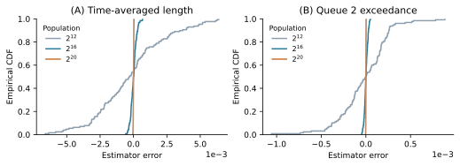

# Supplementary Material: Dense Counts, Finite-Word Corrections and Estimator Error

*Companion to Exact State-Ranked Array-RQMC: Representations and Shared Work, 5 October 2026.*

This supplement gives the dense-alphabet construction and the finite-word corrections underlying an earlier exact-execution study, then illustrates why preserving a finite-population realization is useful. Its numerical error example uses its own SciPy-adapter tape and retained implementations. The current coefficient-reuse and primal-basis experiments are evaluated in the main paper; their timings are not pooled with these records. Section S5 directs readers to the historical performance archive.

The execution contract is Proposition 1 of the main manuscript. For a finite symbol alphabet $\mathcal Z$, let $C_{j,z}=\#\{r\in I_j:\omega(r)=z\}$. Applying the transition to these exact multiplicities and sorting the positive destination counts gives the next rank partition. Here the complete symbol-count vector is constructed, so the work depends on $B=|\mathcal Z|$.

## S1. Affine inputs and dense exact counts

Represent ranks by $m$ bits in most-significant-bit-first order, and identify $\mathcal Z$ with $\mathbb F_2^d$, so $B=2^d$. A realized digital point set is indexed by $u\in\mathbb F_2^m$. Suppose its sorting-coordinate prefix is $r=Au+s$, with invertible $A$, and its consumed bits are $Hu+t$.

**Lemma S1 (realized affine rank representation).** Sorting this point set by its sorting coordinate assigns to numeric rank $r$ the consumed symbol

$$
z_r=Mr+b,\qquad M=HA^{-1},\qquad b=t+HA^{-1}s,
$$

*Proof.* All arithmetic is over $\mathbb F_2$. The unique index is $u=A^{-1}(r+s)$; substitution gives the displayed map. Lower bits of the sorting coordinate cannot change this order: every $m$-bit prefix occurs once. The point-index convention, including any Gray-code map, must be included consistently in $A$ and $H$. $\square$

Given these matrices, ordinary binary Gaussian elimination and multiplication form $M,b$ in $O(m^3+dm^2)$ bit operations. Creating the random matrices or extracting them from a software generator is an additional input cost.

This change of coordinates is exact for the realized point set. It does not permit replacing a seed's map by a different map drawn from the same distribution when seed-identical population execution is intended. In the experiments, the actual scrambled direction numbers and shifts from SciPy 1.15.3 are transformed [2].

The executor accepts the realized $M,b$. The archive retains a derived conditional column-coset law; execution requires only the realized map.

### S1.1. Prefix counts

Write $c_1,\ldots,c_m$ for the columns of $M$ and define

$$
P_z(a)=\#\{0\le r<a:Mr+b=z\},\qquad 0\le a\le N.
$$

**Lemma S2 (exact cached prefix construction).** The following suffix-image construction computes $P(a)$ for any endpoint, including deficient maps. Its cache takes $O(mB+B\log(B+1))$ word operations to construct and $O(m+B)$ words to store. A prefix query costs $O(mB)$ operations and $O(B)$ temporary count words. Hence each state-interval vector is exactly

$$
C_{j,z}=P_z(a_{j+1})-P_z(a_j).
$$

*Proof and construction.* Start with the empty suffix image $\{0\}$. On adding the next column $c$ backwards, retain the current image $V$ if $c\in V$; otherwise enumerate and sort the disjoint union $V\cup(c+V)$. This constructs every suffix image, sharing a tuple when the image is unchanged.

In a dyadic rank block, some leading bits are fixed and $q$ trailing bits are free. Let $v$ include the shift $b$ and the fixed-bit contributions, and let $V$ be the cached image of the free columns. Rank-nullity gives multiplicity

$$
2^{q-\dim V}
$$

for each symbol in $v+V$ and zero outside it. The binary expansion of $a<N$ decomposes $[0,a)$ into at most $m$ disjoint dyadic blocks. Adding their count vectors gives $P(a)$; for $a=N$, use the whole image of $M$ directly. Subtracting adjacent prefixes proves the interval formula, with no full-rank assumption.

Each strict suffix-image enlargement doubles its size. Consequently, fewer than $2B$ image entries are stored across distinct tuples, together with $m+1$ references. Linear membership tests cost $O(mB)$ in total; sorting the geometrically growing images costs $O(B\log(B+1))$ in total. A query initializes $B$ counts and visits at most $B$ symbols per dyadic block. These facts give the stated bounds. $\square$

Each interval endpoint is evaluated once. The materialized flow table in Algorithm S1 matches the retained cloud implementation; a streaming variant is discussed after Proposition S1.

**Algorithm S1. One implicit step using cached prefix counts.**

~~~text
Input: ordered states s[1:S], positive counts n[1:S], affine M,b
       and a certified list of exceptional-rank replacements
Build shared suffix-image cache for M
previous = zeros(B); end = 0; flows = []; endpoints = []
for j = 1,...,S:
    end += n[j]; endpoints.append(end)
    current = prefix_count(end, M, b, suffix_cache)
    flows.append(current - previous); previous = current
destinations = empty map
for j = 1,...,S:
    for each z with flows[j,z] > 0:
        destinations[Phi(s[j],z)] += flows[j,z]
for each exceptional rank:
    locate its incoming state using endpoints
    replace its base destination contribution by the reference one
Return positive destination counts sorted by the full-state order
~~~

### S1.2. Balanced interiors and mixed blocks

Suppose the final $d$ columns of $M$ are independent. In every aligned rank block of length $B$, the trailing $d$ rank bits produce every input symbol once. Thus a whole such block contained in one state run contributes the same count to every symbol.

Call a block *mixed* when it contains a boundary between two distinct state runs. There are at most $S-1$ mixed blocks. Processing homogeneous blocks by multiplicity and directly evaluating ranks only within mixed blocks gives

$$
R\le B\,M_{\mathrm{mix}}\le B(S-1)
$$

explicit residual-rank evaluations. Several state boundaries may share a block; ranks must still be counted only once. The implemented per-run interval decomposition has this property because the intervals partition the population.

More generally, if the last $\kappa$ columns span $\mathbb F_2^d$, each aligned block of length $2^\kappa$ contains each symbol $2^{\kappa-d}$ times. This gives a corresponding bound with $2^\kappa$ in place of $B$. The tested specialization uses $\kappa=d$ and falls back to generic counting when that test fails.

Balanced-block processing is an exact alternative, not an assumption needed by Algorithm S1. Its residual-slot bound does not by itself imply faster execution than a cached vector count. The archived dense study measured that comparison separately.

## S2. The dense executor and its costs

Let $S$ be the incoming number of occupied complete states. A certified exception list, of size $E$, specifies distinct ranks whose base affine-input transition must be replaced by the reference transition. The list is empty when the affine map is already exact. Let $K\le SB+E$ count distinct destinations encountered, including any added by corrections. Write $C_{\mathrm{map}}$ for input-map and exception-list construction, $C_\Phi$ for a transition evaluation, $C_D$ for expected dictionary access and count update, and $C_\prec$ for a state comparison. These costs include the relevant state representation work.

**Proposition S1 (general dense executor).** Assume the rank contract of main-manuscript Proposition 1, a realized affine rank map as in Lemma S1, and exact integer arithmetic. Given the ordered histogram and any certified exception list, Algorithm S1 returns the exact reference histogram and its next rank intervals without expanding the population into individual particles. Its expected word-operation cost per step, including construction of the compact input, is

$$
\begin{aligned}
O\bigl(&C_{\mathrm{map}}+mB+B\log(B+1)+SmB\\
       &+SB(C_\Phi+C_D)+K\log(K+1)C_\prec\\
       &+E[\log(S+1)+C_\Phi+C_D]\bigr).
\end{aligned}
$$

If a state record occupies at most $\ell$ words, the stored histogram, shared cache, materialized flows, destinations and exception list require

$$
O\bigl(m+B+SB+(S+K)\ell+E\bigr)
$$

words, in addition to model data and the workspace used to construct the input map. Repeated application with the same successive realized maps preserves the entire histogram path and its supported readouts.

*Proof.* Lemma S2 computes every interval count exactly, using the actual affine map. Applying the transition to each positive state-symbol count gives the uncorrected destination multiplicities by main-manuscript Proposition 1. The exception list replaces exactly one particle contribution at each of its distinct ranks, using that rank's incoming state. This gives the reference multiplicities (Section S3). Their sum remains $N$; sorting the positive destinations reconstructs all rank intervals needed for the next step. Induction gives the path statement.

The shared suffix cache has the construction cost and storage established in Section S1.1. There are $S$ queried endpoints, each costing $O(mB)$, followed by at most $SB$ transition evaluations and dictionary updates. Binary searches in the incoming endpoints locate the $E$ exceptions; each replacement uses at most two transition evaluations and dictionary updates. Sorting costs $O(K\log(K+1))$ state comparisons. Summing these costs gives the displayed bound. The measured implementation retains $SB$ flow counts, $S$ endpoints, at most $K$ destination records and the cache; this gives the storage bound. Neither the proof nor the algorithm assumes a full-rank output projection. $\square$

The preservation assertion is deterministic. Only the dictionary access bound is expected. Sorting and merging at most $SB+2E$ signed destination contributions gives a comparison-based alternative, with cost $O((SB+E)\log(SB+E+1)C_\prec)$ in place of dictionary aggregation and destination sorting. The measured implementation uses integer-key dictionaries and materializes the flows as in Algorithm S1. Streaming one flow row at a time would replace its $SB$ count storage by $O(B)$; that variant is not measured here.

The word model treats counts, rank endpoints and packed symbols as bounded-size operands. Counts and endpoints require $m+1$ bits and symbols require $d$ bits. For multiword operands, their actual arithmetic and comparison costs must be charged instead; the theorem is not a constant-cost assertion for arbitrary integers. State and accumulator sizes may grow with the horizon. In the measured range, readouts fit signed 64-bit arithmetic in the compiled baseline; the implicit implementation uses Python integers. Model-table construction is a separate setup cost included in the reported trajectory timings. Computing a readout adds its own cost, for example $O(K C_g)$ for a weighted sum whose state evaluation and arithmetic cost $C_g$.

For fixed $B$, bounded state-operation costs, and no exceptions, the bound simplifies to $O(C_{\mathrm{map}}+Sm+S\log(S+1))$. If $S$ is bounded independently of $N$ and input construction is polynomial in $m$, a step costs only polynomial work in $\log N$. This is a representation-dependent statement: $S$ can reach $N$, $B$ may be large, and producing a compact map may itself be expensive. Reading an arbitrary expanded initial population or returning an expanded output still costs at least linear work.

The balanced-suffix variant uses $O(SB+Rm)$ count work, with $R\le B(S-1)$ under its condition. This is a different work decomposition, not an unconditional improvement over cached prefixes. Its tested generic fallback is uncached. The retained explicit baseline stores length-$N$ state and input arrays and constructs another state array. Explicit methods can instead stream inputs, or repeated states, so linear storage is not inherent to every method that visits all particles. Section S5 identifies the archived baseline audit.

**Corollary S1 (changing executor without changing the experiment).** If two implementations satisfy main-manuscript Proposition 1 for each realized reference map, choosing either implementation at any step preserves the histogram path, provided representation conversion is exact and the map is not rejected or redrawn.

This follows by applying the same commuting identity at each step. Selection can depend on the current histogram or map; it changes execution cost only. Conversion costs still matter. The present experiments do not use a switching policy.

## S3. Finite-word endpoint corrections

The tandem model's reference event selection uses $u\le7/16$ for service at queue 1, then $u\le3/4$ for service at queue 2, and arrival otherwise. The four leading input bits identify all events except the two threshold atoms. A finite binary grid assigns positive probability to those atoms, so replacing the inequalities by half-open bins changes the reference process.

We solve for each threshold's rank in the complete 30-bit affine coordinate. The tested coordinate is injective on its $2^m$ point indices: Gaussian elimination either returns its unique preimage or establishes absence. A deficient coordinate is rejected by this solver rather than silently treated as having one preimage. If a threshold rank occurs, its old state is located in the ordered intervals, one count is removed from its ordinary destination and added to the corrected destination.

This is the certified exceptional-rank case included in Proposition S1. It preserves the exact reference map while keeping a small consumed alphabet for ordinary ranks. With a uniform 30-bit marginal, the three event probabilities are

$$
\frac{1}{2^{30}}
\left(7\cdot2^{26}+1,\quad 5\cdot2^{26},\quad 4\cdot2^{26}-1\right).
$$

### S3.1. Composition with exact corrections

Suppose a base symbol map $\omega$ is exact except on a finite set of ranks $\mathcal E$. For each $r\in\mathcal E$, let $z_r^-$ be its base symbol and $z_r^+$ its corrected symbol. Locate the unique run $j(r)$ containing $r$ and apply

$$
n'_y\leftarrow n'_y+
\sum_{r\in\mathcal E}
\left[
\mathbf1\{\Phi(s_{j(r)},z_r^+)=y\}
-\mathbf1\{\Phi(s_{j(r)},z_r^-)=y\}
\right].
$$

Symbol replacements may equivalently be encoded as before/after transition codes, as in the tandem implementation. This replaces precisely the explicit contribution at each exceptional rank. Multiplicity is conserved, and the corrected histogram satisfies main-manuscript Proposition 1 for the corrected map. Binary search locates each run in $O(\log(S+1))$ comparisons once endpoints are available. The preimage calculation is an additional cost included in map extraction.

Under the uniform-randomization model for the LMS-plus-shift inputs used here, the consumed-coordinate shift is independent and uniform conditional on the sorting data and generating matrices. Each fixed rank therefore receives the uniform finite-word input marginal. Fresh independent maps make this statement conditional on the previous population. Linearity therefore yields the one-chain mean for any additive population readout. This observation does not identify population variance: cross-particle dependence contributes to it. The pointwise execution identity preserves that dependence without computing a separate covariance formula.

## S4. A concrete use: assessing finite-sample error

The retained tandem study uses arrival rate 1, service rates 1.75 and 1.25, 200 uniformized transitions, and the complete-state order $(q_1+q_2,q_2)$ of [1, Section 4.4]. Its realized inputs come from SciPy 1.15.3 two-coordinate 30-bit LMS-plus-shift maps; this is a separate tape from the inverse-LMS source of the main paper. Each of $N=2^{12},2^{16},2^{20}$ has 128 independent randomizations. The dense prefix, boundary and retained explicit executors use exactly the same map within each pair. The package saves per-time integer readouts for every replication and includes an independent rational one-chain DP. The original protocol and full source remain in the archived dense-study package.

All particles start in state $(0,0)$ at time zero. For randomization $k$, let $(s_{k,t,j},n_{k,t,j})_{j=1}^{S_{k,t}}$ be the histogram **after** update $t$. With $T=200$, the two estimators are

$$
Y_{k,N}^{(g)}=\frac{1}{NT}\sum_{t=1}^{T}
\sum_{j=1}^{S_{k,t}}n_{k,t,j}g(s_{k,t,j}),
\qquad
g_L(q_1,q_2)=q_1+q_2,\quad
g_E(q_1,q_2)=\mathbf1\{q_2>4\}.
$$

Thus the time-zero readout is excluded and the readout after the 200th update is included. Reranking leaves these histogram sums unchanged. For the single queue pair $Z_t$, starting at $Z_0=(0,0)$ and using the three transitions and exact finite-word probabilities of Section S3, the reference mean is

$$
\mu^{(g)}=\frac{1}{T}\sum_{t=1}^{T}\mathbb E[g(Z_t)].
$$

The rational DP propagates this one-chain distribution for 200 transitions and sums each post-update expectation. Under the fresh uniform-shift law, $\mathbb E[Y_{k,N}^{(g)}]=\mu^{(g)}$ by the conditional marginal argument in Section S3.1. For the uniform 30-bit reference kernel, the means are approximately 3.873994219831 for length and 0.201488719293 for exceedance. The corresponding continuous-uniform values are 3.873994260315 and 0.201488722023. Reported errors are $Y_{k,N}^{(g)}-\mu^{(g)}$, computed from the saved exact fractions before conversion to floating point for summaries.

<!-- include: tables/errors.md; table: S1 -->

The three executors produce identical integer numerators for every $Y_{k,N}^{(g)}$ and every per-time readout. Their empirical variances, RMSEs and empirical quantiles therefore agree by construction.

**Figure S1. Finite-sample error of the preserved reference estimator.** Each curve uses 128 independent randomizations. The empirical CDF is identical for the three executors; one curve per population size is sufficient. The reference mean comes from exact finite-word DP. This sample supports central error summaries, not precise claims about extreme tails or coverage probabilities.

One-chain DP supplies $\mu^{(g)}$ cheaply for this small queue model: the preceding compiled floating-point comparison required approximately 0.057--0.077 s for the scalar calculation. Exact population execution supplies the realizations $Y_{k,N}^{(g)}$ needed for their error distribution. Computing that distribution by DP would instead require a sufficiently rich *population* state. This example uses the scalar DP mean as the reference for population samples. Historical timing comparisons are summarized separately in Section S5.

## S5. Archived measurements and reproduction

The earlier dense-alphabet study, its explicit-baseline audit and its compiled coalesced follow-up used separate implementations, tapes and measurement protocols. Their original observations remain available in the consolidated companion. The cloud comparison's apparent advantage over its selected explicit implementation was sensitive to input-write order; a later fused explicit implementation reversed the result. A subsequent coalesced study tested another compiled executor against compact rank streaming. These records explain the development of the current comparison, but supply no additional performance evidence for coefficient reuse.

The full historical report, including the old speed tables, component costs, sampled RSS and coefficient-sampling note, is retained as `supporting/retained_history/retained_studies.md` and as its original PDF. The two earlier distributed ZIPs are copied unchanged into the consolidated archive. Their source, observations and replay instructions keep their original study identities. The main paper's six-method confirmation is reproduced through `review_checks/primal_dual/`; its repair and tandem data are the performance evidence for the current executors.

The dense-alphabet source and figures here are reproduced by the archived private package's README commands. In that study, local tests checked 3,168 count cases and 144 interval partitions; the cloud comparison checked 154,560 step-histogram equalities across 414 randomizations. Saved integer traces reproduce the error summaries, and representative saved-source replay checked 1,944 stored histogram checkpoints. These historical validation counts are not added to the current study's independent seed count.

## References

[1] P. L'Ecuyer, C. Lécot and B. Tuffin, A randomized quasi-Monte Carlo simulation method for Markov chains, *Oper. Res.* 56 (2008), no. 4, 958--975. [doi:10.1287/opre.1080.0556](https://doi.org/10.1287/opre.1080.0556).

[2] SciPy contributors, SciPy 1.15.3: scipy.stats.qmc.Sobol, [versioned documentation](https://docs.scipy.org/doc/scipy-1.15.3/reference/generated/scipy.stats.qmc.Sobol.html) and [implementation](https://github.com/scipy/scipy/blob/v1.15.3/scipy/stats/_qmc.py), accessed 1 October 2026.

## Author information

**Aoi Kawasaki**, Independent researcher. E-mail: [aoikawasaki42@gmail.com](mailto:aoikawasaki42@gmail.com).

<!-- Postal address remains to be supplied or its required publication granularity confirmed with the journal. -->
